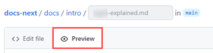
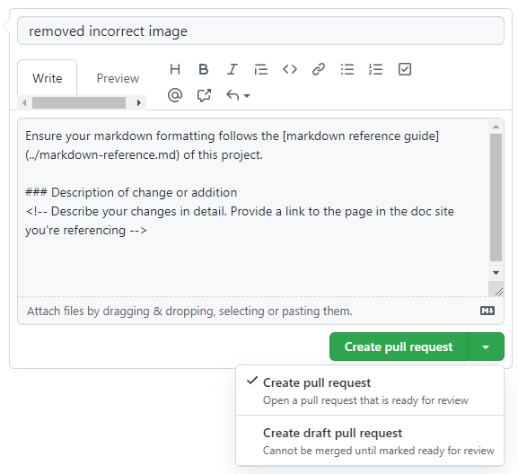

<!-- Reference links -->
[issues]: https://github.com/gobeyondidentity/customer-docs/issues
[conduct]: /docs/contributing-guide/code-of-conduct
[repo]: https://github.com/gobeyondidentity/customer-docs.git
[pr]: https://github.com/gobeyondidentity/customer-docs/pulls
[style-guide]: ./style-guide.md
[markdown]: ./markdown-reference.md
[contributor]: ./contributor-guide.md

- [Contributor's guide](#contributors-guide)
  - [Provide feedback](#provide-feedback)
  - [Before you start](#before-you-start)
  - [Local Git repo](#local-git-repo)
    - [Prerequisites](#prerequisites)
    - [Optional editing tools](#optional-editing-tools)
    - [Clone the repo](#clone-the-repo)
    - [Start the development server](#start-the-development-server)
  - [When to contribute](#when-to-contribute)
    - [Best practices](#best-practices)
  - [Edit content (minor changes)](#edit-content-minor-changes)
  - [Edit content (significant changes)](#edit-content-significant-changes)
  - [Add new content](#add-new-content)
  - [Release notes](#release-notes)


---

# Contributor's guide

Thank you for taking an interest in contributing to the Beyond Identity Developer Documentation. 

We've built the documentation with [Docusaurus](https://docusaurus.io) and you can find the source code our [customer-docs GitHub repo][repo].

You're welcome to contribute to the documentation to help make it better and we want to make it possible for you to become a contributor. Additionally, anyone can open an issue about documentation or suggest a change with a [pull request (PR)][pr] to the [GitHub repository][repo]. 

This topic outlines the different ways that you can get involved. In addition, it provides some of the resources that are available to help you get started. All feedback is welcome. 

## Provide feedback

If you're not ready to contribute, you can provide us feedback.  Your feedback is essential in shaping the customer content experience. There are several ways to provide feedback:

- [Submit an enhancement idea][enhancements] to make the docs better
- [open a GitHub issue][issues] to report an issue with the content (something is incorrect or confusing)

The Product team will track these ideas and issues to address your feedback. 

## Before you start

- You are familiar with Git and GitHub, and [markdown][markdown]. We use basic markdown, extended markdown, and Docusaurus-specific markdown.
- Review the [documentation repo's][repo] organization and structure. 
- Familiarize yourself with our [contributor's guide][contributor].
- Verify that you can open a [pull request][pr] and review changes.
- Ensure an [issue][issues] exists because someone might have reported or started work on it. 
- If the solution you are proposing is complex, prose it anyway and wait for one of the core contributors to approve it before implementing it. This helps in shorter turnaround times in merging PRs.
  
## Local Git repo

### Prerequisites

- Code editor, [VS Code](https://code.visualstudio.com) is recommended
- [Git](https://git-scm.com)
- [Node.js](https://nodejs.org)
- [Yarn](https://yarnpkg.com) 


### Optional editing tools

If you want the WYSIWYG experience, you can install one of the VS Code extensions:

- [Rich Markdown Editor](https://marketplace.visualstudio.com/items?itemName=patmood.rich-markdown-editor)
- [Markdown Editor](https://marketplace.visualstudio.com/items?itemName=zaaack.markdown-editor)
- [UNOTES](https://marketplace.visualstudio.com/items?itemName=ryanmcalister.Unotes)

Other helpful VS Code extensions:

- [Code Spell Checker](https://marketplace.visualstudio.com/items?itemName=streetsidesoftware.code-spell-checker)
- [Markdown All in One](https://marketplace.visualstudio.com/items?itemName=yzhang.markdown-all-in-one)

Non VS Code markdown editors:

- [StackEdit](https://stackedit.io/)
- [Dillinger](https://dillinger.io/)
- [Pandeo MEditor.md](https://pandao.github.io/editor.md/en.html)


### Clone the repo

1. Clone the repo.  This creates a directory named `customer-docs` in your current working directory.

   ```bash
   git clone https://github.com/gobeyondidentity/customer-docs.git
   cd customer-docs
   ```

2. Next, create a new [branch](https://git-scm.com/book/en/v2/Git-Branching-Branches-in-a-Nutshell) from `main` (always give your branch a meaningful, descriptive name). 

   ```bash
   git checkout -b <branch_name> main
   ```

### Start the development server

We're finally able to get to the fun stuff! Install the dependencies and start a local development server:

```bash
yarn
yarn start
```

The `http://localhost:3000` opens in your browser so you can see your changes reflected live.

## When to contribute

When relying on others to draft and review documentation, it makes sense to have a process to make it more productive and encouraging for everyone. 

The acceptance criteria for contributing to Beyond Identity developer documentation is:

**Does the topic or doc exist?**

- If yes, update the doc! Contribute until your heart's content. But first, determine which use case best fits your update:

  - **[Minor changes:](#edit-content-minor-changes)** If you only need to fix a typo or make a clarification to a sentence or section, this option is your best choice. In this use case, you will not be able to upload files, such as an image, and you can update only one file.
    
  - **[Significant changes:](#edit-content-significant-changes)** Suppose you need to make substantial changes, such as adding an image or editing multiple topics. In that case, this method is your best friend, as you'll have one pull request to manage. 

- If not, should it? If so, consider [adding it](#add-new-content), but don't add a topic or doc just because you can. Consult with the Sr. Technical Writer first before adding. 
  
  The reason for consulting with the Sr. Technical Writer is to maintain the highest quality of the content and reduce duplication. For example, your new topic could be added to an existing one, consolidating and clarifying the information. It's also possible that someone else is working on a similar topic. 


### Best practices

To promote consistency, follow the guidelines below and mentioned throughout to keep the process productive and beneficial for all involved.

- [ ] Always create a *working branch* whenever you introduce a set of logically related changes. This helps you manage your changes through the workflow. We refer to it here as a working branch because it's a workspace to iterate or refine your changes until they can be integrated into the default branch. 

- [ ] The in-browser editing experience is best for minor or infrequent changes. 

- [ ] Always consult with the Sr. Technical Writer when adding topics or want to propose changes to the content structure.  

- [ ] Always keep your branch up-to-date. 


## Edit content (minor changes)

If you only need to fix a typo or clarify a sentence or section, this option is your best choice. It streamlines the process of reporting and correcting minor errors and omissions in the documentation.  

Despite all efforts, small grammar and spelling errors _do_ make their way into our published documents. While you can create GitHub issues to report mistakes, creating a PR to fix the issue is faster and easier when the option is available.
<!--
<details>
<summary>**Show me how!**</summary>
<div>
<video  width="100%" controls src="https://user-images.githubusercontent.com/88200052/199261463-899c36ad-e433-46c9-ac28-87f7e86c1f84.mp4" />
</div>
</details>
-->

1. In the [repo][repo], navigate to the /docs folder and locate the file you want to edit. Then, select the pencil icon to edit the article. <br /><br />

   <br /><br />

2. Edit the file in the web editor. Choose the **Preview** tab to check the formatting of your changes.<br /><br />

   <br /><br />

3. When you're finished editing, scroll to the bottom of the page and propose your changes. <br /><br />

   1. In the **Commit changes** area, enter a title and an optional description for your changes. The title will be the first line of the commit message. <br /><br />

   2. Select the option to create a branch and then  **Propose changes** to commit your changes.<br /><br />
   
     <br /><br />

4. Now that you've proposed and committed your changes, you need to ask the owners to review your changes. This is done using a pull request (PR).<br /><br />

   Enter a title and a description for the PR, and then select **Create pull request**. You can select **Create a draft pull request** instead. The difference is that the reviewers are notified only when the PR is *Open* rather than *Draft*.<br /><br />

   


That's it! Team members will review your PR and merge it when approved. You may get feedback requesting changes.


## Edit content (significant changes)

If you need to make substantial changes, add an image or add a section to a topic. On the other hand, if your change is minor that doesn't involve uploading a file or making changes to multiple files, follow the [Edit content - minor change](#edit-content-minor-changes) instructions.

1. Make sure you're back on the main (default) branch so you can sync your local working branch.

   ```
   git checkout main
   git pull origin main
   ```

2. Create a working branch for your proposed changes. For example, **content-dev-faqs** or **update-visual-guidelines**.

   ```
   git checkout -b {branch-name}
   ```

3. Navigate to /docs and locate the topic you want to change. 

4. Change the date in the metadata and ensure the title, description, and author are correct. Add any additional keywords if they are missing.

   ```markdown
   ---
   title: Welcome to Secure Workforce
   id: welcome
   description: ''
   slug: /
   keywords: 
    - faq
    - help
   pagination_next: null
   pagination_prev: null
   last_update: 
      date: 03/29/2023
      author: Patricia McPhee
   draft: true
   doc_type: overview
   product: secureWorforce
   hide_table_of_contents: false
   displayed_sidebar: secureWorkforceSidebar
   ---
   ```

4. Make your changes to the content and run the following command to build and review your changes.

   ```
   yarn start
   ```

   This command starts a local development server and opens a browser window. Most changes are reflected live without having to restart the server. If a browser window doesn\'t open, go to **http://localhost:3000/** to view your local changes. 

5. Add your changes.

   ```
   git add --all
   ```

6. Commit your changes.

   ```
   git commit -m "short description of the change"
   ```

7. Publish, or push, your changes to the main repo for merging. 

   ```
   git push --set-upstream origin {branch name}
   ```

8. From the main (default) branch, select **Compare & pull request**.

9. Provide additional information, add reviewers, and select **Create pull request**.

   Alternatively, you can select **Create draft pull request**.

10. After going through the review process for technical accuracy and a copy edit from a Content Designer, enter `#sign-off` and select **Comment**.

   Your changes get merged into the default branch (`main`).  After each merge, the Sr. Technical Writer reviews all merges, fixes any merge conflicts, and publishes all changes.


## Add new content

1. Make sure you're back on the main (default) branch so you can sync your local working branch.

   ```
   git checkout main
   git pull origin main
   ```

2. Create a working branch for your proposed changes. For example, **content-dev-faqs** or **update-visual-guidelines**.

   ```
   git checkout -b {branch-name}
   ```

3. Navigate to `/docs` and locate the subdirectory for your new topic.

4. Add the metadata (frontmatter).

   Keywords are optional but helpful. All other metadata is required.

    ```markdown
    ---
    title: Welcome to Secure Workforce
    id: welcome
    description: ''
    slug: /
    keywords: 
     - faq
     - help
    pagination_next: null
    pagination_prev: null
    last_update: 
       date: 03/29/2023
       author: Patricia McPhee
    draft: true
    doc_type: overview
    product: secureWorforce
    hide_table_of_contents: false
    displayed_sidebar: secureWorkforceSidebar
    ---
    ```

5. Add the new markdown file in the sidebar.js file.

   ```javascript
   {
     type: 'category',
     label: 'Content',
     link: {
       type: 'doc',
       id: 'content/content-overview',
     },      
     items: [ 'content/language-inclusivity', 'content/grammar-mechanics', 'content/voice-tone-principles', 'content/in-product-word-list', 'content/writing-for-errors', 'content/writing-guidelines' ],
   },
   ```
   
   It's a best practice to add the markdown file early in the content development phase. Otherwise, you\'ll get an error when you run the command to build and review your content.

6. Create your content and run the following command to build and review your changes.

   ```
   yarn start
   ```

   This command starts a local development server and opens a browser window. Most changes are reflected live without having to restart the server. If a browser window doesn't open, go to  **http://localhost:3000/SCOOBY/docs-next/** to view your local changes. 

7. When ready, commit and publish your changes to the main (default) branch, add your changes.

   ```
   git add --all
   ```

8. Commit your changes with a descriptive summary, for example, *add clarity to the data table component usage examples*.

   ```
   git commit -m "short description of the change"
   ```

9. Publish, or push, your changes to the main repo for merging. 

   ```
   git push --set-upstream origin {branch name}
   ```

10. From the main (default) branch, select **Compare & pull request**.


11. Provide additional information, add reviewers, and select **Create pull request**.

    Alternatively, you can select **Create draft pull request**.

12. After going through the review process for technical accuracy and a copy edit from a Content Designer, enter `#sign-off` and select **Comment**.

    Your changes get merged into the default branch (`main`).  After each merge, the Sr. Technical Writer reviews all merges, fixes any merge conflicts, and publishes all changes.


## Release notes

If you want to contribute to the release notes in advance, you can follow the guidelines in [How to write effective release notes](https://beyondidentity.atlassian.net/l/cp/STZ7Sqtz).  If a template for that release has been added to **Product Documentation > Release Notes** in Confluence, feel free to add your content. If a template for a specific release hasn't been created yet, [duplicate or copy the template](https://beyondidentity.atlassian.net/wiki/spaces/PD/pages/2509406212/Template+version+Date), update the title with the release number, and publish it. 


