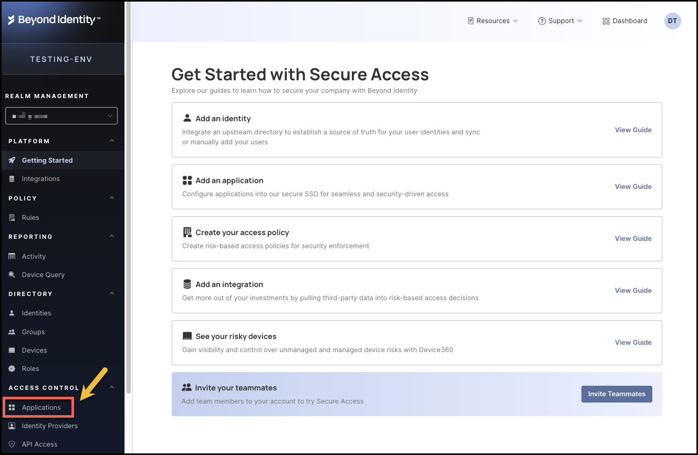
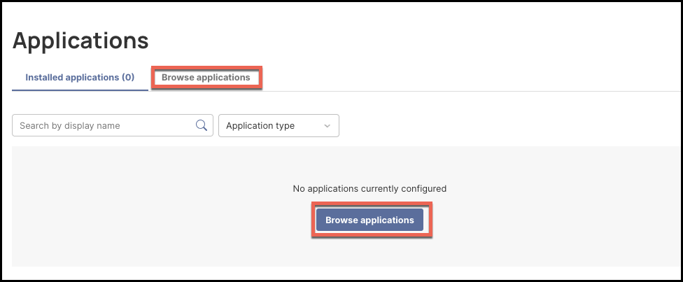
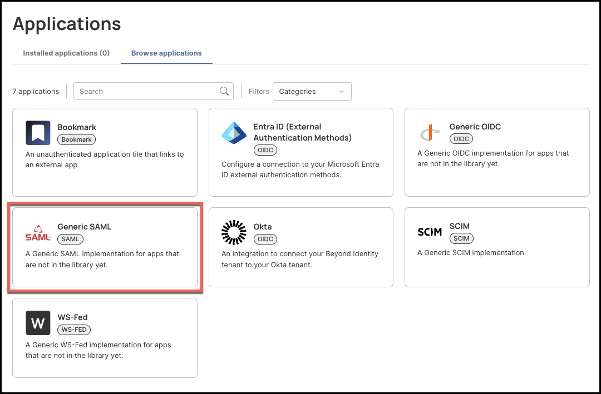
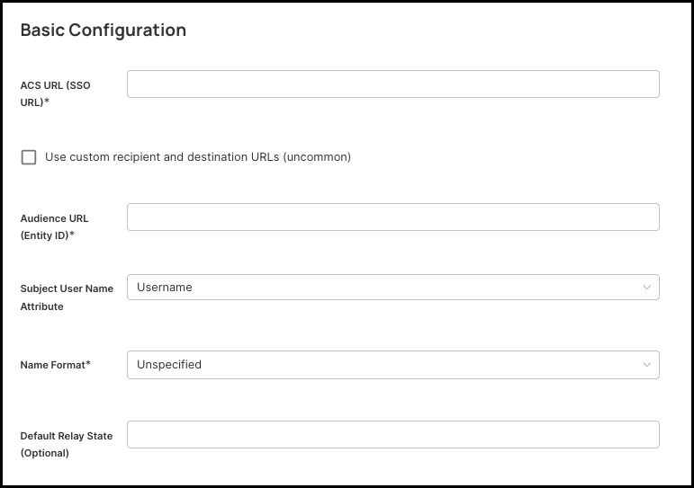

# Configuring Generic SAML on Secure Access

Beyond Identity Secure Access supports SAML 2.0 for integrating with third-party applications that rely on an external Identity Provider (IdP) for authentication. By configuring a SAML application in the Secure Access Console, administrators can enable secure, passwordless authentication for any Service Provider (SP) that accepts SAML-based assertions.

In a typical SAML flow, Beyond Identity acts as the IdP, generating a signed SAML response containing the user’s identity information. The SP validates the response using the metadata and certificates you provide. To establish this trust relationship, both systems must exchange configuration details, including ACS URLs, Entity IDs, certificates, and optional attribute mappings.

This guide walks you through the complete setup process within Beyond Identity Secure Access, from defining basic SP information to configuring signatures, assigning users, and exporting IdP metadata. Each field in the configuration is explained clearly to ensure compatibility with any SAML-compliant service.

To configure generic SAML, follow the steps below.

---

## Steps

1. Log in to your Secure Access tenant.
2. Click **Applications** from the left-hand navigation panel.
    
3. Click **Browser Applications**.  
    
4. Click the tile labeled **Generic SAML**.  
    
5. Click **Add SAML** near the top right corner of the screen.
    

---

## Configuration

To configure generic SAML, provide the appropriate values on the **Generic SAML application** page.

    

### General

1. **Display Name** – Enter a descriptive name for your SAML application. This name will appear in the Secure Access Console and, if enabled, on the user Launchpad tile. Choose a name that clearly identifies the service you’re integrating.

   Examples:

   - Salesforce SAML  
   - Generic SAML Application  
   - ServiceProviderName (SAML)

2. **Enable or Disable the App Tile** – Toggle **Show Tile** to determine whether users will see this application on their Beyond Identity Launchpad.

   - **ON**: The app appears as a clickable tile for users.  
   - **OFF**: The app remains functional but is hidden from the Launchpad.

3. **(Optional) Upload a Custom Icon** – Upload a JPEG, PNG, or SVG to personalize the tile.

   Requirements:

   - Minimum size: 420 × 120 px  
   - Max file size: 1 MB  

   If no image is uploaded, a placeholder icon is used automatically.

### Basic Configuration

    

4. **ACS URL (SSO URL)** – Enter the Assertion Consumer Service (ACS) URL provided by your Service Provider (SP). This is the endpoint where your SP expects to receive SAML responses from Beyond Identity.

   Example:

   - `https://serviceprovider.example.com/saml/acs`

5. **Audience URL (Entity ID)** – Provide the Entity ID associated with the SP. This identifies the SP that is requesting authentication.

   Common formats:

   - A URL (most common)  
   - A URN (some enterprise SPs)

6. **Subject User Name Attribute** – Choose which Beyond Identity attribute will be used as the SAML `NameID` value.

   Common choices:

   - Email  
   - Username  

   Use the attribute required by your SP.

7. **Name Format** – Select the format of the `NameID`.

   - Unspecified (recommended unless the SP requires a specific value)  
   - EmailAddress  
   - Persistent  
   - Transient  

8. **(Optional) Default Relay State** – If the SP requires users to land on a specific internal page after login, enter that value here. Otherwise, leave this field blank.

### Advanced Configuration

9. **Enable Response Envelope Signature** – When enabled, Beyond Identity signs the entire SAML response. Most SPs require this, so it is recommended to leave this enabled.

10. **Enable Assertion Signature** – This signs the assertion inside the SAML response. This is also required by most SPs, so it is recommended to leave this enabled.

11. **Add Certificate** – Click **Add Certificate** and upload the X.509 certificate provided by your SP.

12. **Signature Algorithm** – Choose the algorithm Beyond Identity should use to sign outbound SAML responses.

   - Default: **RSA-SHA256** (recommended)

13. **Digest Algorithm** – Defines the hashing algorithm used within the signature.

   - Default: **SHA256** (recommended)

   If the SP does not require request signing, you may skip this entire section.

14. **(Optional) Assertion Encryption** – Enable only if the SP requires the SAML assertion to be encrypted. If enabled, you must upload the SP's encryption certificate.

15. **Assertion Expiration** – Choose how long the SAML assertion remains valid after issuance.

   - Default: 5 minutes  
   - Recommended: 5 minutes

16. **Authentication Context Class** – Select the authentication strength being asserted.

   - Default for Beyond Identity: **X.509**  

   Leave this unchanged unless the SP requires a different Authentication Context.

### Attribute Statements (Optional)

Attribute Statements allow you to pass additional user information from Beyond Identity to the Service Provider (SP) inside the SAML assertion. Only configure this section if your SP explicitly requests attributes.

17. **Add an Attribute** – Click **Add Attribute** to begin defining a new mapping.

18. **Service Provider Attribute Name** – Enter the attribute key name expected by your SP.

   Examples include:

   - `email`  
   - `firstName`  
   - `lastName`  
   - `role`  
   - `department`

19. **Name Format** – Select a format for the attribute name.

   - Unspecified (default and recommended)  
   - Other formats are rarely required.

20. **Beyond Identity Attribute Name** – Select which Beyond Identity user profile attribute will populate the value.

   Common mappings include:

   - Email  
   - Username  
   - GivenName  
   - FamilyName  

Repeat these steps for each attribute your SP requires. If your SP does not need additional attributes, leave this section empty.

### Client Information and Endpoints

This section provides the URLs and identifiers the SP needs to complete the integration. These values are auto-generated by Beyond Identity.

21. **Application ID** – A unique identifier for this SAML application inside Beyond Identity.

22. **SP-Initiated URL** – Used when the Service Provider directs users to Beyond Identity to authenticate. Provide this to your SP if they support SP-initiated SSO.

23. **IdP-Initiated URL** – Used when the user starts SSO from Beyond Identity, such as from the Launchpad tile. Provide this if the SP supports IdP-initiated SSO flows.

24. **IdP Issuer** – Beyond Identity’s unique Entity ID for SAML. Your SP must configure this value so it can validate that assertions came from Beyond Identity.

25. **IdP Metadata URL** – A full metadata document containing:

   - Signing certificates  
   - SSO endpoints  
   - Supported bindings  
   - Algorithms  
   - Entity ID  

   Your SP can import this URL directly to configure their SAML settings. This is typically the most important URL you provide to the SP.

### Review and Manage IdP Certificates

26. **View Active Certificate** – The certificate displayed is currently being used to sign SAML responses.

27. **Keep Only One Active Certificate** – Do not delete the active certificate unless you’re performing a planned certificate rotation.

28. **Add Certificate** – Use this only during a certificate rotation or for advanced security scenarios.

29. **Certificate Expiry** – If applicable, your SP will need the updated certificate from your Metadata URL when the certificate is rotated.

### Assign Users

The SAML application will not be usable until you assign at least one user or group.

30. Navigate to the **Assignments** tab.

31. **Assign by Identity** – Select individual identities who should have access to this SAML integration.

32. **Assign by Group** – If your environment uses user groups, assign the SAML app to an entire group.

33. **Save Your Assignments** – Only assigned users will be able to authenticate via this SAML configuration.

### Provide Metadata to Your Service Provider

Once configuration is complete, share the following with your SP:

- IdP Metadata URL  
- IdP Issuer  
- IdP SSO (IdP-Initiated) URL  
- Your SAML signing certificate (if their system doesn’t import the metadata automatically)

### Service Provider Configuration

Your SP will configure:

- ACS URL  
- Audience / Entity ID  
- NameID format  
- Attribute requirements  
- (Optional) encryption certificate  

Once the SP loads the metadata, SAML trust is established.

 
 
 