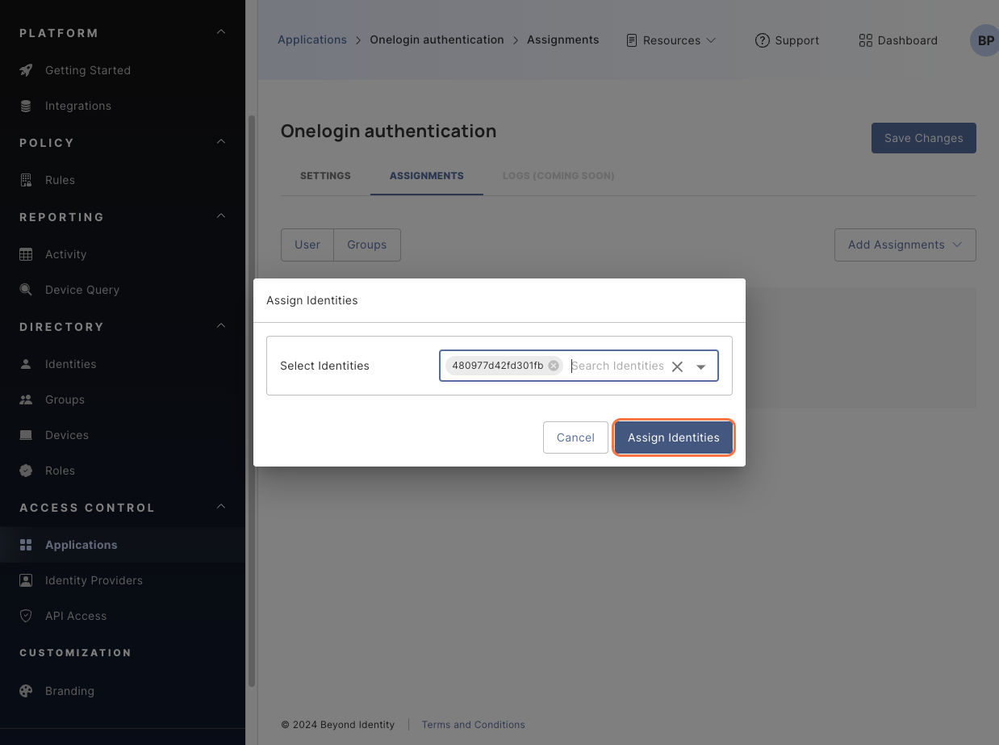

## Beyond Identity phishing-resistant passwordless authentication for OneLogin

Beyond Identity and OneLogin integrate to offer phishing-resistant, passwordless login with device trust to OneLogin SSO. 

This guide is designed to offer step-by-step instructions to integrate Beyond Identity with your OneLogin environment, and to enable your end users to authenticate with phishing resistant, passwordless authentication. Specifically, you will learn how to:

- Configure Beyond Identity as the primary phishing-resistant, passwordless authentication method for your OneLogin environment.
- Configure OneLogin to delegate authentication to Beyond Identity to enhance security and the user experience.

## Prerequisites

To get started with the integration, view the following prerequisites.

### OneLogin requirements

This information contains the necessary items for integrating with Beyond Identity.

- Appropriate OneLogin SKU (advanced or Pro) with provisioning and federation 
- OneLogin Super User Privileges
- SCIM implementation for OneLogin as upstream directory source to Beyond Identity
  - View the [Generic SCIM](/docs/access-control/applications/generic-scim) for more information.

### Beyond Identity requirements

The list below covers the basic Beyond Identity requirements for the integration.

- Secure Access Tenant with Super Admin Role
  - Use an existing account, or [sign up here](https://www.beyondidentity.com/get-demo) to create a new Beyond Identity account
- Have at least two devices and two Super Admin roles configured*
  - **Recommended, optional*

:::note
For each of the platforms, have at least two administrators. Protect yourself from lockout and configure only one administrator at first with the integration. The administrator without the integration configuration can provide support if an access issue occurs during setup.
:::

---

# Steps

Follow the steps in the sections below to complete your integration for Beyond Identity and OneLogin.

## Legend

The sections below use these two color codings to identify the steps for separate platforms.

🔵 **Beyond Identity** - Beyond Identity platform tasks are highlighted in blue.

🟠 **OneLogin** - OneLogin platform tasks are highlighted in orange.

## 🟠 Configure OneLogin Administration

These steps are for the 🟠 OneLogin platform administration account.

1. Under the Authentication dropdown at the top, click **Trusted IdPs**.
2. Click **New Trust**.
3. In the blank field at the top for the Trusted IdP, type `Beyond Identity OIDC`.
4. Click the green check icon to confirm.
5. Click the checkbox for **Enable Trusted IDP**.
6. In the same **Settings** tab, scroll down to the **Protocol** section.
7. In the **Configurations** section, select the checkboxes for **Sign users into OneLogin** and **Sign users into additional applications**.
8. Navigate to the **Protocol Type** dropdown and select **OIDC**. 


## 🔵 Beyond Identity console information

The following section covers the 🔵 Beyond Identity console and related steps.

1. Navigate to your Beyond Identity console.
2. On the left-hand navigation under **Access Control**, click **Applications**.
3. Select the **Browse Applications** tab.
4. Click **Generic OIDC** to proceed.
5. Click the **Add OIDC** button on the right to bring up the **New SSO Application** screen.
6. Under **Settings** → **General** → **Display Name**, input `Onelogin OIDC Connection` into the text field.
7. Scroll down to the **Important Values** section.


## 🔵🟠 Copy and paste values from Beyond Identity to OneLogin

This section explains the steps to copy values from Beyond Identity and paste into OneLogin. The color coding shows origin fields to destination fields.

1. Copy the following values from **Step 7** of the 🔵 [Beyond Identity console information section](#-beyond-identity-console-information). Navigate to the 🟠 OneLogin administration page to paste into the corresponding fields. 
  - 🔵 **Issuer** → 🟠 **Issuer**, under **Configurations**
  - 🔵 **Authorization endpoint** → 🟠 **Authentication Endpoint**, under **OIDC Configurations**
  - 🔵 **Token Endpoint** → 🟠 **Token Endpoint**, under **OIDC Configurations**
  - 🔵 **User Info Endpoint** → 🟠 **User Information Endpoint**, under **OIDC Configurations**
  - 🔵 **Client ID** → 🟠 **Client Id**, under **OIDC Configurations**
  - 🔵 **Client Secret** → 🟠 **Client Secret**, under **OIDC Configurations**
2. Type `openid email` in the **Scopes** field under the **OIDC Configurations** section.
:::note
No other configuration in 🟠 OneLogin for **User Attributes** and **Third-Party Initiated Login Settings** are required. The fields in these sections can be empty to continue.
:::
3. Confirm 🟠 OneLogin configuration by scrolling to the top of the page and clicking **Save**.<br></br>

## 🔵 Beyond Identity console OneLogin authentication

The steps in this section involve going through the 🔵 Beyond Identity console again to configure the integration with OneLogin.

1. Under the Redirect URIs section, click the + icon.
2. Input `https://{YOUR_ONELOGIN_DOMAIN}.onelogin.com/access/idp` into the text field.<br></br>
3. In the **General** section, add the `https://{YOUR_ONELOGIN_DOMAIN}.onelogin.com/login` URL to the **Login Link** field. This shows the OneLogin tile for end users after logging into Beyond Identity.
4. Click the **Save Changes** button at the top. The pop up display shows the authentication successfully updated.

## 🔵 Beyond Identity SCIM setup

The Link below is for completing the SCIM implementation to bring OneLogin user information to Beyond Identity. Follow the steps for the [Generic SCIM guide](/docs/access-control/applications/generic-scim), then complete the section below for OneLogin. The following values are required for the OneLogin configuration.

- SCIM URL
- Bearer Token

## 🟠 OneLogin SCIM setup

The steps in this section cover going through OneLogin to configure the SCIM implementation for porting information to Beyond Identity.

1. Navigate to Applications → Applications.
2. Click Add App at the top right of the screen.
3. Search for `SCIM Provisioner with SAML (SCIM v2 Core)` and select the application.
4. Update the Display Name field to `Beyond Identity SCIM`.
5. Click Save.

### 🟠 OneLogin SCIM configuration

The section below contains the information for configuring the SCIM app in OneLogin. Complete the steps in your OneLogin portal for the application from the [OneLogin SCIM setup](#-onelogin-scim-setup) section.

1. Navigate to the **Applications** → **Applications** dropdown at the top menu and select the `Beyond Identity SCIM` application created from the previous section.
2. Navigate to the **Configuration** tab on the left.
3. Input the following information into the **API Connection** section fields. The Beyond Identity values are from the **Configure inbound provisioning** section of the Generic SCIM application.
    - SCIM Base URL → Beyond Identity SCIM URL
    - SCIM Bearer Token → Bearer token from Beyond Identity
    - SCIM JSON Template → paste the following JSON template
      ```json
      {
      "schemas": [
        "urn:ietf:params:scim:schemas:core:2.0:User"
      ],
      "userName": "{$parameters.scimusername}",
      "displayName": "{$user.firstname} {$user.lastname}",
      "name": {
        "givenName": "{$user.firstname}",
        "familyName": "{$user.lastname}"
      },
      "emails": [
        {
          "value": "{$user.email}",
          "primary": true,
          "type": "work"
        }
      ]
      }
      ```
4. Click the **Enable** button to begin the SCIM process.

## 🔵 Beyond Identity user assignment for OneLogin

This section is for assigning users to the OneLogin application from the Beyond Identity console.

1. Click the **Assignments** tab at the top.
2. Click the **Add Assignments** dropdown.
3. Click **By Identity**.
4. On the **Assign Identities** pop up, click the dropdown menu for **Select Identities**.
5. Select the respective identity for the integration.
6. Click **Assign Identities**.
<br></br>

## 🟠 OneLogin user configuration

Before continuing with the next steps, complete the sections in the [Generic SCIM guide](/docs/access-control/applications/generic-scim) for configuring users from the upstream directory source. This section covers the steps for configuring the user in your 🟠 OneLogin platform.

1. Under the **Users** dropdown menu at the top, click **Users**.
2. Click the respective user for the integration.
3. On that user's page, click the **Authentication** tab on the left.
4. Under the **Trusted IDP** section dropdown, select **Beyond Identity OIDC**.
5. Click the **Save User** button on the top right.<br></br>
6. Under the Authentication dropdown menu at the top, click **Trusted IdPs**.

:::success
Congratulations! You've completed your Beyond Identity and OneLogin integration!
:::

