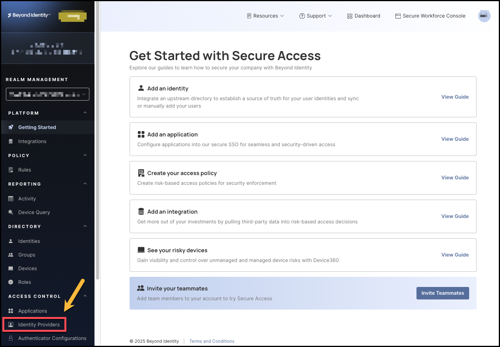
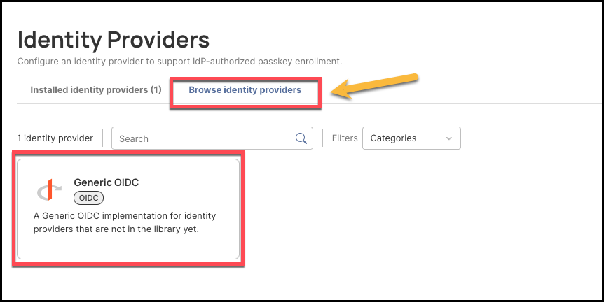
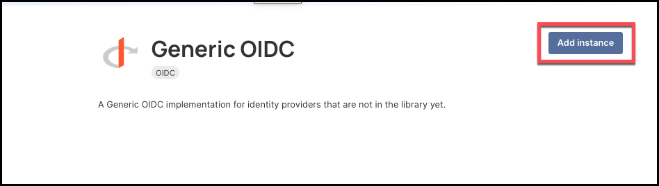
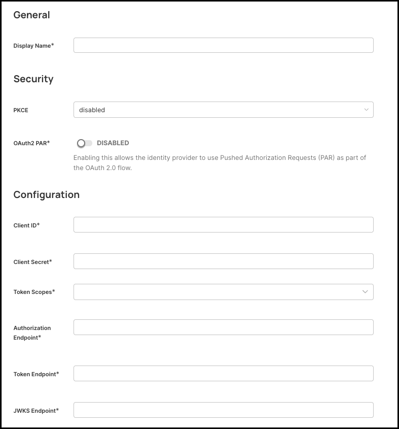
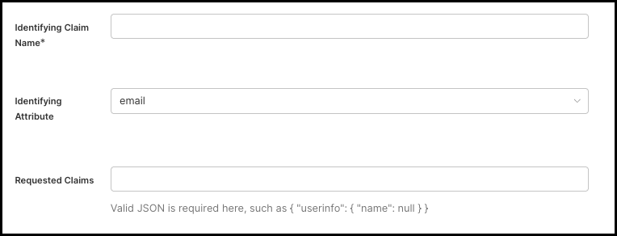
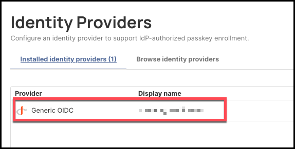

## Configuring Generic OIDC

### Overview
Configuring Generic OIDC in Secure Access establishes a connection to an external OpenID Connect (OIDC) identity provider (IdP). OIDC is an industry-standard identity layer built on OAuth 2.0 that enables Secure Access to verify a user’s identity, retrieve essential profile attributes, and manage authentication flows using ID tokens. By integrating a third-party OIDC IdP, organizations can enable integration with external systems to support IdP-authorized workflows, such as passkey enrollment.

### What You'll Learn
You’ll learn how to configure a Generic OIDC identity provider in the Secure Access Admin Console, including how to establish the connection, map essential settings, and ensure a secure, standards-based authentication flow.

### Steps

1. Log in to your Secure Access tenant.
2. Click **Identity Providers** from the left-hand navigation panel.

    

3. Next, click the **Browse Identity Providers** tab, then select the **Generic OIDC** tile.

    

4. On the next screen, click **Add Instance**.

    

5. Fill in the information for the **General** and **Configuration sections**, including:

- **Display name**: Create a name for this configuration.
- **PKCE**: Determines whether Proof Key for Code Exchange is used. PKCE protects against authorization code interception attacks. Admin choices likely include: `disabled`, `plain`, `S256` (recommended).
- **OAuth2 PAR**: Whether to use OAuth 2.0 Push Authorization Request for the authentication flow. If enabled, you will need to provide the **OAuth2 PAR Endpoint**.
- **Client ID**: This is the unique identifier assigned to your application by the identity provider (IdP). Secure Access uses the Client ID to identify itself when requesting authorization codes or tokens. Where you get it: From your IdP’s app registration / OIDC client setup page.
- **Client Secret**: This is the confidential key associated with your OIDC client, used to authenticate Secure Access to the IdP when exchanging authorization codes for tokens.
- **Token Scopes**: The list of OAuth 2.0/OIDC scopes Secure Access should request during authentication. These scopes determine which claims, permissions, and identity information the IdP returns. Examples: `openid` (mandatory for all OIDC flows), `email`, `profile`, `email`, `phone.`
- **Authorization Endpoint**: The URL where Secure Access redirects users to sign in with your identity provider. Example: `https://{yourIdpDomain}/oauth2/v1/authorize`
- **Token Endpoint**: The URL Secure Access uses to exchange the authorization code for tokens (ID token, access token, refresh token). Example: `https://{yourIdpDomain}/oauth2/v1/token`
- **JWKS Endpoint**: The URL where Secure Access retrieves your IdP’s JSON Web Key Set (JWKS).
These keys allow Secure Access to cryptographically verify the signature of the ID token and ensure it was issued by your IdP. Example: `https://{yourIdpDomain}/.well-known/openid-configuration`
- **Identifying Claim Name**: This is the name of the claim in the ID token that Secure Access will use to uniquely identify the user.
- **Identifying Attribute**: This is a dropdown of attributes Secure Access can match against the user profile inside our system. This determines how the claim above maps to the user record.
- **Requested Claims**: A JSON string of additional OIDC claims that Secure Access should request from the IdP during the authorization flow. For example: `{ "userinfo": { "name": null } }`

    
    

6. When you have entered all the values, click **Save Changes** on the top right side of the page.

    

7. If the new generic OIDC connection was configured correctly, it will display under the **Installed Identity Providers** tab.

    

## Redirect URI

Upon creating a generic OIDC identity provider, the Redirect URI is auto-generated. Be sure to copy this and add it to your identity provider's configuration settings. Redirect URIs must match exactly.

 
 
 
 

