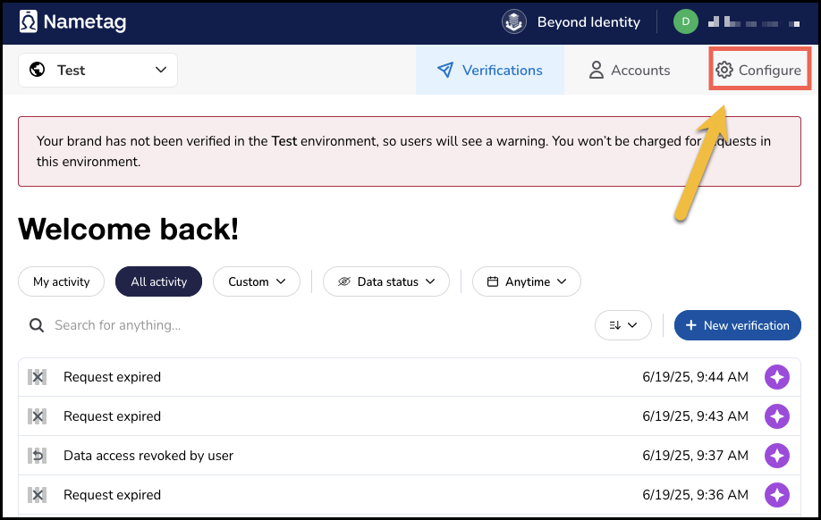
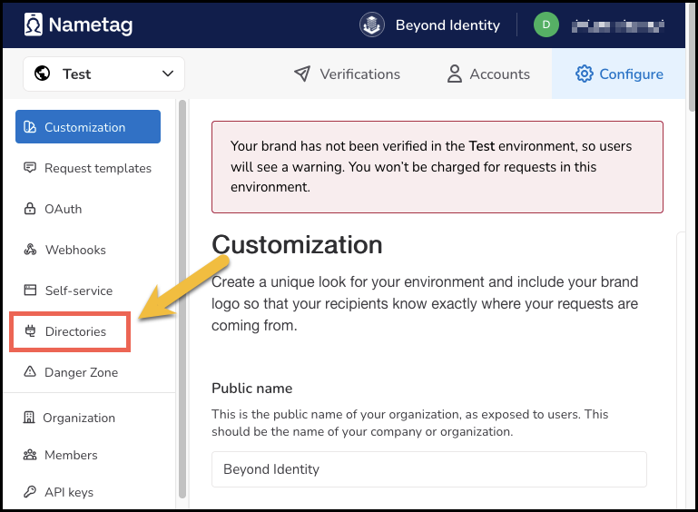
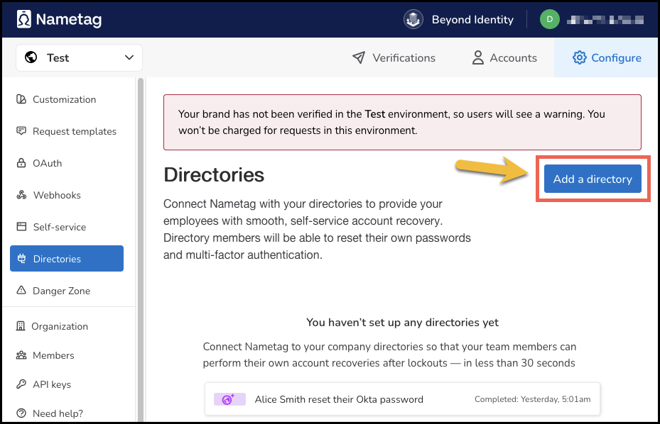
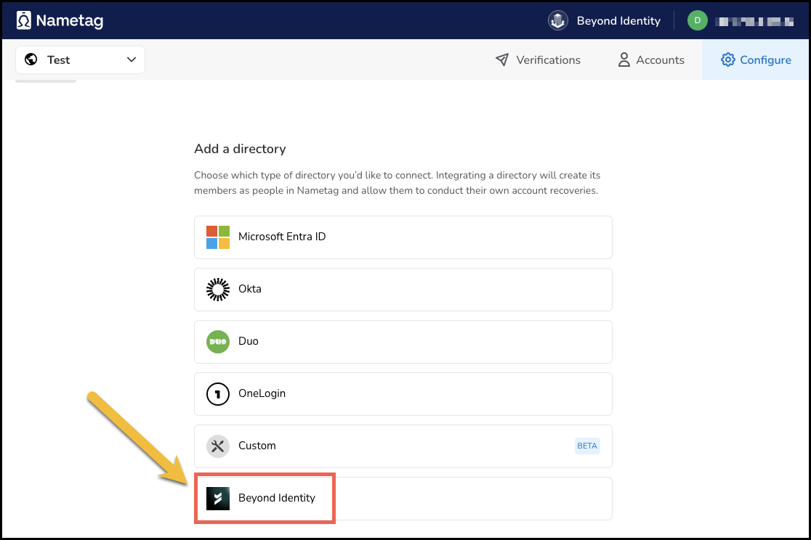
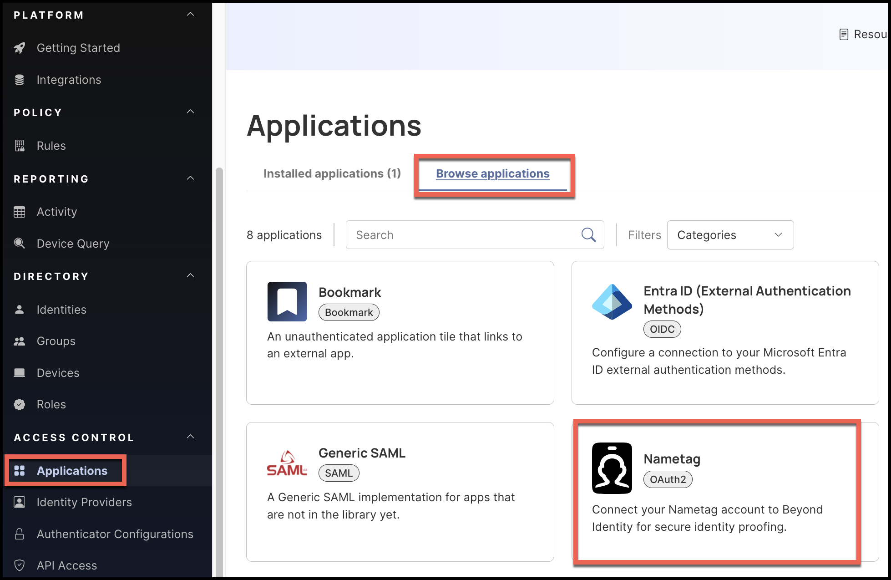
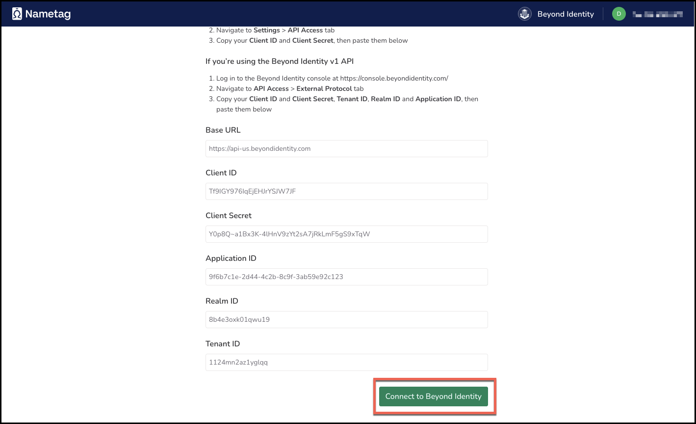
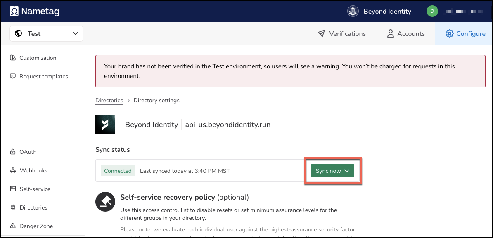
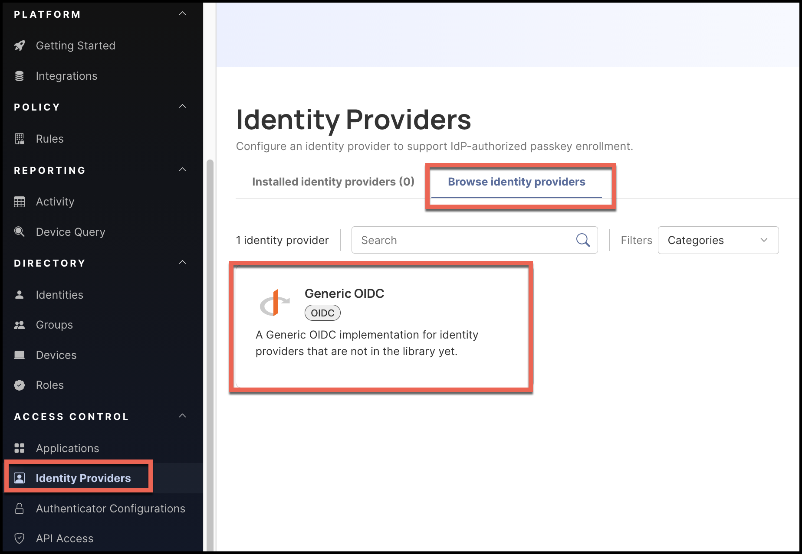
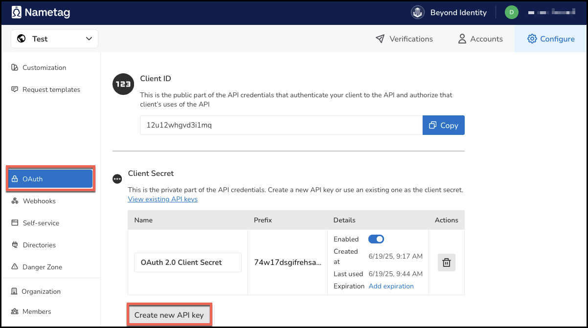

## Overview

Nametag provides verified identity authentication using secure, government-issued ID verification. It helps organizations verify users’ real-world identities quickly and safely, reducing fraud and improving risk while increasing trust in identity assertions.

This integration allows you to:

- Synchronize users from the Beyond Identity Directory into a Nametag tenant.  
- Use Nametag as a **delegate OIDC Identity Provider (IDP)** during enrollment flows that are authorized through another IDP.  

Once configured, users authenticating through your primary IDP can be additionally verified by Nametag during enrollment.

---

### Prerequisites

Before you begin:

- Administrative access to the Nametag Console.  
- Administrative access to the Beyond Identity Admin Console.  
- A working Beyond Identity tenant with Directory enabled.  
- A working Nametag tenant.  

> **Recommended:** Create a separate Nametag test environment before configuring in production.

---

## Part 1 — Directory Synchronization

This section connects Beyond Identity to Nametag so user identities can be shared between systems.

---

### Step 1 — Select the correct Nametag environment  
**Where:** Nametag Console  

1. Confirm you are in the correct Nametag environment (Test or Production).  
2. If needed, create or switch to a dedicated test environment.

### Step 2 — Create a Beyond Identity directory in Nametag  
**Where:** Nametag Console  

1. Navigate to **Configure**.  

    

2. Click **Directories** from the left navigation.  

    

3. Click **Add a directory**.  

    

4. Select **Beyond Identity** from the list.

    

Stay on this page — you will copy values from Beyond Identity into this form in the next steps.

### Step 3 — Add Nametag in Beyond Identity 
**Where:** Beyond Identity Admin Console  

1. Go to **Applications**.  

    

2. Open the **Browse Applications** tab.  
3. Select **Nametag** and add it to your tenant.

Beyond Identity will generate connection details that you will enter into Nametag.

### Step 4 — Map Beyond Identity values into Nametag  
**Where:** Beyond Identity Console 

Enter the following values from Beyond Identity to the new Nametag application:

| Field | Description |
|-------|-------------|
| **Base URL** | API base URL for Beyond Identity |
| **Tenant ID** | Your Beyond Identity tenant ID |
| **Realm ID** | Your Beyond Identity realm ID |
| **Application ID** | Beyond Identity application ID for Nametag |
| **Client ID** | OAuth Client ID issued by Beyond Identity |
| **Client Secret** | OAuth Client Secret issued by Beyond Identity |

Click **Save Changes**.

### Step 5 — Connect and validate synchronization  
**Where:** Nametag Console  

1. Click **Connect to Beyond Identity**.  

    

2. Click **Sync now** and confirm that users from Beyond Identity now appear in Nametag.

    

If synchronization fails, recheck credentials and retry.

### Step 6 — Record the Nametag Directory Client ID  
**Where:** Nametag Console  

Locate and save the **Client ID associated with this directory** — you will need it in Part 2.

## Part 2 — Configure Nametag as a Delegate IDP in Beyond Identity  

This section registers Nametag as a Generic OIDC Identity Provider.

### Step 1 — Add a Generic OIDC Provider  
**Where:** Beyond Identity Admin Console  

1. Go to **Identity Providers**.  
2. Select **Browse identity providers**.  
3. Choose **Generic OIDC**.

    

Enter the following values:

| Setting | Value |
|--------|-------|
| **Display Name** | `Nametag` |
| **Client ID** | *Client ID from Directory Synchronization Step 6* |
| **PKCE** | `disabled` |
| **OAuth 2PAR** | `ENABLE` |
| **PAR Endpoint** | `https://nametag.co/oauth2/par` |
| **Token Endpoint Auth Method** | `client_secret_basic` |
| **Token Scopes** | `openid` |
| **Authorization Endpoint** | `https://nametag.co/oauth2/authorize` |
| **Token Endpoint** | `https://nametag.co/oauth2/token` |
| **JWKS Endpoint** | `https://nametag.co/.well-known/jwks` |
| **Identifying Claim Name** | `account.immutable_external_id` |
| **Identifying Attribute** | `id` |
| **Requested Claims** | `{"id_token":{"account":null}}` |

---

### Step 2 — Create a Nametag API Key (Client Secret)  
**Where:** Nametag Console  

1. Go to **OAuth → Create new API Key**.  

    

2. Generate a new secret.  
3. Copy **only the secret** (do **not** reuse the Client ID).

---

### Step 3 — Enter the secret in Beyond Identity  
**Where:** Beyond Identity Admin Console  

1. Paste the Nametag secret into the **Client Secret** field.  
2. Click **Save Changes**.

Beyond Identity will generate a Redirect URI for this provider.

---

### Step 4 — Register the Redirect URI in Nametag  

1. Copy the Redirect URI from Beyond Identity.  
2. In the Nametag Console, go to **OAuth settings**.  
3. Add this Redirect URI as an **Authorized Callback URL**.  
4. Save changes.

---

## Final State

After completing these steps:

- Users are synchronized from Beyond Identity into Nametag.  
- Nametag is registered as a delegate OIDC Identity Provider.  
- You can now design enrollment flows that require Nametag verification after authentication with another IDP.

🎉 You are ready to use Nametag as part of your identity proofing workflow.
