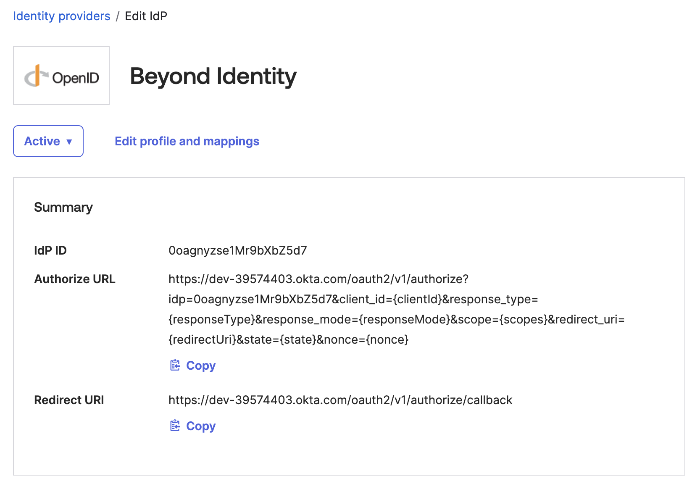
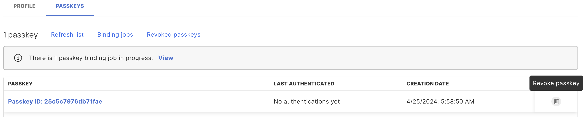

import Arcade, {Clip} from '@site/src/components/Arcade.tsx';

This guide is designed to offer step-by-step instructions to integrate Beyond Identity with your Okta environment, and to enable your end users to authenticate with phishing resistant, passwordless authentication. Specifically, you will learn how to:

- Configure Beyond Identity as the primary phishing-resistant, passwordless authentication method for your Okta environment.
- Configure Okta to delegate authentication to Beyond Identity to enhance security and the user experience.

## Prerequisites

To ensure a smooth integration process, please confirm the availability of the following prerequisites and settings within your Okta account.

### Create an Okta Account

This guide assume you already have an Okta account provisioned. If you need to create one, [Click here](https://developer.okta.com/signup/).

### Okta Account Access

Ensure you have either **Super Admin** or **Organization Admin** privileges.

    

Why is this required?

    
Having <strong>Super Admin</strong> or <strong>Organization Admin</strong> privileges enables you to:

    <ul>
        <li>Add or edit attributes and their mappings via <code>Directory &gt; Profile Editor</code>.</li>
        <li>Add or edit Identity Providers (IdPs) through <code>Security &gt; Identity Providers</code>.</li>
        <li>Add or edit routing rules in <code>Security &gt; Identity Providers &gt; Routing Rules</code>.</li>
    </ul>

### Okta Feature Verification

Confirm that the following features are active on your account:

    

OpenID Connect IdP

    
Verify this by checking if you can navigate to <code>Security &gt; Identity provider &gt; Add Identity Provider &gt; Add OpenID Connect IdP</code>. If this option is unavailable, you will need to contact Okta support to enable it.

    

Routing Rules

    
Ensure the "Routing Rules" tab is visible under <code>Security &gt; Identity Providers</code>. If it is missing, contact Okta support to request its activation on the Identity Provider page.

### 🔵 Create a Beyond Identity Account

To create a Beyond Identity account, please [click here](https://www.beyondidentity.com/products/secure-workforce).

---

### Legend
In the following sections, a color-coded indicator has been added to a heading to help identify whether the steps should be performed using Beyond Identity or a different application.

🔵 **Beyond Identity:** Actions to be performed in the Beyond Identity platform are highlighted in blue.

🟠 **Okta:** Actions to be performed in the Okta platform are highlighted in orange.

---

## 1. Create a Custom Attribute

### 🟠 Create Custom Attribute in Okta User Profile

To enable Okta to automatically direct users registered with Beyond Identity towards a passwordless authentication flow, create a custom attribute named "byndidRegistered" on an Okta User's profile.

<Arcade clip={Clip.OktaIntegrationGuideCreateByndidRegisteredAttribute} />

### 🟠 Update Custom Attribute in Okta User Profile

Once you've created the "byndidRegistered" attribute, update the profile source to inherit from Okta.

<Arcade clip={Clip.OktaIntegrationGuideUpdateByndidRegisteredAttribute} />

---

## 2. Configure your Okta Identity Provider

### 🔵 Create an Identity Provider in Beyond Identity

Enable Okta to use Beyond Identity for authentication by setting it up as an identity provider. This is achieved by creating an identity provider within the Beyond Identity Admin Console. Follow the steps here to create a <a href="/docs/auth-and-sso/protect-your-sso/generic-oidc" target="_blank">generic OIDC Identity Provider</a>. Return to this guide once you've created a generic OIDC Identity Provider in Beyond Identity.

### 🟠 Create an Identity Provider in Okta

Create an OpenID Connect Identity Provider in Okta.

<Arcade clip={Clip.OktaIntegrationGuideCreateOktaIdp} />

### 🟠 Configure the Identity Provider in Okta

Configure the OpenID Connect Identity Provider in Okta with the following values and click finish to save the Idp:

| Field                   | Expected Value                                             |
|-------------------------|------------------------------------------------------------|
| Name                    | Beyond Identity                                            |
| IdP Usage               | SSO only                                                   |
| Scopes                  | email openid                                               |
| Client ID               | Copy over from important values in the Beyond Identity IdP |
| Client Secret           | Copy over from important values in the Beyond Identity IdP |
| Issuer                  | Copy over from important values in the Beyond Identity IdP |
| Authorization endpoint  | Copy over from important values in the Beyond Identity IdP |
| Token endpoint          | Copy over from important values in the Beyond Identity IdP |
| JWKS endpoint           | Copy over from important values in the Beyond Identity IdP |
| IdP username            | idpuser.email                                               |
| Match against           | Okta Username                                               |
| Account Link Policy     | Automatic                                                   |
| Auto-Link Restrictions  | None                                                        |

  

Upon creating the Identity Provider in Okta, copy the redirect URI:

### 🔵 Configure the Identity Provider in Beyond Identity

Head back to the identity provider you already created by navigating to **Auth & SSO > Identity Providers** and clicking on the identity provider. Copy the redirect URI from the Identity Provider in Okta into the redirect URI fields in Beyond Identity.

### 🟠 Configure IdP Routing Rules

Configure your Identity Provider routing rules in Okta to enable redirection to Beyond Identity when the `byndidRegistered` user attribute is set to `true`. To create a new routing rule, navigate to **Security > Identity Providers** and click on the **Routing Rules** tab.

<Arcade clip={Clip.OktaIntegrationGuideRoutingRuleConfiguration} />

---

## 🔵 3. Add Users to Beyond Identity's Directory

### Option 1: Add Identities Manually

In order to manually add identities directly to Beyond Identity:
1. Go to **Directory > Identities > Add identity > Manual Entry**
2. Enter the name, username, and email of the new user.
3. Click **Add Identity**.

### Option 2: Enable Using SCIM

In order to enable user syncing between Okta and Beyond Identity, <a href="/docs/directory/directory-integrations/okta" target="_blank">follow the guide here</a>. Return to this guide once you've enabled user syncing between Okta and Beyond Identity.

---

## 🔵 4. Send Passkey Enrollments

### Option 1: Email

1. Go to **Directory > Identities**.
2. Click on **Add a Passkey**.
3. Set delivery method to **Send an email to user**.
4. Click on **Proceed & send email**.

### Option 2: API

1. Go to **Directory > Identities**.
2. Click on **Add a Passkey**.
3. Set delivery method to **Generate curl for link from the API**.
4. Click on **Generate curl**.
5. Execute the curl request using the terminal.
6. Send the `credential_binding_link` from the response to your employees using any delivery method.

See the <a href="https://docs.beyondidentity.com/api/v1#tag/Credential-Binding-Jobs/operation/CreateCredentialBindingJob" target="_blank">API here</a> for more details.

## 5. Managing User Access

### 🔵 Disable Beyond Identity Authentication

To disable Beyond Identity authentication for a specific user:

1. Navigate to **Directory > Identities**.
2. Click on the Identity you want to disable.
3. Select the **Passkeys** tab.
4. Click on **Revoke Passkey**.

---