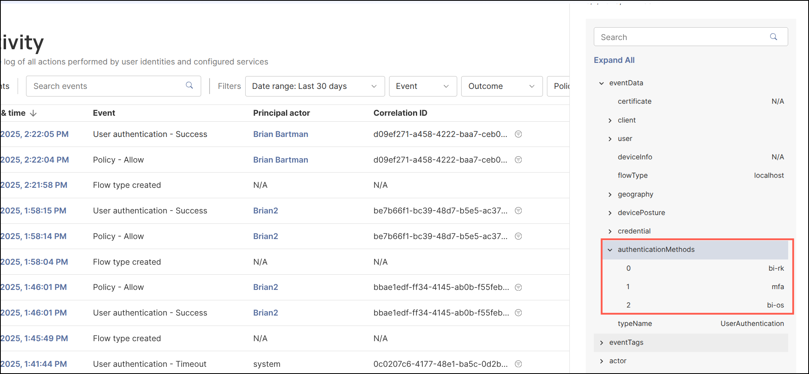

## SAML Authentication Methods Overview

***This feature is only available with Authenticator versions 2.108.0 or higher.***
 

### Overview
The **SAML Authentication Methods** feature enriches each **SAML response** in the Secure Access admin console with concise information about *how* a user authenticated.

This metadata gives identity providers and relying parties visibility into authentication strength and context, enabling better **policy decisions**, **auditing**, and **adaptive security**.

---

### Benefits

- The feature aligns with Beyond Identity’s model of **flows**, **factors**, and **methods**.
- It enables downstream systems to **reason about authentication strength**.
- It lays groundwork for **risk-based and adaptive authentication policies** in SAML integrations.

---

### What It Does

When a user authenticates through a **SAML transaction**, the system collects indicators describing the **authentication methods** used during that session.

These indicators are inserted into the SAML response under a new **authentication_methods** field.

This data includes:

- Whether authentication used biometrics, PIN, a hardware/software key, or a roaming authenticator.
- Whether authentication was local or delegated to a trusted device.
- Whether additional evidence such as device posture, geolocation, or risk signals influenced the policy decision.

This information is **non-sensitive** and **privacy-preserving**, while still giving relying parties meaningful context about authentication strength.

---

### Why It Matters

Previously, SAML transactions did not expose authentication detail beyond basic result status.

With this enhancement, admins and connected systems can now:

- **Enforce adaptive policies**  
  Example: reject logins using a simple PIN when biometrics were available.

- **Strengthen compliance visibility**  
  Systems can record which factor type (biometric, possession, knowledge) was used.

- **Integrate with risk engines**  
  Assign varying trust levels based on authentication strength or device posture.

- **Support auditing**  
  Provides richer data for forensic and compliance reporting.

---

### Relationship to Authentication Concepts

### Authentication Flows
Describe the *interaction path* used to complete authentication:

- **Platform authentication:** user verifies locally on device.
- **Roaming authentication:** authentication occurs on a trusted secondary device.
- **Layered authentication:** fallback to roaming when local authentication fails.

---

#### Authentication Factors
Represent the *type of evidence* proving identity:

- **Knowledge:** PIN or password  
- **Possession:** registered device or hardware key  
- **Inherence:** fingerprint or facial ID  
- Optional contextual signals: **location**, **behavioral** patterns  

---

#### Authentication Methods
Identify the *specific mechanism* providing one or more factors.

#### Method Reference Table

| **Method** | **Description** | **Factor** |
|---|---|---|
| **bi-bio** | Biometric verification (fingerprint, facial recognition) | Inherence |
| **pin** | PIN or pattern verification | Knowledge |
| **hwk** | Hardware-secured key | Possession |
| **swk** | Software-secured key | Possession |
| **bi-roam** | Roaming authenticator used (trusted device) | Possession |
| **bi-os** | User’s OS verification completed | Possession |
| **mfa** | Combined multi-factor authentication | Multiple |

These values align to **RFC 8176**, extended with platform-specific method codes.

---

### How It Works

1. User authenticates through platform, roaming, or layered method.
2. Platform Authenticator collects metadata—method, factor type, context.
3. Data is embedded into the SAML response.
4. Relying party parses it to determine authentication strength.

---

### Where It Appears

- Policy Events now include an **authentication_methods** field.
- Authentication Events reflect detected methods.
- Example values may appear in the **Activity** logs section as:  "authentication_methods": ["hwk", "bio", "bi-roam"]

    

### Use Cases

- **Policy enforcement**  
  Require biometrics when available; fallback to roaming otherwise.

- **Audit logging**  
  Review which factor types are occurring across an organization.

- **Security analytics**  
  Integrate event logs with SIEM or analytic systems for risk-based scoring.

