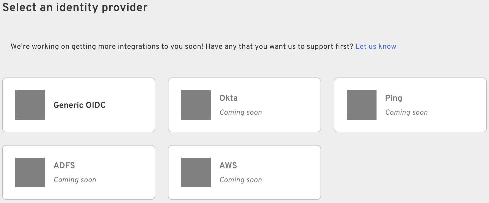

Identity Providers allow you to configure authentication using single device MFA. This is essential for enabling your SSO to use Beyond Identity for Authentication.

## Navigate to External SSO

To access the Identity Provider settings, navigate to **Auth & SSO > External SSO**. Here you can add and configure a new identity provider.

## Add an Identity Provider

To begin adding an identity provider, click on **Add Identity Provider**. You will be presented with a few options:

The following identity providers are currently available:

- [Generic OIDC](/docs/auth-and-sso/external-sso/generic-oidc)
