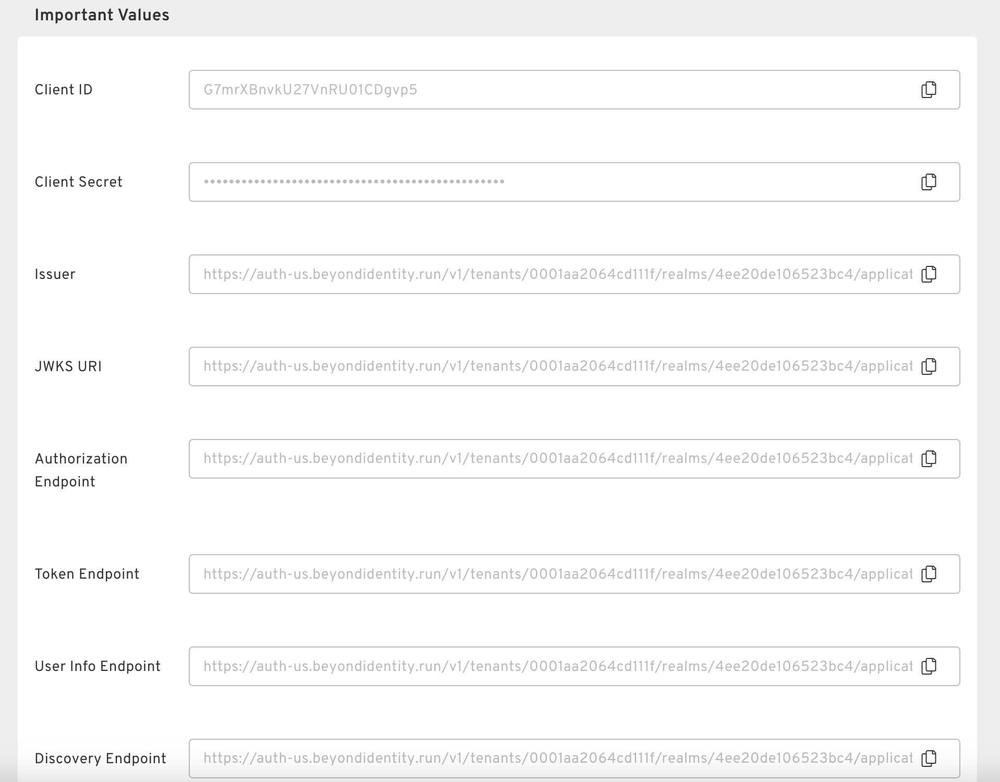

import Arcade, {Clip} from '@site/src/components/Arcade.tsx';

## Create a Generic OIDC Identity Provider

<Arcade clip={Clip.OktaIntegrationGuideCreateBeyondIdentityIdp} />

:::info

Notice the important values section at the bottom of the Identity Provider creation screen. You will need to copy a few of these URLs over to the application/SSO you are configuring.

  

:::

## Fill in the Redirect URI

Upon creating a generic OIDC identity provider, you'll be required to fill in the redirect URI to ensure that the identity provider is operational. Instructions for this vary depending on the SSO you are integrating with.
