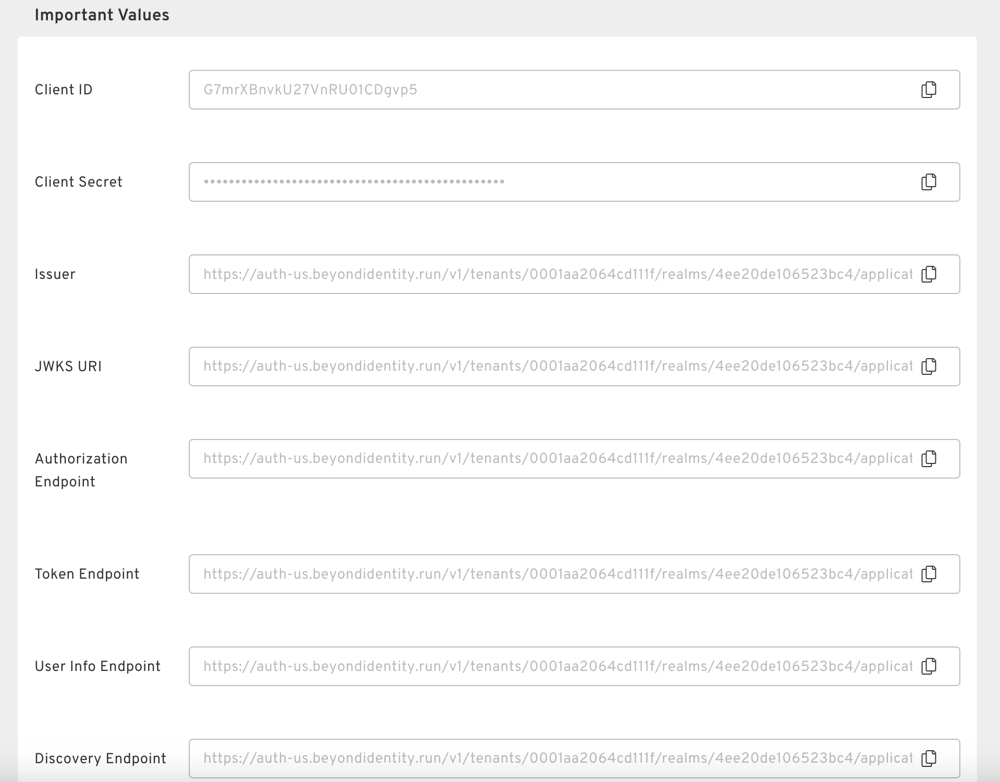

import Arcade, {Clip} from '@site/src/components/Arcade.tsx';

This guide is designed to offer step-by-step instructions to integrate Beyond Identity with your Okta environment, enabling a passwordless authentication solution. Specifically, you will learn how to:

- Configure Beyond Identity as the primary passwordless authentication method for your Okta environment.
- Establish Okta to recognize Beyond Identity as an Identity Provider, enhancing security and the user experience.

---

### 🔵 **Beyond Identity**

Actions to be performed in the Beyond Identity platform are highlighted in blue.

### 🟠 **Okta**

Actions to be performed in the Okta platform are highlighted in orange.

---

## Prerequisites

To ensure a smooth integration process, please confirm the availability of the following prerequisites and settings within your Okta account.

### 🟠 Create an Okta Account

This guide assume you already have an Okta account provisioned. If you need to create one, [Click here](https://developer.okta.com/signup/).

### 🟠 Okta Account Access

Ensure you have either **Super Admin** or **Organization Admin** privileges.

    

Why is this required?

    
Having <strong>Super Admin</strong> or <strong>Organization Admin</strong> privileges enables you to:

    <ul>
        <li>Add or edit attributes and their mappings via <code>Directory &gt; Profile Editor</code>.</li>
        <li>Add or edit Identity Providers (IdPs) through <code>Security &gt; Identity Providers</code>.</li>
        <li>Add or edit routing rules in <code>Security &gt; Identity Providers &gt; Routing Rules</code>.</li>
    </ul>

### 🟠 Okta Feature Verification

Confirm that the following features are active on your account:

    

OpenID Connect IdP

    
Verify this by checking if you can navigate to <code>Security &gt; Identity provider &gt; Add Identity Provider &gt; Add OpenID Connect IdP</code>. If this option is unavailable, you will need to contact Okta support to enable it.

    

Routing Rules

    
Ensure the "Routing Rules" tab is visible under <code>Security &gt; Identity Providers</code>. If it is missing, contact Okta support to request its activation on the Identity Provider page.

### 🔵 Create a Beyond Identity Account

To create a Beyond Identity account, please [click here](https://www.beyondidentity.com/products/secure-workforce).

---

## 1. Enable User Syncing between Okta and Beyond Identity

### 🟠 Update User Profile Attributes

To enable Okta to automatically direct users registered with Beyond Identity towards a passwordless authentication flow, define a custom attribute named "byndidRegistered" on an Okta User's profile.

<Arcade clip={Clip.OktaIntegrationGuideCreateByndidRegisteredAttribute} />

Once you've created the "byndidRegistered" attribute, update the profile source to inherit from Okta.

<Arcade clip={Clip.OktaIntegrationGuideUpdateByndidRegisteredAttribute} />

### 🟠 Create a Beyond Identity Group

To enable specific users to authenticate passwordlessly with Beyond Identity, you shold create a group and include those users in it.

<Arcade clip={Clip.OktaIntegrationGuideGroupCreation} />

### 🟠 Generate an API Token

To successfully integrate Beyond Identity with Okta, the first step involves registering a credential on the user's device. Following this successful registration, Beyond Identity must notify Okta that the user is now equipped to authenticate using Beyond Identity. This notification is facilitated through the `byndidRegistered` attribute, which you would have configured previously. It is necessary for Beyond Identity to possess an Okta API token in order to communicate the update to Okta.

<Arcade clip={Clip.OktaIntegrationGuideAPITokenGeneration} />

### 🔵 Create a Directory Integration
- Go to directory integrations -> Add Directory -> Okta
- Enter your Okta API token where requested
- Select bearer token for SCIM -> click save
- Keep the bearer token handy

TODO: Add arcade here

### 🟠 Synchronize Users via SCIM
- In Okta Set up a SCIM application
- Paste in SCIM information (bearer token) from BI directory integration

TODO: Add arcade here

---

## 2. Enable Authentication Using Beyond Identity

### 🔵 Create an Identity Provider in Beyond Identity

Enable Okta to use Beyond Identity for authentication by setting it up as an identity provider. This is achieved by creating an identity provider within the Beyond Identity Admin Console. After creating the identity provider, the status will display `Not Installed`. This indicates that you will need to revisit this section to enter a redirect URI once you have set up an identity provider in Okta.

<Arcade clip={Clip.OktaIntegrationGuideCreateBeyondIdentityIdp} />

:::info

Notice the important values section at the bottom of the Identity Provider creation screen. You will need to copy a few of these URLs over to Okta in a later section.

  

:::

### 🟠 Create an Identity Provider in Okta

Create an OpenID Connect Identity Provider in Okta.

<Arcade clip={Clip.OktaIntegrationGuideCreateOktaIdp} />

### 🟠 Configure the Identity Provider in Okta

Configure the OpenID Connect Identity Provider in Okta with the following values and click finish to save the Idp:

| Field                   | Expected Value                                             |
|-------------------------|------------------------------------------------------------|
| Name                    | Beyond Identity                                            |
| IdP Usage               | SSO only                                                   |
| Scopes                  | email openid                                               |
| Client ID               | Copy over from important values in the Beyond Identity IdP |
| Client Secret           | Copy over from important values in the Beyond Identity IdP |
| Issuer                  | Copy over from important values in the Beyond Identity IdP |
| Authorization endpoint  | Copy over from important values in the Beyond Identity IdP |
| Token endpoint          | Copy over from important values in the Beyond Identity IdP |
| JWKS endpoint           | Copy over from important values in the Beyond Identity IdP |
| IdP username            | idpuser.email                                               |
| Match against           | Okta Username                                               |
| Account Link Policy     | Automatic                                                   |
| Auto-Link Restrictions  | None                                                        |

### 🔵 Configure the Identity Provider in Beyond Identity
- Copy redirect uri from Okta into Beyond Identity

---

## 3. Enroll Users

### 🟠 Add Users to the Beyond Identity Group
- Suggestion: Start with a small group
- Add user to Beyond Identity Group

TODO: Add arcade here

### 🔵 Provision Newly Added Users
- Select identity that was just added
- Add Passkey -> send email
- Once user enrolls, have them sign into their Okta instance

TODO: Add arcade here

---

## 4. Managing User Access

### 🟠 Disable Beyond Identity Authentication
- Remove user from "Beyond Identity" group in Okta

TODO: Add arcade here

---
