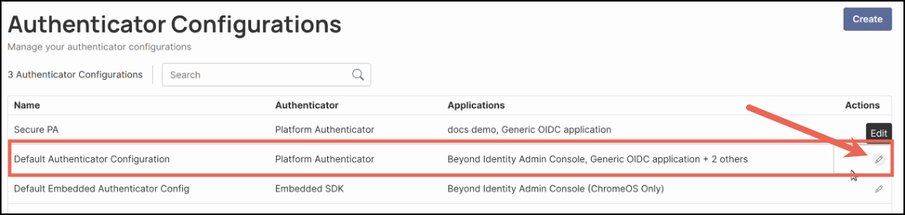
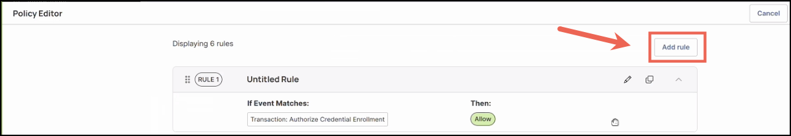

### Overview

Roaming authentication allows users to authenticate from a different device that has the Beyond Identity Authenticator installed and a valid credential on it. This feature provides flexibility for users who need to sign in from workstations or environments that aren’t their own, while maintaining control and security at the tenant and policy levels.

There are three primary use cases for roaming authentication:

1. **Enable roaming authentication for all users in the tenant**  
   Makes roaming authentication available to every user in the tenant.

2. **Restrict roaming authentication by group or IP range**  
   Limits roaming authentication to specific user groups or IP addresses/ranges. This is recommended when you want to minimize exposure, as roaming authentication is less secure than device-bound authentication.

3. **Support kiosks or shared desktops**  
   Allows users to authenticate on shared systems or kiosks that do not have a Beyond Identity credential installed. Users can authenticate using the credential stored on a mobile device to gain access to desktop or web applications.

Each tenant has a roaming authentication configuration that applies to all authentication flows for that tenant’s users, including OIDC, SAML, and WS-Fed.

When roaming authentication is enabled, end users will be prompted with a QR code during login. They can scan this QR code using the Beyond Identity Authenticator on another device that already holds their valid credential. This flow allows them to securely verify their identity and complete the authentication process even when signing in from a new or shared workstation.

    

Additionally, roaming authentication is governed by policy rules, which serve as the final layer of enforcement. Writing precise and well-scoped policies is essential for both usability and security. Policies determine when and how roaming authentication is permitted, ensuring access is limited to trusted users, devices, and network contexts. Without proper policy alignment, roaming authentication could unintentionally allow access from untrusted environments.

Configuration enables the flow, but policy governs who can actually use it. To ensure a secure implementation, administrators should verify that roaming authentication is enabled in configuration and explicitly allowed in policy, with appropriate conditions such as group membership, IP restrictions, and risk signals. Policy rules ultimately determine whether a roaming authentication attempt succeeds or fails, making them critical to both the feature’s functionality and its overall security posture.

---

## What You’ll Learn

By the end of this guide, you will be able to:

- Configure roaming authentication in the Secure Access Console for:
  - All users in the realm, or
  - Specific users and user groups
- Write and apply policy rules that control when roaming authentication is permitted, influencing both the user experience and security posture.
- View and monitor authentication events to identify when users log in using roaming authentication, helping you validate configuration and audit activity.

> **Important:** To successfully enable roaming authentication, two components must be configured:
>
> 1. The Platform Authenticator configuration  
> 2. The Policy Rule governing access and security

---

## Prerequisites

Before you begin, ensure you have the following:

1. A Secure Access tenant – Roaming authentication is configured at the tenant level.  
2. Administrator access to the Secure Access console.  
3. User groups created in the Directory for those who will have access to roaming authentication (if not enabling it for all users).  
4. Users added to the Directory who will be selected to use roaming authentication.  
5. Familiarity with writing Policy Rules in the Secure Access console, as policies determine when and how roaming authentication is allowed.

---

## Part I: Configuring the Platform Authenticator

### Steps

1. Log in to your Secure Access tenant.  
2. On the left-hand navigation panel, click **Authenticator Configurations**.  

    

You’ll see two default configurations:

- **Default Authenticator Configuration** – controls the Platform Authenticator.  
- **Default Embedded Authenticator Configuration** – used by the embedded SDK.

    

> **Note:** Every new application created in Secure Access automatically receives a Default Authenticator Configuration.
>
> - This configuration can be reassigned for most applications.  
> - Managed applications (such as the Admin Console) will always use the Default Platform Authenticator, and ChromeOS will always use Default Embedded.

3. To configure roaming authentication, click the ✏️ (pencil) icon under the **Actions** column for **Default Authenticator Configuration**.  

    

> **Note:** The Authenticator Configuration determines whether a QR code will be shown during login. It does not control access to underlying resources — that access is ultimately governed by policy rules.

4. Next, you will need to enter and configure the following values:

| **Field** | **Description** |
| --- | --- |
| **Name** | Enter a name for the configuration, or keep the default. |
| **Authenticator** | The Platform Authenticator will already be preselected. |
| **Assigned Applications** | The Beyond Identity Admin Console and default applications (such as Generic OIDC Application) will already be selected. You can add additional applications that have already been created. |
| **Used For** | Ensure both of the following options are checked: - Local Authentication (default option) - Roaming Authentication (required to enable the feature) |
| **Allowed Groups** | By default, **All Groups** is selected, allowing every group in your Directory to use roaming authentication. To limit access, click the field and select specific groups.  **Note:** When groups or identities are assigned, those checks are based on the `login_hint` value, if provided. This field serves only as a hint — at this stage, there’s no guarantee that the username or email entered matches the identity attempting authentication. |
| **Allowed Users** | By default, all users in your Directory can use roaming authentication. To limit access, click the field and select specific users.  **Note:** The same behavior applies as with **Allowed Groups** — the check is based on the `login_hint` value and is not yet tied to a verified identity. |
| **Allowed IPs** | By default, **All IPs** is selected. To restrict access, select one of the other options and specify valid IP addresses or ranges. Accepted formats include: • A single IP (e.g., 192.168.0.3 or 2001:db8::68) • A CIDR block (e.g., 192.0.2.0/24 or 2001:db8::/32) • An IP range (e.g., 192.168.0.1–192.168.0.5)  **Notes:** - IPv4 and IPv6 are both supported. - Ranges must use the same format (IPv4 or IPv6). - Ranges are inclusive and must be defined from lowest to highest value. |

---

### Example Configuration

        

> **Note:** Each application can have one Authenticator Configuration assigned (with the exception of OAuth2 Client Credential applications). However, a single Authenticator Configuration can be linked to multiple applications.

5. After configuring all values, click **Save**.

⚠️ **Important:** You are not done yet!  
Roaming authentication will not be secure to use until you complete **Part II: Writing Policy Rules for Roaming Authentication.**

---

## Part II: Writing Policy Rules for Roaming Authentication

Configure clear and precise policy rules to ensure your organization stays secure. Roaming authentication security depends on how well these rules are defined and enforced.

Access control for roaming authentication is enforced through Policy Rules. In the **Transaction → Authentication** section of the Policy Editor, select **Roaming (2nd device)** to create rules that evaluate authentication attempts made from a roaming device.

### Steps

1. On the left-hand navigation, click **Rules**.  

    

2. Click **Edit** in the top right corner.  

    

3. In the Policy Editor window, click **Add Rule**.  

    

4. Enter and select the following values:

| **Field** | **Description** |
| ---------- | ---------------- |
| **Rule name (optional)** | Though optional, it’s a best practice that your rules have a name. For example: “Roaming Authentication Policy.” |
| **Description (optional)** | It’s also a best practice to provide a description to your rules. For example: “This rule sets policy for the roaming authentication feature.” |
| **Rule Definition** | Click **Add Attribute**, then select:  For any transaction, select **Authentication**. Using, select **Authentication Method**, then **Roaming (2nd Device)**. |

    

All roaming authentication attempts will be evaluated against the new rule you created.

Be sure to configure the rule with additional key attributes that define who can log in and the device posture requirements. [Click here for more information on the different attributes.](https://docs.beyondidentity.com/docs/policy/rules)

5. Click **Save**.

---

## Monitoring Roaming Authentication Activity

All login activity performed through roaming authentication is available in the admin console. These logs help you monitor access, troubleshoot issues, and gain insights into user behavior.

### Steps

1. To access activity logs, click **Activity** on the left-hand navigation panel.  

    

2. Click a **User authentication log event** in the table to open its details.  
3. In the right-hand panel, expand `eventData` — the `flowType` attribute will display `roaming_auth`.

    

You can also apply filters and use `roaming_auth` as a keyword to refine your search results.

Regularly reviewing authentication logs helps detect unusual patterns, verify policy enforcement, and maintain strong login security.

 
 
 

