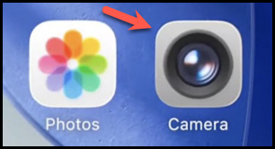
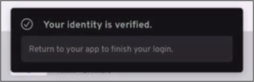

## Overview
### What is Roaming Authentication

Roaming authentication allows end users to securely authenticate on a device that does not have their passkey installed. This method is especially useful in situations where they need to access resources in shared workstations, kiosks, or virtual desktops, and provides a phishing-resistant way to access resources when a user’s primary device is unavailable, broken, or lost.

 
---

### What You'll Learn

In this article, you’ll learn how to use a mobile device with the Beyond Identity Authenticator to securely log in to a resource from a device that doesn’t have your passkey setup, using a QR code.

 
---

### Prerequisites

1. Roaming authentication requires that you already have a passkey set up on your mobile device using the Beyond Identity Platform Authenticator. If you don't have this yet, your IT administrator will need to send you an email invitation with instructions to download the Authenticator and complete the passkey setup.

2. Access to a secondary device (not your primary one) that you want to log in to.

 
---

### Steps

:::info
The following steps show screenshots from an iOS device, but the process is similar on Android.

:::

1. On your mobile device with the Beyond Identity Authenticator already installed and passkey set up, open the **Camera** app.

    

 
2. Next, point the camera at the QR code displayed on the device you’re trying to log in to. Then, tap **Open in [your default browser name]**.

 
3. When prompted with the message, **This site is trying to open another application**, tap **Allow**.

 
4. Tap **Open** when you see, **[Your default browser name] wants to open Beyond Identity.**

 

The Beyond Identity Platform Authenticator will authenticate you to use the device.

 
5. Tap **Yes, log me in** to confirm your OS, browser, and nearest location.

 
6. If authentication is successful, a banner will appear on your mobile device stating: **Your identity is verified. Return to your app to finish your login.**

    

    You can now use the device you were trying to log in to. 

:::info
If you're unable to log in to the secondary device after multiple attempts, please contact your IT administrator for assistance.

:::

 
 