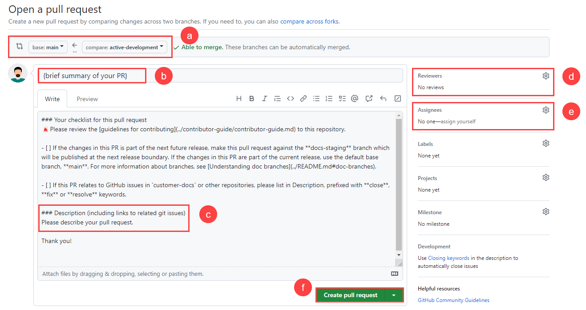

<!-- Reference links -->
[style-guide]: ./style-guide.md
[markdown]: ./markdown-reference.md
[contributor]: ./contribute.md
[site]: https://docs.beyondidentity.com/
[issues]: https://github.com/gobeyondidentity/customer-docs/issues
[repo]: https://github.com/gobeyondidentity/customer-docs
[pr]: https://github.com/gobeyondidentity/customer-docs/pulls
[enhancements]: https://github.com/gobeyondidentity/customer-docs/issues/new?assignees=&labels=%F0%9F%8C%9F+enhancement&projects=&template=enhancement.yml
[get-started]: ./get-started.md

Now you're ready to create and submit a pull request to have your changes or additions reviewed. This is where the collaboration begins. You may get feedback requesting changes. 

At a high level, after the assigned reviewer reviews the content for technically accurate, they hand it off (add `#sign-off` in the comments of the PR) to the Technical Writer. If the Sr. Technical Writer has a question regarding the clarity of something, this is where the collaboration begins. After the review, the Technical Writer will `#sign-off` on the PR and merge it. For more details, see [Content development process](./create-pull-request#content-development-process).

## Create a Pull Request

👉 Make sure to follow the [Pull request guidelines](#pull-request-guidelines).

1. Go to the main page of the repo, and in the yellow banner, click **Compare & pull request** to create a pull request for the associated branch.   

   

1. In the Open a pull request window, do the following:

   1. Select the branch.  

     :::note important  
     Always open all pull requests against the `main` branch unless it's for the upcoming next release. In that case, the PR should be opened against the `docs-staging` branch. In our example below, the branch that you are currently in is `active-development` and you want to merge it into the `main` branch.
     :::

   1. Ensure that the summary title is short but descriptive. If it is associated with a JIRA ticket, append it to the beginning in brackets, for example, **[MD-111] mac desktop login**. 

   1. Describe your changes. For more details, see [PR descriptions](./create-pull-request#pr-descriptions).

   1. In the **Reviewers** section, in the right panel, click the cog icon and select designated reviewers—for example, another PM, a developer, and the technical writer. 

   1. Assign the PR to a specific reviewer if they are the main reviewer.  

   1. Select **Create pull request**.  

     :::tip
     If the pull request is a **work in progress** and not ready to be reviewed, select the **[Create draft pull request](https://github.blog/2019-02-14-introducing-draft-pull-requests/#tag-your-work-in-progress)**. The difference is that the reviewers only get notified when the PR is *Open* rather than *Draft*.
     :::

   

That's it! Team members will review your PR and merge it when approved. You may get feedback requesting changes.

## Pull request guidelines

We ask that contributors submit a pull request with your changes. Here are our expectations for pull requests. Following them will expedite the process of merging and publishing your content.

A few things to keep in mind when creating your pull request:

| If | Then |
| --- | --- |
| PR relates to issues you found in the docs  | Add **inaccurate**, **typo**, or **missing information** keywords in the description and use the default base branch, **main**.  |
| PR relates to GitHub issues you've addressed for `customer-docs`  | Provide links to related GitHub issues and use the default base branch, **main**.  |
|  PR is part of the current release | Use the default base branch, **main**.  |
| PR is part of the next future release  | Make it against the **docs-staging** branch.  |
|  PR is part of front-end or back-end development | Make it against the **active-development** branch.  |

## Content development process

The ownership of the PR is on the person who creates the PR. The author's responsibility is to review and approve it for technical accuracy before submitting the PR. The Technical Writer's responsible for copyediting and ensuring consistency across the customer-facing documentation.

What's common in tech companies (software companies in particular) is that the SME/author of the content will consult with the Sr. Technical Writer to understand better where the content fits in the sidebar (left nav). During the conversation, they'll determine where the content fits. They'll also want to know: 

- What's the topic type? Reference, concept, how-to? In some cases, it can be a combination.

- Can it be added to an existing topic to clarify topics?  

- Does the content stand-alone, like a how-to, overview, or reference topic?  

You can still use the Sr. Technical Writer's help between the initial consult and the Pull Request. You absolutely can and should if guidance is needed. Often, engineers will continue collaborating with them even before they submit their Pull Request.

Once they get their content to the point where it's technically accurate, they hand it off (`#sign-off`) to the Technical Writer via a Pull Request. This is where the content review takes place. If the Sr. Technical Writer has a question regarding the clarity of something, this is where the collaboration begins. After the review, the Technical Writer will `#sign-off` on the PR and merge it. 

Some developers and product managers are comfortable with this process, but some are not. In that case, you can provide the Sr. Technical Writer with the document (Google Docs or text file), and they can convert it to markdown. 

## Pull request template

When you create a pull request, a default pull request template is automatically applied for all new pull requests in the repository. It's useful to ensure that every pull request follows a standard process and to have a to-do list for the author to check before requesting a review. 

## PR descriptions

The PR descriptions matter because it's an opportunity to set the reviewer up for a review they will know how to review. Here you'll get to explain what you've done, why you've done it, and how to prove it is ready to be merged into the main branch.

| The What | The Why |
| --- | --- |
|  Explain the changes you've made. It doesn't need to be fancy, and you don't have to get too technical. At a high level, this is where you let the reviewer know the overall effect of the PR. It's important to explain the change and then reference the ticket. It's a much better experience for the reviewer if they can spend more time reviewing and less time studying specifications that may not even be applicable.   **Example**  "Added support for authentication. #JIRA-123"   | The "why" is sometimes more important than the "what." The "why" tells us what business or engineering goal this change achieves. It's a chance to explain the engineering goal and the business.  **Example**   "These changes complete the user login and account creation experience."    |

## Rejected PRs

-- 🚧 WIP ---