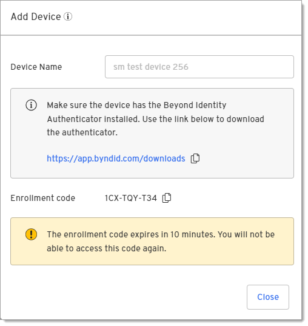
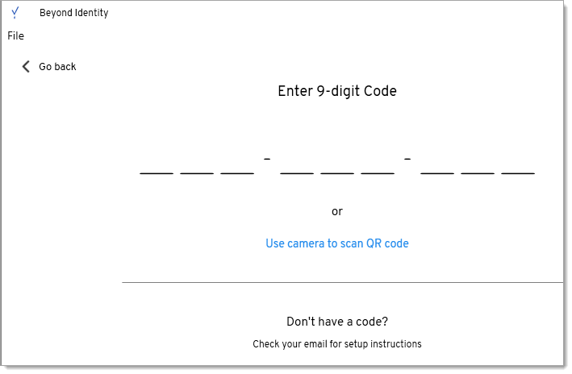

# Adding a device

To begin collecting data and running queries on a device, you must first enroll it. 

1. Click **Devices** under My Project Space.

2. Click **Add Device**.

   

   :::caution Note 
   If you already have the Beyond Identity authenticator version 2.92.0 or later installed on your device, skip to Step 5 below to add a passkey to your device to start collecting data.
   :::

3. Enter a device name and click **Next**.
   
   

4. Click the link to open the authenticator downloads page.
   
   

5. Copy the Enrollment code.

6. Open the authenticator and click the + button.

   

7. Paste or type the enrollment code in the Enter 9-digit code screen. Note that a cursor doesn't appear on the screen.

      

   The device will be added to the Device table with a status of Pending until internal queries complete. Once those complete, the status will change to Active.
   You can now monitor and query the device.