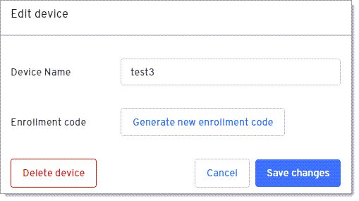

# Delete a device

:::note 
This will not delete the passkey from the authenticator that allows users to securely sign into corporate applications without passwords.
:::

1. Click the Edit icon under the Actions column on the Devices page.

   

2. Click **Delete Device**. A message displays that the device was successfully deleted and the device is removed from the Device table.

   