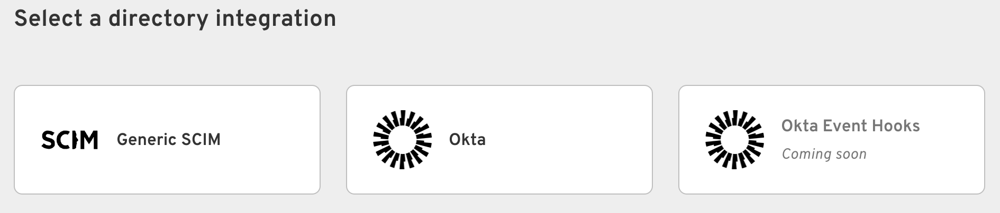

import DocCardList from '@theme/DocCardList';

Directory Integrations allow you to configure inbound SCIM as well as Okta Registration Sync. This is essential for maintaining consistent user access and identity management across your applications.

## Navigate to Directory Integrations

To access the Directory Integrations settings, navigate to **Directory > Directory Integrations**. Here you can add and configure a new directory integration.

## Add a Directory Integration

To begin adding a directory integration, click on **Add Directory**. You will be presented with a few options:

The following integrations are currently available:

<DocCardList />
