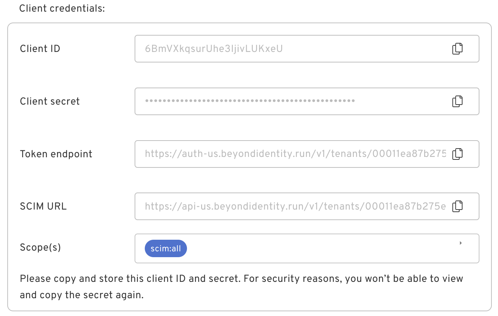
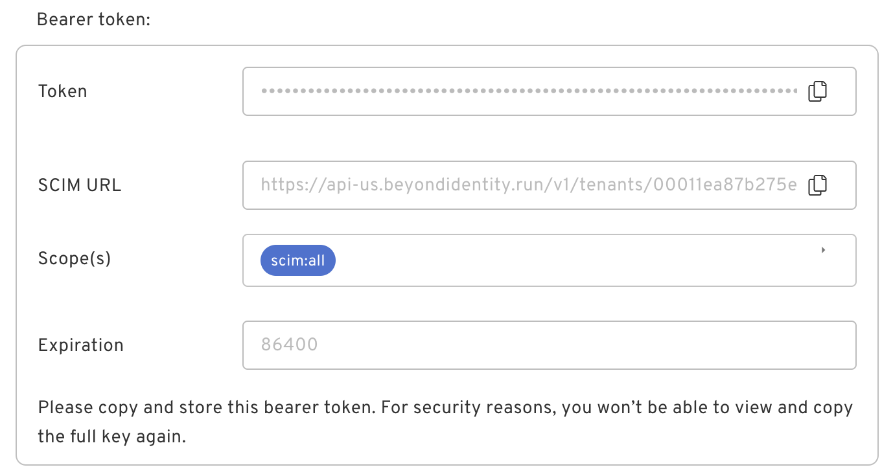

## 1. Generate Credentials

Depending on the requirements of the system you are connecting to, you can generate a bearer token or client credentials. Select which one you would like to generate and click on **Generate**.

| Credentials Type   | Description                                                                  | What it Looks Like                                                                       |
| ------------------ | ---------------------------------------------------------------------------- | ---------------------------------------------------------------------------------------- |
| Client Credentials | Upon selection, you will be provided with a `client_id` and `client_secret`. |  |
| Bearer Token       | If you select bearer token, you will see a token displayed.                  |              |

  

## 3. Copy Values into Receiving Application

After generating credentials, the SCIM URL will also be displayed. You will need to copy this URL into the application you are configuring along with the credentials you generated above.
