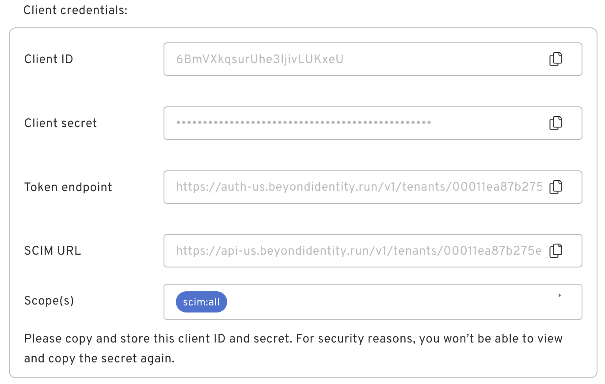
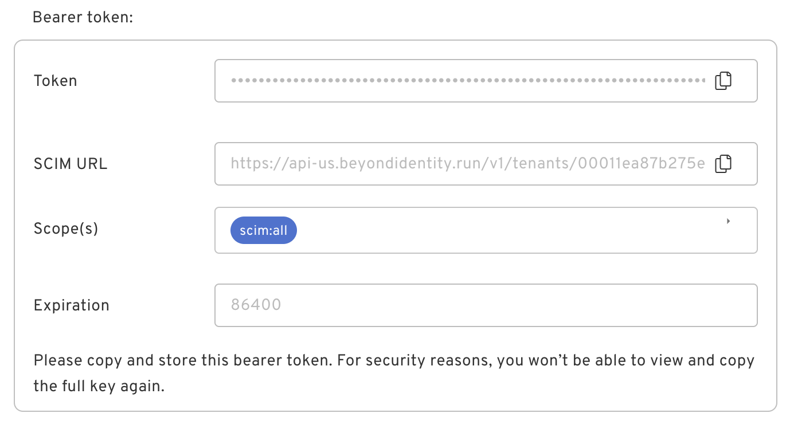
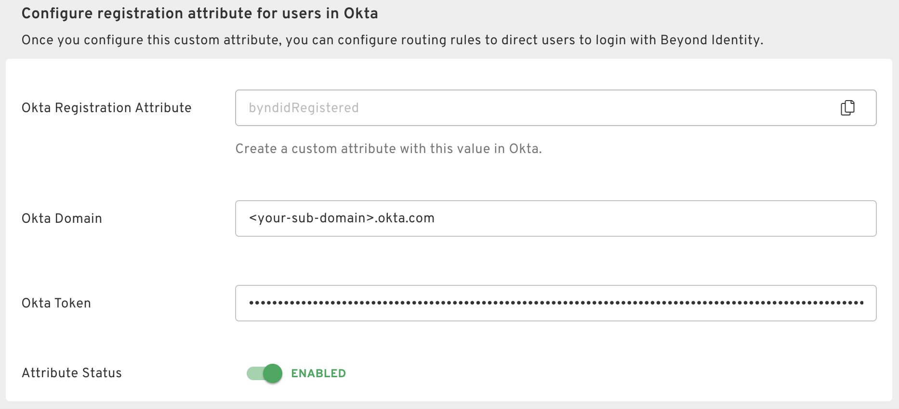

import Arcade, {Clip} from '@site/src/components/Arcade.tsx';

This guide will walk you through setting up an Okta directory integration. The Okta directory integration supports two main use cases:
- **SCIM User Provisioning**: This enables Okta users to be automatically synced over to Beyond Identity by means of SCIM.
- **Registration Syncing**: This feature facilitates a passwordless experience by enabling Okta to redirect users to Beyond Identity, bypassing the username/password input screen. However, if this redirect occurs before a Passkey is linked to the employee's device, authentication may fail. Registration Syncing allows Beyond Identity to inform Okta when it is appropriate to route users to Beyond Identity.

---

### 🔵 **Beyond Identity**

Actions to be performed in the Beyond Identity platform are highlighted in blue.

### 🟠 **Okta**

Actions to be performed in the Okta platform are highlighted in orange.

---

## 🟠 Update User Profile Attributes

To enable Okta to automatically direct users registered with Beyond Identity towards a passwordless authentication flow, define a custom attribute named "byndidRegistered" on an Okta User's profile.

<Arcade clip={Clip.OktaIntegrationGuideCreateByndidRegisteredAttribute} />

Once you've created the "byndidRegistered" attribute, update the profile source to inherit from Okta.

<Arcade clip={Clip.OktaIntegrationGuideUpdateByndidRegisteredAttribute} />

## 🟠 Create a Beyond Identity Group

To enable specific users to authenticate passwordlessly with Beyond Identity, you shold create a group and include those users in it.

<Arcade clip={Clip.OktaIntegrationGuideGroupCreation} />

## 🟠 Generate an API Token

In order for users to be appropriately routed to Beyond Identity from Okta, Beyond Identity must notify Okta when a user successfully binds a Passkey onto their device. This notification is facilitated through the `byndidRegistered` attribute, which you would have configured previously. It is necessary for Beyond Identity to possess an Okta API token in order to communicate the update to Okta.

<Arcade clip={Clip.OktaIntegrationGuideAPITokenGeneration} />

## 🟠 Create a SCIM Application

<Arcade clip={Clip.OktaIntegrationGuideCreateSCIMApplication} />

## 🔵 Create a Directory Integration

In order to create an Okta Directory Integration, navigate to **Directory > Directory Integrations > Add Directory Integration** and click on **Okta**.

### 1. Generate Credentials

The Okta SCIM application you created will expect a bearer token. Select **Bearer Token** and click on **Generate**.

:::note important
Keep the bearer token and SCIM URL in a safe place as you will need them to configure the Okta SCIM application you already created.
:::

| Credentials Type   | Description                                                                  | What it Looks Like                                                                       |
| ------------------ | ---------------------------------------------------------------------------- | ---------------------------------------------------------------------------------------- |
| Client Credentials | Upon selection, you will be provided with a `client_id` and `client_secret`. |  |
| Bearer Token       | If you select bearer token, you will see a token displayed.                  |              |

  

### 2. Configure the Registration Attribute

Finish configuring your Okta directory integration by entering your Okta domain as well as the API token you created in above.

## 🟠 Finish Configuring the Okta SCIM Application

Configure the SCIM application in Okta with the SCIM URL and bearer token you generated in the Beyond Identity directory integration. After you've configured provisioning, enable the following actions:
- Create Users
- Deactivate Users

<Arcade clip={Clip.OktaIntegrationGuideConfigureSCIMApplication} />

## 🟠 Synchronize Users via SCIM

Push the group you created above to Beyond Identity. Once this is done, all users in the Beyond Identity group will show up in Beyond Identity under **Directory > Identities**.

<Arcade clip={Clip.OktaIntegrationGuidePushGroupSCIMApplication} />
