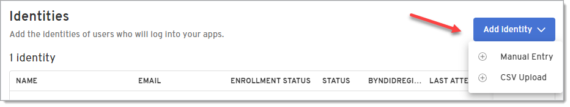
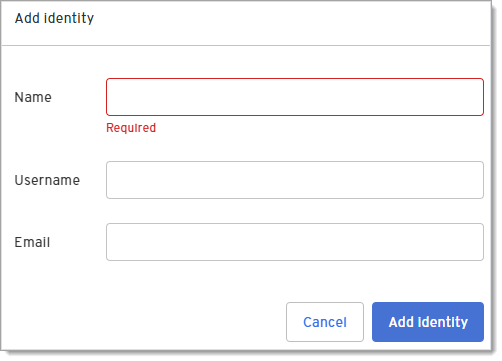

Before your users can use Beyond Identity or obtain a passkey, they need to be added as an identity to the Beyond Identity tenant so they can access applications.

An identity is a unique identifier and an end-user may have multiple identities. Identities can also be part of a group or belong to many groups. Groups are commonly used as a predicate in a policy rule (e.g. Allow group "Beyond Identity Administrators" to access the "Beyond Identity Admin console" application).

You can add user identities one of three ways:

- Admin Console (manually or csv upload)
- Beyond Identity APIs
- SCIM

# Admin Console

## Manually add an identity

1. From the Admin Console, select **Directory > Identities > Add identity > Manual Entry**.

   

2. Enter the name, username, and email of the new identity you're adding.

   

3. Click **Add Identity**.

## Upload identities from a .csv file
1. From the Admin Console, select **Directory > Identities > Add identity > CSV Upload**.

Coming soon!

# View a user's profile

You can view the status of a user's account and other details from the User Profile page. 

1. From the Admin Console, select **Directory > Identities** and click an identity from the list. You can use the Search bar to search for a user if needed.

2. 

