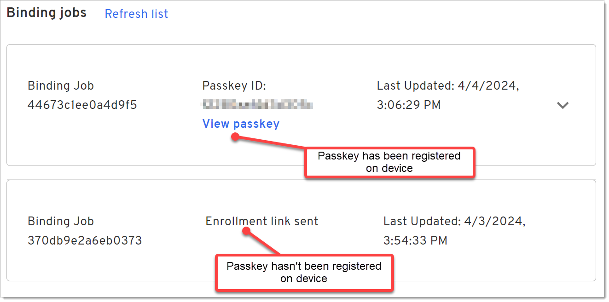

import Arcade, {Clip} from '@site/src/components/Arcade.tsx';

## Manage Users and Passkeys
Before your users can use Beyond Identity or obtain a passkey, they need to be added as an identity to the Beyond Identity tenant so they can access applications.

An identity is a unique identifier and an end-user may have multiple identities. Identities can also be part of a group or belong to many groups. Groups are commonly used as a predicate in a policy rule (e.g. Allow group "Beyond Identity Administrators" to access the "Beyond Identity Admin console" application).

You can add users by: 

- Uploading a .csv file in the Admin console
- Manually adding them in the Admin console
- Using the Beyond Identity APIs
- Using SCIM

## Manage Users

### Upload Users from a .csv File
1. Select **Directory > Identities > Add identity > CSV Upload**.

   Coming soon!

### Manually Add a User

1. Select **Directory > Identities > Add identity > Manual Entry**.

   <Arcade clip={Clip.IdentitiesAddId} />

2. Enter the name, username, and email of the new user.

   

3. Click **Add Identity**.

### Edit or Delete a User

1. Select **Directory > Identities** and click an identity from the list.

     <Arcade clip={Clip.IdentitiesSelectId} />

2. Click **Edit Identity**.

     <Arcade clip={Clip.IdentitiesEditId} />

3. Update the fields as needed and click **Save**.

   -Or-

   Click **Delete Identity**.

## Manage Passkeys

You can add passkeys using the Admin console or from the API. This section describes how to use the console to add and manage passkeys.

### Add a Passkey

1. Select **Directory > Identities** and click an identity from the list. You can search for a user if needed.

     <Arcade clip={Clip.IdentitiesSelectId} />

2. Click **Add a passkey**.
     <Arcade clip={Clip.IdentitiesAddPasskey} />

3. Select whether to send an email to the user to register their passkey or to use the API to generate a link.
     <Arcade clip={Clip.IdentitiesSendEmail} />
   :::note
   You can customize the email template in Branding.
   :::

4. Click **Proceed & send email**.
   
   -Or-
   
   Click **Generate curl**.

### View Binding jobs
When you send an invite to a user to add a passkey, until the user follows the instructions and registers/binds the passkey to their device, the passkey remains in a pending state under Binding jobs.

1. Select **Directory > Identities** and click an identity from the list.

     <Arcade clip={Clip.IdentitiesSelectId} />

2. Click the **Binding jobs** tab.

     <Arcade clip={Clip.IdentitiesBindingJobsTab} />

3. View the status of any enrollments.

   

4. You can optionally do the following: 

   - Click **Refresh list** to update the list of outstanding jobs.

   - Click **View passkey** or click the down arrow beside a device with a passkey to view details about the enrollment.