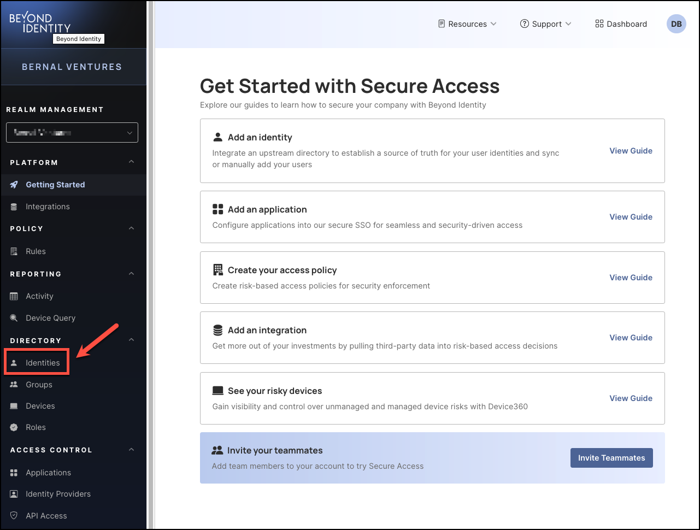
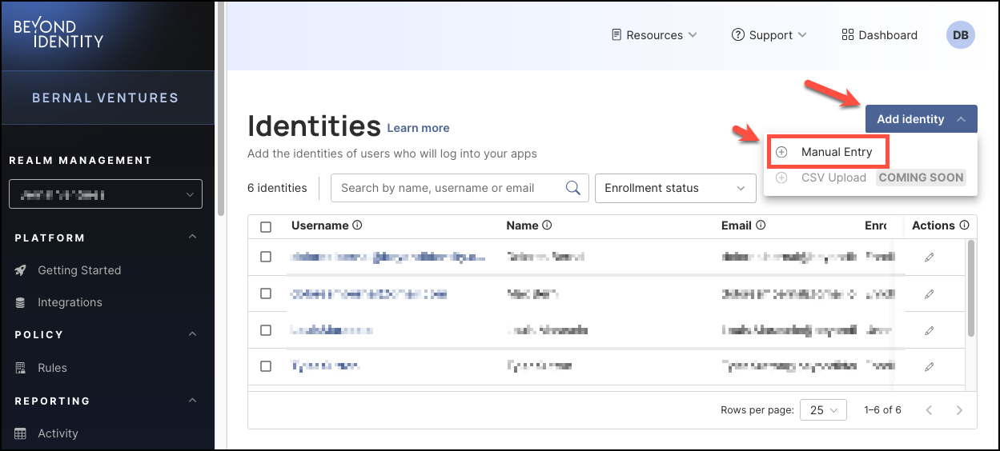
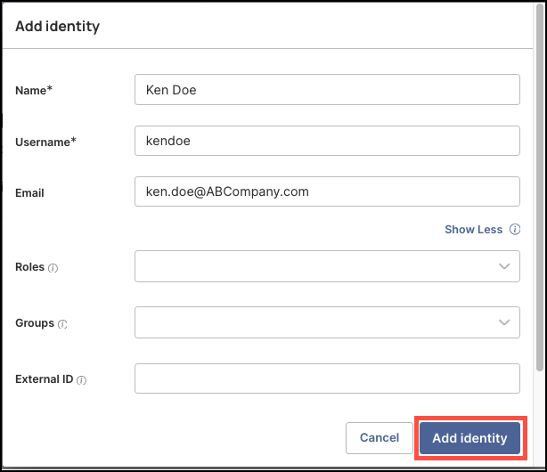
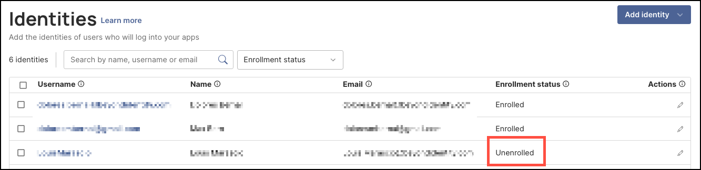
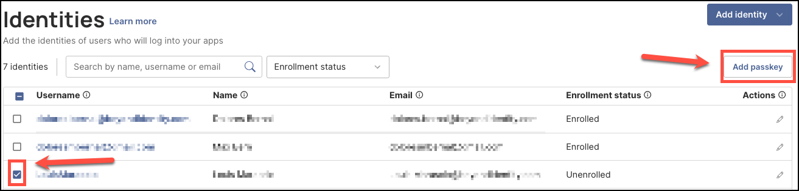
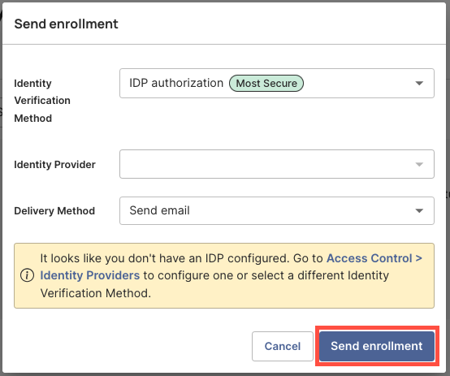
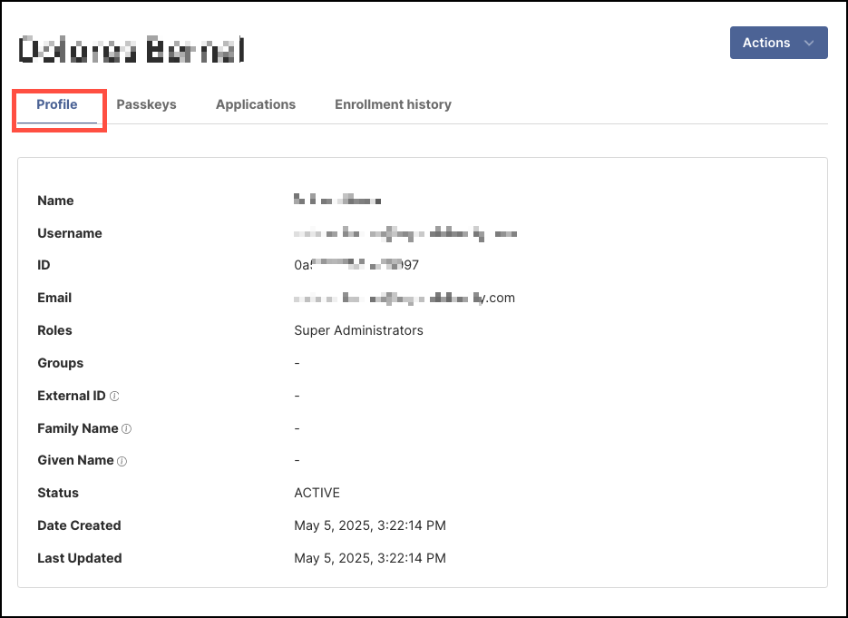
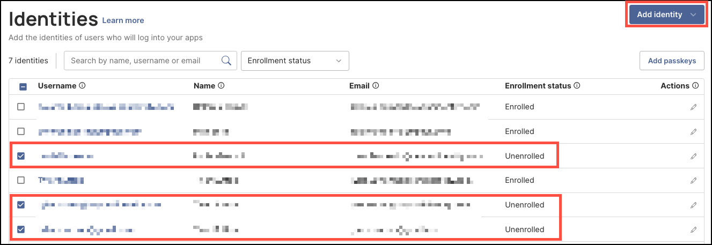

## How to Add Identities

Adding identities is a foundational task for managing your organization's security with Secure Access. Each Identity represents an individual who must authenticate into their account to access approved applications and resources.

The user onboarding workflow is as follows:

    1. A user is added to the Secure Access directory.

    2. The user receives an email prompting them to download and install the Beyond Identity Authenticator to their device.

    3. After the user installs the Authenticator, a passkey is securely bound to their identity in the Secure Access directory.

    4. Once this enrollment process is complete, the user can sign in and access resources using phishing-resistant passkeys.

### What You’ll Learn

In this article, you’ll learn how to manually add identities in the Secure Access directory using the admin console. Specifically, we’ll cover:

- **Sending Email Invite** – How to manually add a user and send them their email ivite through the Secure Access console.  
- **Viewing User Details** – How to access and review a user's information.  
- **Manually Assigning a Passkey** – Similar to **Sending Email Invite**.  
- **Bulk Enrollment of Multiple Users** – How to add up to 100 users at once using the bulk enrollment feature.

---

 

#### Sending the Activation Invite via Email

##### Steps 

1. Log in to your Beyond Identity Secure Access tenant.

2. Click **Identities** from the left-hand navigation panel. 

    

3. Next, click the **Add Identity** drop-down and select **Manual Entry**.

   

4. In the dialog window, enter the following user details:

   - **Name** – Full name of the user  
   - **Username** – The unique username for the account  
   - **Email** – Where the activation email will be sent  
   - **Role** – The user’s role (e.g., *User*, *Viewer*, *Admin*, *Superadmin*)  
   - **Group** – The group the user should be assigned to  
   - **External ID** – This is the identifier in your primary identity provider used to match a user in your upstream directory.

       

5. When you are done click **Add identity**.

:::info
After you finish adding the Identity, the user will receive an activation email with instructions to download and install the Beyond Identity Authenticator on their desktop device. Once the Authenticator is set up, the passkey will be securely stored on the device, allowing the user to log in to their organizational accounts and assigned applications. 
 

The user will appear in the list of **Identities** showing their **Enrollment status** as **Unenrolled** until they activate their accounts. 
 

    
:::

---

 

### Assigning a Passkey Manually

Adding a passkey manually follows a similar process to the **Sending the Activation Invite via Email** workflow. In both cases, the user receives an email with instructions to download the Beyond Identity Authenticator and activate their account.

Manually adding a passkey is useful in the following scenarios:

- The user did not receive the original activation email  
- The user was unable to successfully activate their account  
- Additional troubleshooting is required

##### Steps

1. Complete Steps 1 to 5 from the **Sending Email Invite** section.

2. On the **Identities** table, checkmark the box for the user showing **Unenrolled** in their **Enrollment status**, then click **Add Passkey**.

    

3. In the **Send Enrollment** dialog window, configure the following:

- **Identity Verification Method** – Choose how the user will verify their identity.  
  - **IDP Authorization** is the default and recommended option, as it provides the highest level of security.  
  - Alternatively, if you do not have an identity provider sent up yet, choose to send a **Magic Link**.
- **Identity Provider** – Select the configured identity provider.
- **Delivery Method** – Choose how to send the invite.  
  - **Send Email** is the default option.

    

4. When you are done, click **Send enrollment.** 

:::info
The user will receive an activation email with instructions to download and install the Beyond Identity Authenticator on their desktop device. Once the Authenticator is set up, the passkey will be securely stored on the device, allowing the user to log in to their organizational accounts and assigned applications. 
 

The user will continue to appear in the list of **Identities** showing their **Enrollment status** as **Unenrolled** until they activate their accounts. 
 

:::

 

---

### Viewing a Identity Details

After adding a new identity, you can view their profile information by clicking their **Username** in the **Identities** table and navigating to the **Profile** tab. The profile includes the following user details:

- **Name** – The user's full name  
- **Username** – The unique username assigned to the user  
- **ID** – The user's unique system ID (not the passkey)  
- **Email** – The user's email address  
- **Roles** – The roles assigned to the user (e.g., user, admin, super admin)  
- **Groups** – The group(s) the user is a member of  
- **External ID** – This is the identifier in your primary identity provider used to match a user in your upstream directory.
- **Family Name** – The user's last name  
- **Given Name** – The user's first name  
- **Status** – Indicates whether the user is Active or Inactive  
- **Date Created** – The date the user was added  
- **Last Updated** – The most recent date the profile was updated  

    
 

---

### **Enrolling Multiple Identities (Bulk Enrollment)**

When adding passkeys, you can select and enroll up to 100 users at a time. This bulk enrollment option is a time-efficient way to manage larger groups of users.
 

##### Steps

1. In the **Identities** table, select the unenrolled users you want to assign a passkey to, then click **Add Passkey**.

    

2. In the **Send Enrollment** dialog window, configure the following:

- **Identity Verification Method** – Choose how the user will verify their identity.  
  - **IDP Authorization** is the default and recommended option, as it provides the highest level of security.  
  - Alternatively, if you do not have an identity provider set up yet, choose to set up a **Magic Link**.
- **Identity Provider** – Select the configured identity provider.
- **Delivery Method** – Choose how to send the invite.  
  - **Send Email** is the default option.

    

3. When you are done, click **Send enrollment.** 

:::info
All selected users will receive an activation email with instructions to download and install the Beyond Identity Authenticator on their desktop device. Once the Authenticator is set up, the passkey will be securely stored on their devices, allowing them to log in to their organizational accounts and assigned applications. 
 

Users will continue to appear in the list of **Identities** showing their **Enrollment status** as **Unenrolled** until they activate their accounts. 
 

:::

 

 

 

 

