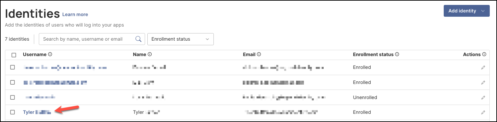
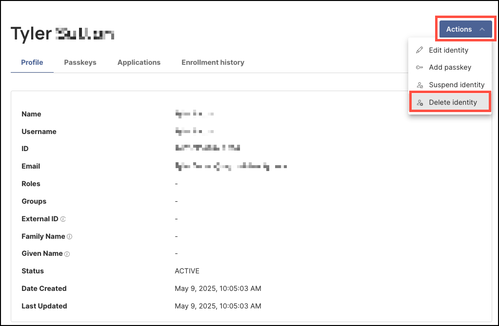
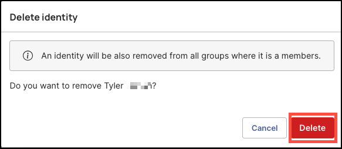
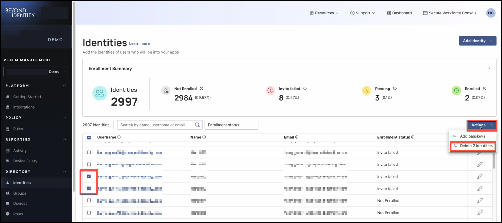
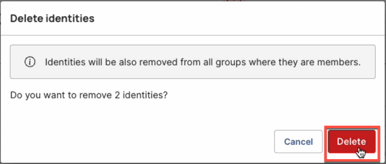

## Overview

Managing identities is a vital part of maintaining your organization’s security with Secure Access, and removing users becomes necessary to protect your systems and data.

When a user leaves the company, changes roles, or no longer needs access due to project completion, it's important for IT administrators to promptly delete their account.

Deleting users helps ensure that only authorized personnel retain access, thereby strengthening your organization’s overall security posture.

---

### What You'll Learn  

This article will guide you through the process of deleting or removing enrolled users.
 
 
---

#### Steps

1. Log in to your Beyond Identity Secure Access tenant.

2. Click **Identities** from the left-hand navigation panel. 

    

3. On the **Identities** table, click the **Username** of the person you'd like to remove.

    

4. Next, click **Actions**, then select **Delete identity** from the drop-down menu. 

    

5. In the dialog window, review the confirmation message to ensure you want to delete the selected user, then click **Delete**. 

    

:::info
Deleting a user cannot be undone.
:::

After deleting the user, their name will no longer appear on the **Identities** section, and the user will no longer be able to log in to any accounts or resources. 

 

---

### **Deleting Multiple Identities in Bulk**

The ability for administrators to delete multiple identities in bulk offers a time-efficient way to manage users.
 

##### Steps

1. In the **Identities** table, select the users you want to delete in bulk, then click **Actions** and choose **Delete # identities** from the drop-down

    

2. Read the delete confirmation message, then click **Delete**.

     

:::info
Deleting users is a permanent action and cannot be undone.
 

 

 

 

