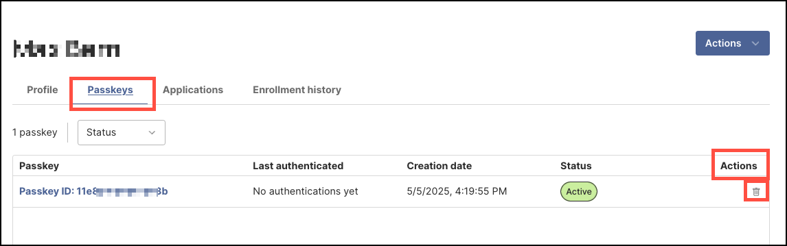
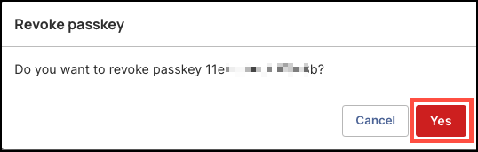
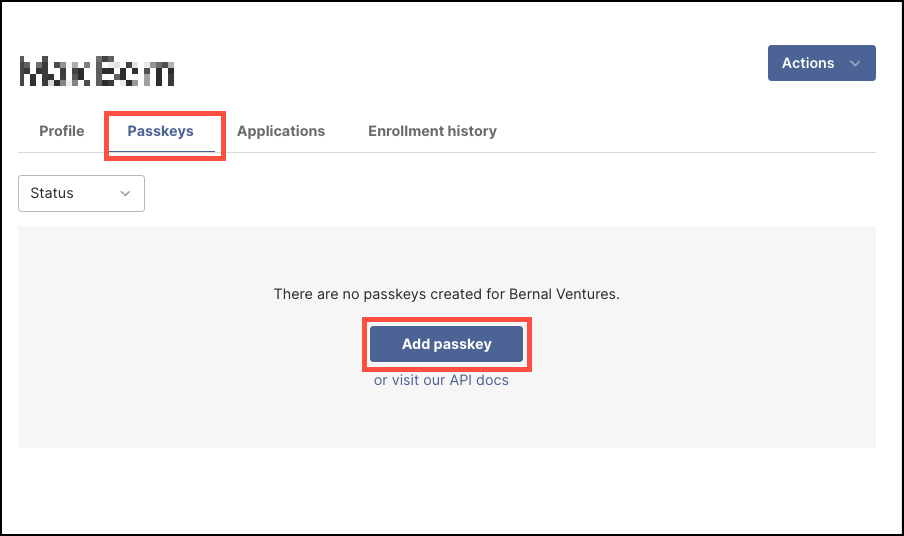

## Overview

In certain scenarios, an IT administrator may need to revoke a user's passkey to maintain the integrity and security of the organization’s access controls. 

Reasons why it may be necessary to revoke a user's passkey:

- **Device Loss or Theft**: If a user loses a registered device or it is stolen, the associated passkey should be deleted immediately to prevent unauthorized access.
- **Compromised Credentials**: If there's suspicion that a user’s credentials or device have been compromised, deleting the passkey is a proactive security measure.
- **Device Replacement**: When a user upgrades or switches devices, the old passkey may need to be removed to ensure only the new device can be used for authentication.
- **Access Revocation**: If a user’s access level changes or they no longer need access to certain resources, deleting specific passkeys helps enforce least privilege.
- **Onboarding Errors**: If a passkey was created in error during enrollment or needs to be reissued, the original passkey may need to be deleted and replaced.

By deleting outdated or unnecessary passkeys, you help reduce risk and ensure that only trusted, up-to-date credentials are used to access sensitive systems and applications.

### What You'll Learn  

This article will guide you through the process of:

- Revoking a user's passkey 
- Adding a new user's passkey

 

### Revoking a Passkey 

#### Steps

1. Log in to your Beyond Identity Secure Access tenant.

2. Click **Identities** from the left-hand navigation panel. 

        

3. On the **Identities** table, click the **Username** of the person whose passkey you want to delete.

        

4. Select the **Passkeys** tab, then under the **Actions** column, click trashcan icon to delete the user's passkey.

        

5. In the dialog window, review the confirmation message to ensure you want to revoke the selected passkey, then click **Yes**.

        

:::info
Revoking a passkey does not remove the user and their profile information and assigned applications remain intact. However, you will need to add a new passkey for the user to regain access to those applications.
:::

 

### Adding a New User's Passkey

 #### Steps

1. On the **Identities** table, click the **Username** of the person who needs a new passkey.

        

2. Select the **Passkeys** tab, then click **Add passkey** on the center of the page. 

        

3. In the **Send Enrollment** dialog window, configure the following:

- **Identity Verification Method** – Choose how the user will verify their identity.  
  - **IDP Authorization** is the default and recommended option, as it provides the highest level of security.  
  - Alternatively, if you do not have an identity provider set up yet, choose to set up a **Magic Link**.
- **Identity Provider** – Select the configured identity provider.
- **Delivery Method** – Choose how to send the invite.  
  - **Send Email** is the default option.

    

:::info
The user will receive an activation email with instructions to download and install the Beyond Identity Authenticator on their desktop device. Once the Authenticator is set up, the passkey will be securely stored on the device, allowing the user to log in to their organizational accounts and assigned applications. 
 

:::

 

 

 

 