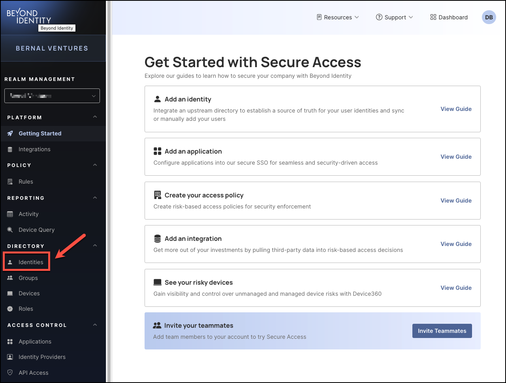
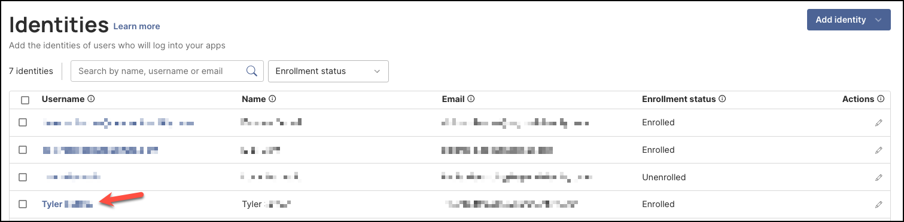

## How to Suspend Users

In many cases, **suspending** a user is a more appropriate action than permanently deleting them.

When a user goes on leave, temporarily changes roles, or their access needs to be paused for compliance or security reasons, IT administrators should suspend the account instead of deleting it.

Suspending users helps ensure that access is immediately blocked while preserving the user’s identity, settings, and audit trail. This approach allows for easier reactivation when appropriate and supports better control over temporary access restrictions without permanent data loss.

### What You'll Learn  

This article will guide you through the process of: 
- Suspending a user
- Unsuspending a user

 

### Suspending a User 

#### Steps

1. Log in to your Beyond Identity Secure Access tenant.

2. Click **Identities** from the left-hand navigation panel. 

    

3. On the **Identities** table, click the **Username** of the person you'd like to suspend.

    

4. Next, click **Actions**, then select **Suspend identity** from the drop-down menu. 

    

5. In the dialog window, review the confirmation message to ensure you want to suspend the selected user, then click **Suspend**. 

    

:::info
Once a user is suspended, they will no longer be able to log in to their accounts or applications until you unsuspend them. However, they will still appear in the **Identities** users table with their enrollment status shown as **Enrolled**.
:::
 

### Unsuspending a User

#### Steps

1. On the Identities table, click the **Username** of the person you'd like to unsuspend.

    

2. Next, click **Actions**, then select **Unsuspend identity** from the drop-down menu.

    

:::info
Once a user is unsuspended, their access will be fully restored.
:::
 

 

 

 