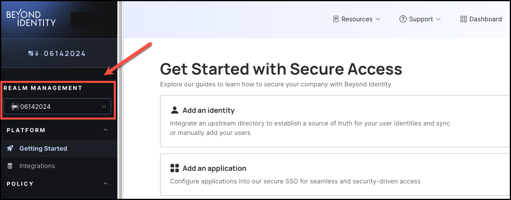
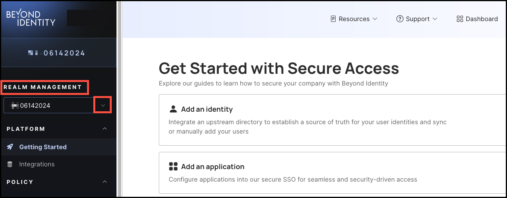
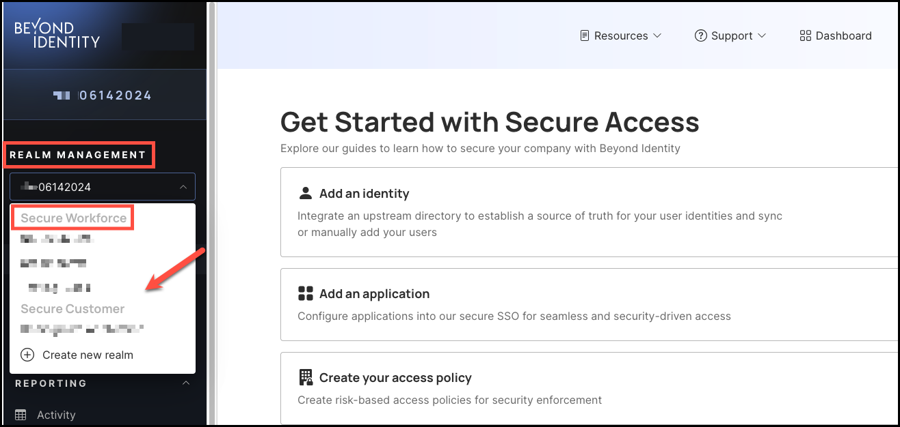
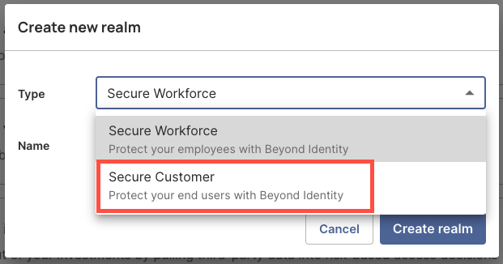
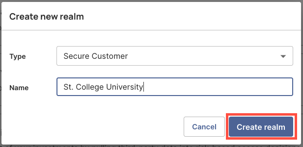
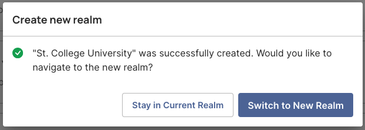
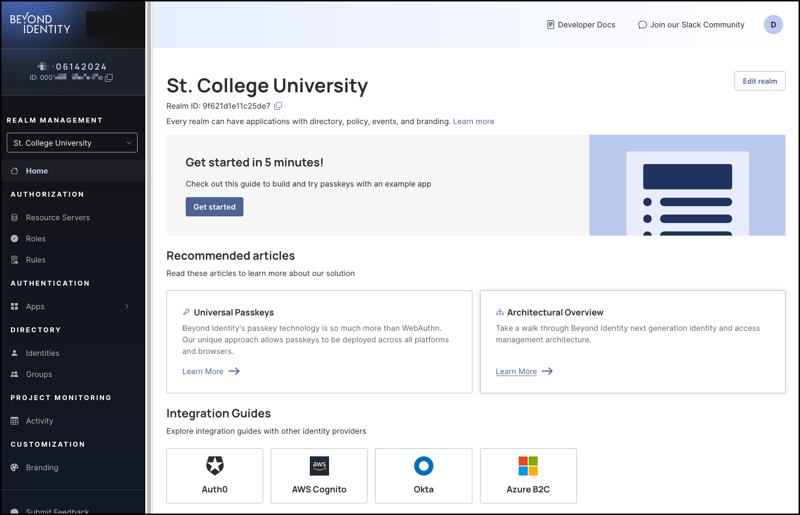
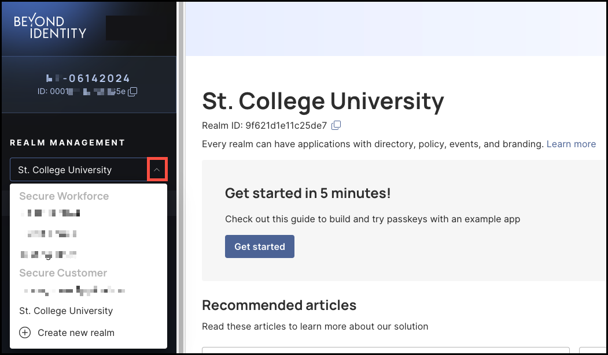

**Early Access**

## Overview

Administrators can create and manage Secure Customer Realms within the Secure Access Platform. Realms are distinct identity directories within a single tenant, each configurable to support customer passwordless authentication.

Once a realm is selected in the Secure Access **Realm Management** section, administrators can create, view, and manage Secure Customer identities, all without switching platforms.

 

### Current Limitations

At this time administrators cannot edit or delete a realm once it has been created. 

---

### What You’ll Learn

In this article, you’ll learn how to create a Secure Customer Realm within the Secure Access Platform.

---

## Create a New Secure Customer Realm

### Prerequisites ###

To create a Secure Customer Realm, your Beyond Identity Sales or Sales Engineering contact must have selected the **Secure Customer** realm type during initial tenant setup, if not, the **Realm Management** section will not appear in the Secure Access Admin Console.

**Note**: During the Early Access period, you’ll need to contact our Support Team to have this feature enabled in your navigation menu.

      

---
### Steps ###

1. Log in to your Beyond Identity Secure Access tenant.

2. From the left-hand navigation panel, go to **Realm Management** and click the drop-down menu.

    

3. Under Secure Customer, select **Create new realm**.

    

4. In the **Create new realm** dialog window, select **Secure Customer**.

    

5. Enter a **Name** for your new realm, then click **Create realm** to finish.

    

6. Next, select either **Stay in Current Realm** or **Switch to New Realm**.

    

      If you choose to switch to the new realm you just created, the next page will display the realm's details, where you can create and manage Secure Customer identities. 

    

      To switch to another realm, click the **Realm Management** drop-down menu and select the realm you'd like to switch to.

      