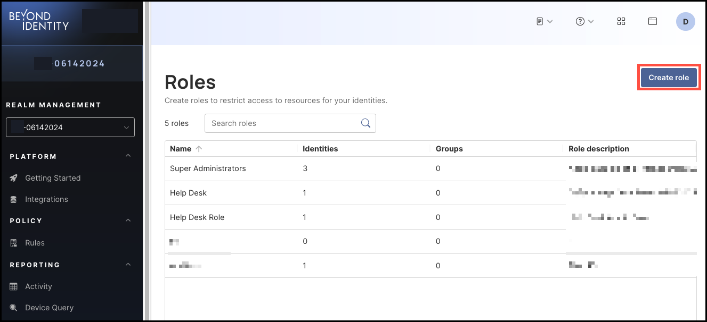
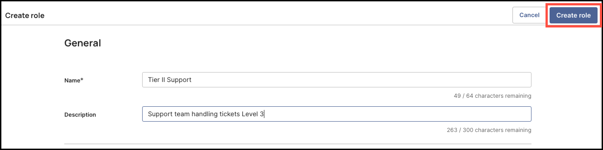
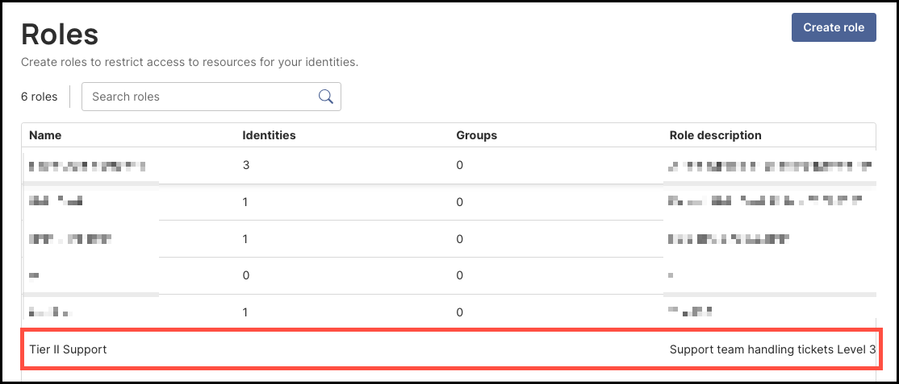

## Overview

Creating **Roles** allows administrators to restrict identity permissions for performing privileged actions in the Secure Access admin console. For example, administrators can create and define a role called "Help Desk Admins" with permissions to perform limited privileged actions, like sending enrollment emails but not deleting identities.

 

### What You'll Learn  

This article will guide you through the process of:

- Creating a new role and customizing its permissions
 
 

### How to Create a Role

#### Steps

1. To create a role, click **Roles** from the left-hand navigation panel. 

    

2. Click **Create Role**. 

    

3. Enter the following information for the role you are creating:

- **Name**
- **Description**

4. Then, in the **Identities** section, select the permissions the new role needs for managing identities (if any):

- **Read Identities** - View list of all identities and individual profiles
- **Create Identities** - Create identity profiles
- **Update Identities** - Update identity profiles and manage identity status (suspend, reactivate)
- **Delete Identities** - Permanently delete identities

5. In the **Passkeys** section, select all the permissions the new role needs for passkey management (if any):

- **Read passkeys** - View list of passkeys
- **Create passkey emails** - Create enrollment emails
- **Create passkey links** - Send enrollment links
- **Create passkey via any method** - Send enrollment of every kind
- **Revoke passkey emails and passkey links** - Revoke enrollment emails and enrollment links after they have been sent
- **Update passkeys** - Manage enrollment emails and revoke passkeys
- **Delete passkeys** - Permanently delete passkeys

6. Select the **Groups** permission for the new role (if any):

- **Read groups** - View list of groups
- **Create groups** - Create groups
- **Update groups** - Update group details
- **Delete groups** - Permanently delete groups

**Note**: To allow the role to manage users in a Groups, select the **Read Identities** permission under **Identities** (Step 4). 

7. Select the permissions for management of **Devices** for the new role (if any):

- **View devices** – List all devices in the fleet, see statistics  
- **Add devices** – Add new devices  
- **Update devices** – Update devices details  
- **Delete devices** – Permanently remove devices

8. Select the **Roles** permissions for the new role (if any):

- **Read roles** – View list of roles  
- **Create roles** – Create roles  
- **Update roles** – Update roles  
- **Delete roles** – Permanently delete roles

9. Select the **Events** permissions for the new role (if any):

- **Read events** – View list of events

10. Select the **Applications** permissions for the new role (if any):

- **Read applications** – View list of applications  
- **Read application secrets** – The ability to view secrets that are associated with applications  
- **Create applications** – Create applications  
- **Update applications** – Update application configurations  
- **Delete applications** – Permanently delete applications  
- **Read app tiles** – Read app tiles  
- **Create app tiles** – Create app tiles  
- **Update app tiles** – Update app tiles  
- **Delete app tiles** – Delete app tiles

**Note**: To allow the role to manage identities for an application, select the **Read Identities** permission under **Identities**.

To allow the role to manage groups for an application, select the **Read Groups** permission under **Groups**.

11. Select the **Identity Providers** permissions for the new role (if any):

- **Read Identity Providers** – View list of Identity Providers  
- **Create Identity Provider** – Create Identity Provider  
- **Update Identity Provider** – Update Identity Provider details  
- **Delete Identity Provider** – Permanently delete Identity Provider

12. Select the **API Access** permissions for the new role (if any):

- **Read API Access** – View API Access details and access tokens  
- **Update API Access** – Create API Access Tokens  
- **Delete API Access tokens** – Permanently delete API Access Tokens

13. Select the **Device Query** permissions for the new role (if any):

- **Read custom attributes** – Read custom attributes  
- **Create custom attributes** – Create custom attributes  
- **Update custom attributes** – Update custom attributes  
- **Delete custom attributes** – Delete custom attributes

14. Select the **Manage Attributes** permissions for the new role (if any):

- **Read managed attributes** – Read managed attributes  
- **Create managed attributes** – Create managed attributes  
- **Update managed attributes** – Update managed attributes  
- **Delete managed attributes** – Delete managed attributes

15. Select the **Policy** permissions for the new role (if any):

- **Read policy** – View list of policy  
- **Update policy** – Update policy rules

16. Select the **Branding** permissions for the new role (if any):

- **Read branding** – View branding configuration  
- **Create branding** – Create branding configurations  
- **Update branding** – Update branding configuration

17. Select the **Integrations** permissions for the new role (if any):

- **Read integrations** – View list of integrations  
- **Create integrations** – Create integrations  
- **Update integrations** – Update integrations details  
- **Delete integrations** – Permanently delete integrations

18. Select the **Realms** permissions for the new role (if any):

- **Read realms** – Read realms  
- **Create realms** – Create new realms  
- **Update realms** – Update realms  
- **Delete realms** – Delete realms

19. Select the **Administration** permissions for the new role (if any):

- **Update tenant** – Ability to update tenant-level settings  
- **Introspect tokens** – Ability to introspect tokens assigned to a user

20. After you are finished selecting all the permissions for the new role, click **Create Role**, on the top right corner of the page. 

      

21. Once created, the new role will now appear in the **Roles** table. 

      