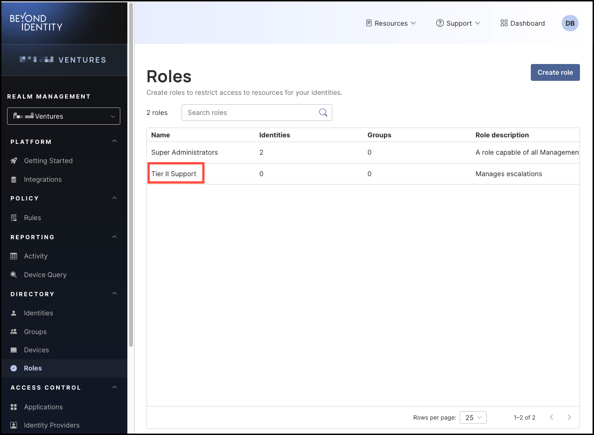
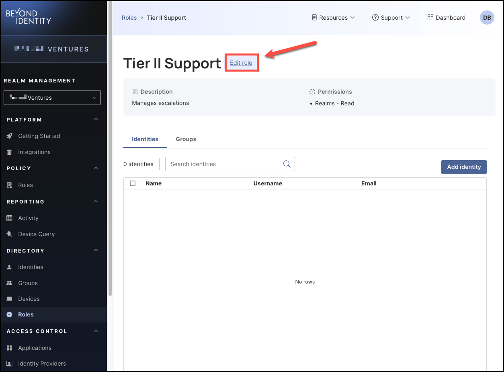
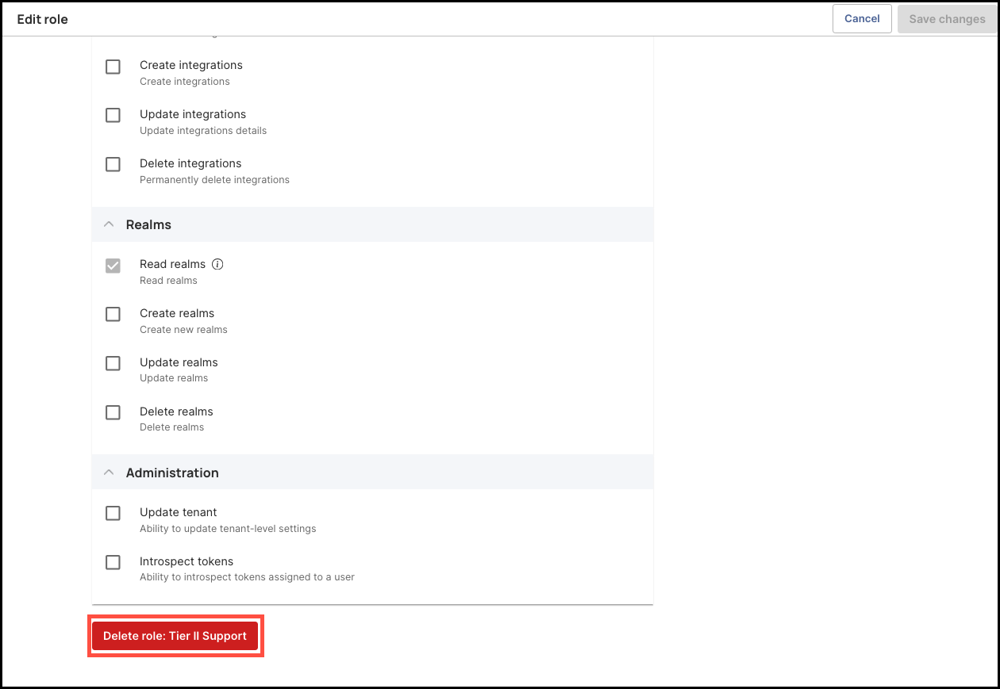
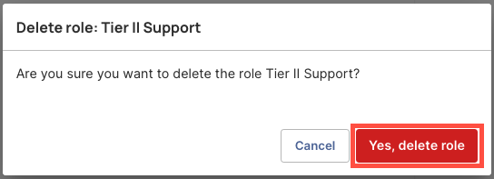

### What You'll Learn  

This article will guide you through the process of deleting a role.
 
 

### How to Delete a Role

#### Steps

1. To delete a role, click **Roles** from the left-hand navigation panel. 

    

2. From the **Roles** table, click the name of the role you'd like to delete. 

     

3. Click **Edit role** next to the role's name. 

     

4. Scroll all the way to the bottom of the page and click **Delete role: (role name)**.

     

5. Read the confirmation message, then click **Yes, delete role**.

     

 
