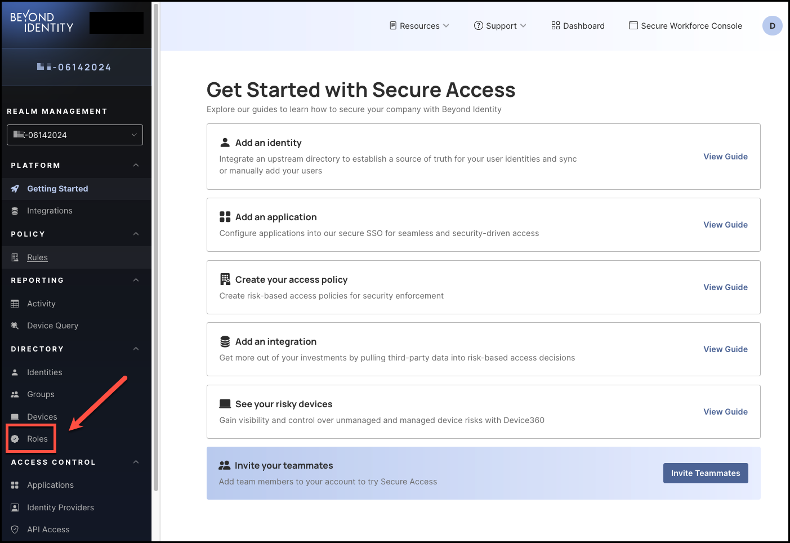

### Overview

After creating a new role, you can assign **Directory** groups to it. These groups will inherit the permissions you defined when setting up the role. For example, if the role includes the **Read passkeys** permission, any groups added to the role will automatically have the ability to read passkeys.

 

### What You'll Learn  

This article will guide you through the process of: 

- Adding groups to a role
- Removing groups from a role

 

### How to Add Groups to a Role

#### Steps

1. To add groups to a role, click **Roles** from the left-hand navigation panel. 

    

2. In the **Roles** table, click the name of the role to which you want to add groups.

     

3. Select the **Groups** tab, then click **Add group.**

     

4. Select the group(s) you want to add to the role. You can also use the **Search groups** bar to find groups you may not see listed. When you are finished, click **Add group**.

     

5. The group you selected to add to the role will now be listed on the **Groups** tab. 

      

 

### How to Remove a Group from a Role

To remove a group from a role, select it from the **Groups** tab, then click **Remove group from role**.

      

:::info
You won’t be prompted to confirm the removal of the selected group. The process is automatic once you click **Remove group from role**.
 

Also, note that removing groups from roles do not delete them from the **Directory**. 

:::

 
 