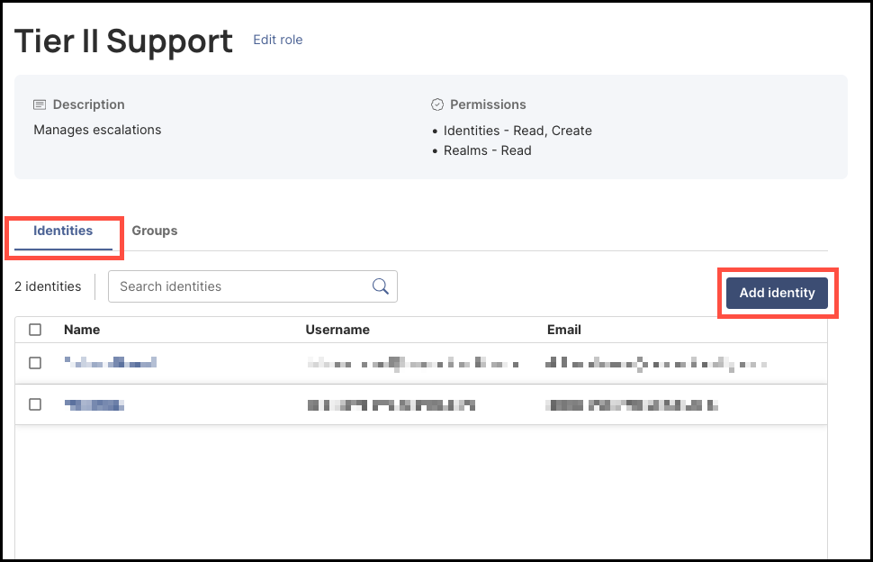
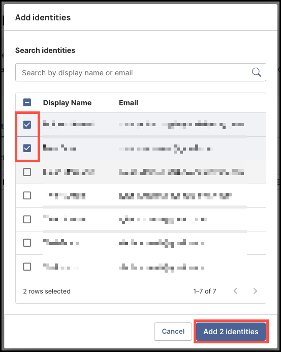
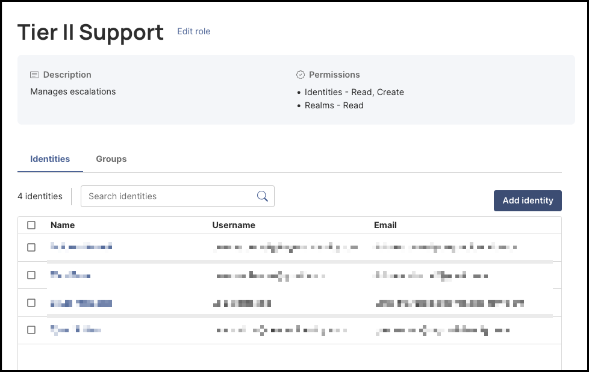
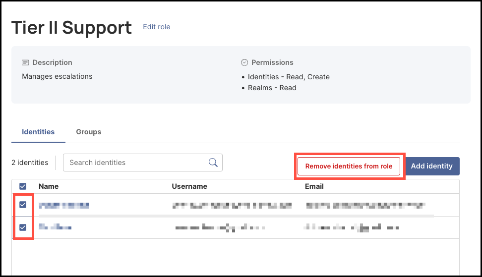

### Overview

After creating a new role, you can assign **Directory** identities to it. These identities will inherit the permissions you defined when setting up the role. For example, if the role includes the **Read passkeys** permission, any identities added to the role will automatically have the ability to read passkeys.

 
---
### What You'll Learn  

This article will guide you through the process of: 

- Adding identities to a role
- Removing identities from a role

 
---
### How to Add Identities to a Role

#### Steps

1. To add identities to a role, click **Roles** from the left-hand navigation panel. 

    

2. In the **Roles** table, click the name of the role to which you want to add identities.

     

3. Under the **Identities** tab, click **Add identity**.

      

4. Select the identities you want to add to the role. You can also use the **Search identities** bar to find identities you may not see listed. When you are finished, click **Add [#] identities**.

      

5. The identities you selected to add to the role will now be listed on the **identities** tab. 

      

 

### How to Remove Identities from a Role

To remove identities from a role, select them from the **Identities** tab, then click **Remove identities from role**.

      

:::info
You won’t be prompted to confirm the removal of the selected identities. The process is automatic once you click **Remove identities from role**.
 

Also, note that removing identities from roles do not delete them from the **Directory**. 

:::

 
 