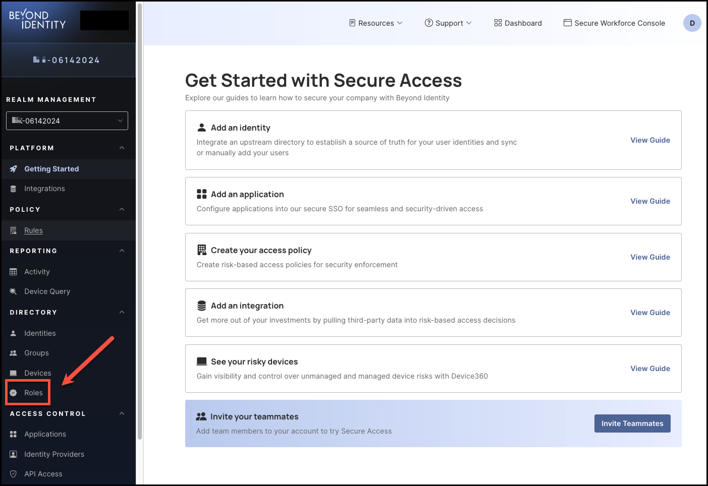
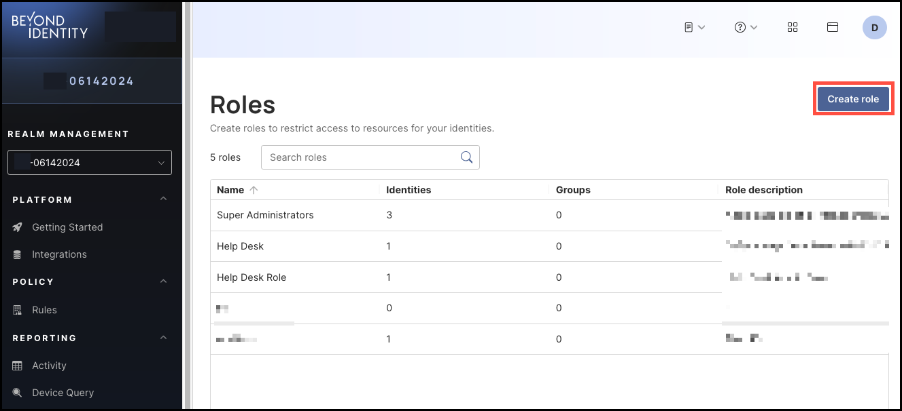
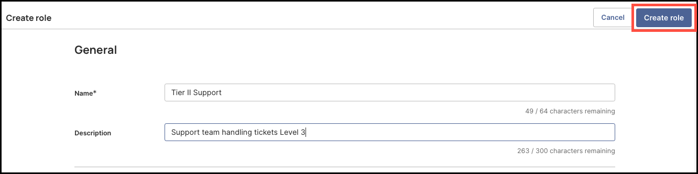
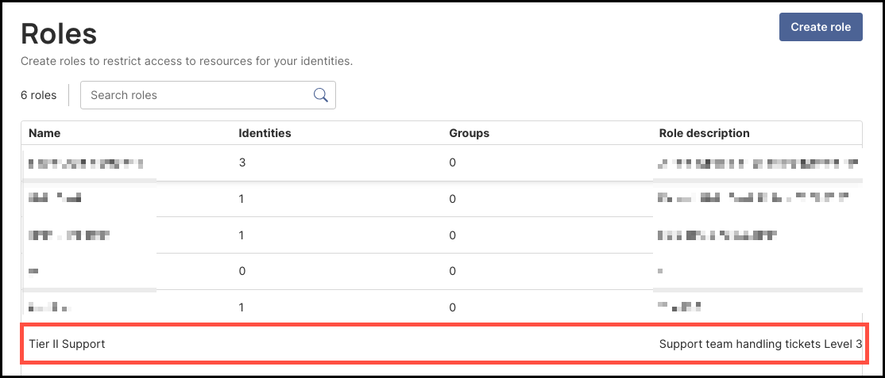

import Arcade, {Clip} from '@site/src/components/Arcade.tsx';

## Manage Roles
Use roles to restrict access to resources for your identities.For example, you might want to create a Users role with basic access corporate applications, HR role with access to financial applictions, etc. A user (identity) can be assigned to multiple roles.

## Create a Role
1. Navigate to **Directory > Roles** and click **Create Role**.

2. Enter a name and an optional description for the role. 

3. Click **Create role**.

<Arcade clip={Clip.RolesAddRole} />

## Edit or Delete a Role
1. Navigate to **Directory > Roles** and click a role name.

2. Click **Edit role**.

3. Update the fields as needed and click **Save changes**.

   -Or-

   Click **Delete role role_name**.

<Arcade clip={Clip.RolesEditDeleteRole} />

## Add an Identity to a Role
1. Navigate to **Directory > Roles** and click a role name.

2. Click the **Identity** tab, if needed. 

3. Click **Add identity**. 

4. Enter a username to search identities or click the drop-down beside **Select identity** to select a user to add. 

   You can enter or select mulitple users from this field. 

5. Click **Add to role**. Any selected identities appear on the page.

To remove an identity from the role, select the checkbox beside a username in the table and click **Remove identity from role**. 

<Arcade clip={Clip.RolesAddIdentitytoRole} />

## Add a Group to a Role
1. Navigate to **Directory > Roles** and click a role name.

2. Click the **Groups** tab. 

3. Click **Add group**. 

4. Enter a group to search existing groups or click the drop-down beside **Select group** to select a group to add. 

   You can enter or select mulitple groups from this field. 

5. Click **Add to role**. Any selected groups appear in the table. 

   **Note:** Any users in the group will be added to the role but they won't appear under the **Identities** tab. 

To remove a group from a role, select the checkbox beside a group in the table and click **Remove group from role**. 

<Arcade clip={Clip.RolesAddGrouptoRole} />

 

--

## Customize Role Permissions

You can create and assign custom roles with granular, least-privilege permissions, specifying exactly which actions each role can perform, for example, allowing help desk staff to reset credentials or enabling application owners to manage app assignments. 

This feature helps reduce the number of high-privilege accounts, lowers the attack surface and insider risk, and supports compliance with access control requirements.

### How to Customize Role Permissions

#### Steps

1. To customize a role's permissions, click **Roles** from the left-hand navigation panel. 

    

2. Create a new role or select an existing one from the **Roles** table. For this walkthrough, click **Create Role**. 

    

3. Enter the following information for the role you are creating:

- **Name**
- **Description**

4. Then, in the **Identities** section, select the permissions the new role needs for managing identities (if any):

- **Read Identities** - View list of all identities and individual profiles
- **Create Identities** - Create identity profiles
- **Update Identities** - Update identity profiles and manage identity status (suspend, reactivate)
- **Delete Identities** - Permanently delete identities

5. In the **Passkeys** section, select all the permissions the new role needs for passkey management (if any):

- **Read passkeys** - View list of passkeys
- **Create passkey emails** - Create enrollment emails
- **Create passkey links** - Send enrollment links
- **Create passkey via any method** - Send enrollment of every kind
- **Revoke passkey emails and passkey links** - Revoke enrollment emails and enrollment links after they have been sent
- **Update passkeys** - Manage enrollment emails and revoke passkeys
- **Delete passkeys** - Permanently delete passkeys

6. Select the **Groups** permission for the new role (if any):

- **Read groups** - View list of groups
- **Create groups** - Create groups
- **Update groups** - Update group details
- **Delete groups** - Permanently delete groups

**Note**: To allow the role to manage users in a Groups, select the **Read Identities** permission under **Identities** (Step 4). 

7. Select the permissions for management of **Devices** for the new role (if any):

- **View devices** – List all devices in the fleet, see statistics  
- **Add devices** – Add new devices  
- **Update devices** – Update devices details  
- **Delete devices** – Permanently remove devices

8. Select the **Roles** permissions for the new role (if any):

- **Read roles** – View list of roles  
- **Create roles** – Create roles  
- **Update roles** – Update roles  
- **Delete roles** – Permanently delete roles

9. Select the **Events** permissions for the new role (if any):

- **Read events** – View list of events

10. Select the **Applications** permissions for the new role (if any):

- **Read applications** – View list of applications  
- **Read application secrets** – The ability to view secrets that are associated with applications  
- **Create applications** – Create applications  
- **Update applications** – Update application configurations  
- **Delete applications** – Permanently delete applications  
- **Read app tiles** – Read app tiles  
- **Create app tiles** – Create app tiles  
- **Update app tiles** – Update app tiles  
- **Delete app tiles** – Delete app tiles

**Note**: To allow the role to manage identities for an application, select the **Read Identities** permission under **Identities**.

To allow the role to manage groups for an application, select the **Read Groups** permission under **Groups**.

11. Select the **Identity Providers** permissions for the new role (if any):

- **Read Identity Providers** – View list of Identity Providers  
- **Create Identity Provider** – Create Identity Provider  
- **Update Identity Provider** – Update Identity Provider details  
- **Delete Identity Provider** – Permanently delete Identity Provider

12. Select the **API Access** permissions for the new role (if any):

- **Read API Access** – View API Access details and access tokens  
- **Update API Access** – Create API Access Tokens  
- **Delete API Access tokens** – Permanently delete API Access Tokens

13. Select the **Device Query** permissions for the new role (if any):

- **Read custom attributes** – Read custom attributes  
- **Create custom attributes** – Create custom attributes  
- **Update custom attributes** – Update custom attributes  
- **Delete custom attributes** – Delete custom attributes

14. Select the **Manage Attributes** permissions for the new role (if any):

- **Read managed attributes** – Read managed attributes  
- **Create managed attributes** – Create managed attributes  
- **Update managed attributes** – Update managed attributes  
- **Delete managed attributes** – Delete managed attributes

15. Select the **Policy** permissions for the new role (if any):

- **Read policy** – View list of policy  
- **Update policy** – Update policy rules

16. Select the **Branding** permissions for the new role (if any):

- **Read branding** – View branding configuration  
- **Create branding** – Create branding configurations  
- **Update branding** – Update branding configuration

17. Select the **Integrations** permissions for the new role (if any):

- **Read integrations** – View list of integrations  
- **Create integrations** – Create integrations  
- **Update integrations** – Update integrations details  
- **Delete integrations** – Permanently delete integrations

18. Select the **Realms** permissions for the new role (if any):

- **Read realms** – Read realms  
- **Create realms** – Create new realms  
- **Update realms** – Update realms  
- **Delete realms** – Delete realms

19. Select the **Administration** permissions for the new role (if any):

- **Update tenant** – Ability to update tenant-level settings  
- **Introspect tokens** – Ability to introspect tokens assigned to a user

20. After you are finished selecting all the permissions for the new role, click **Create Role**, on the top right corner of the page. 

      

21. Once created, the new role will now appear in the **Roles** table. 

      