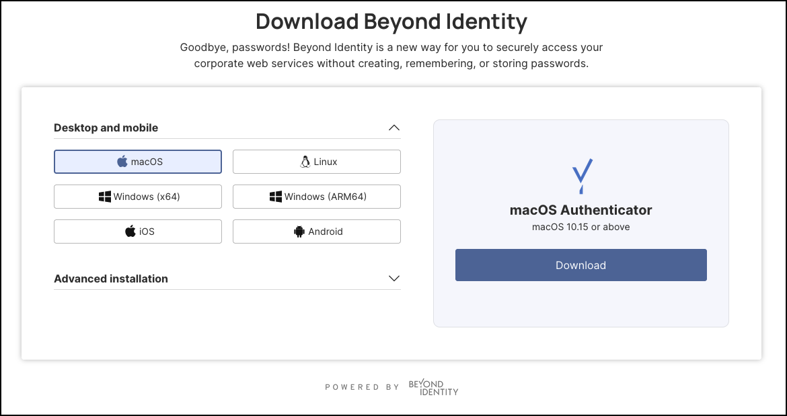
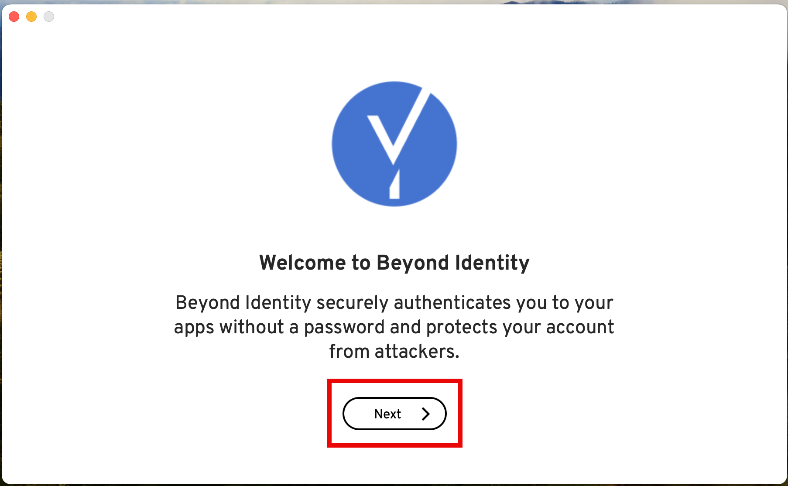
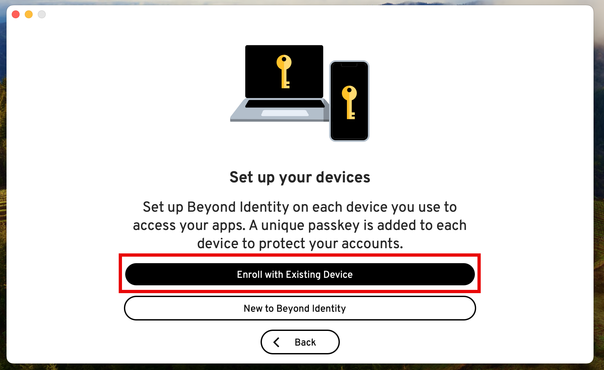
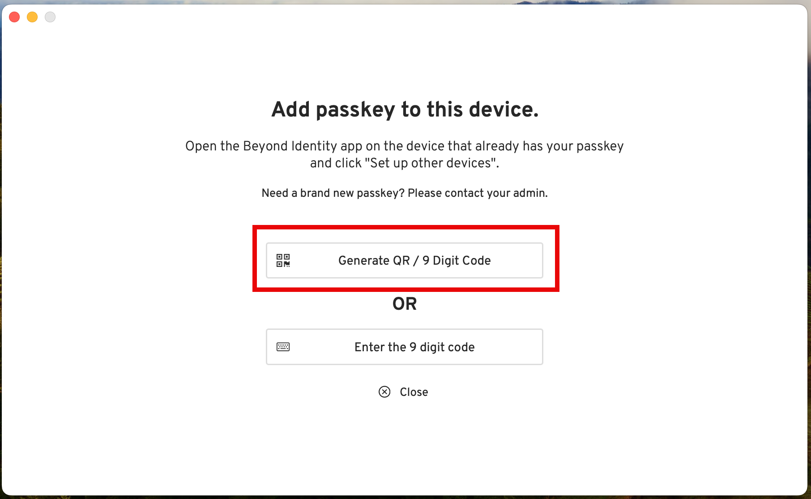
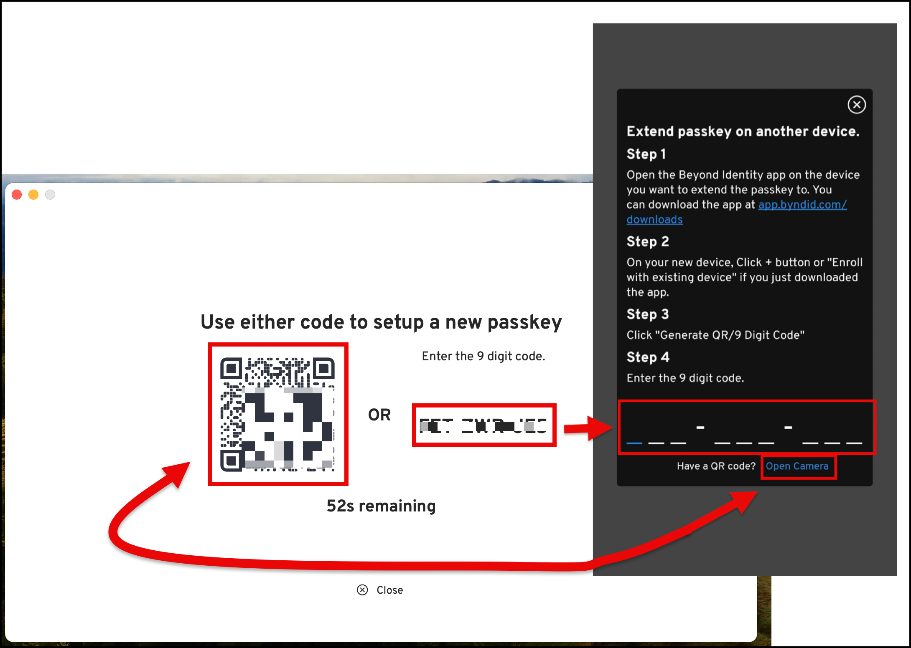
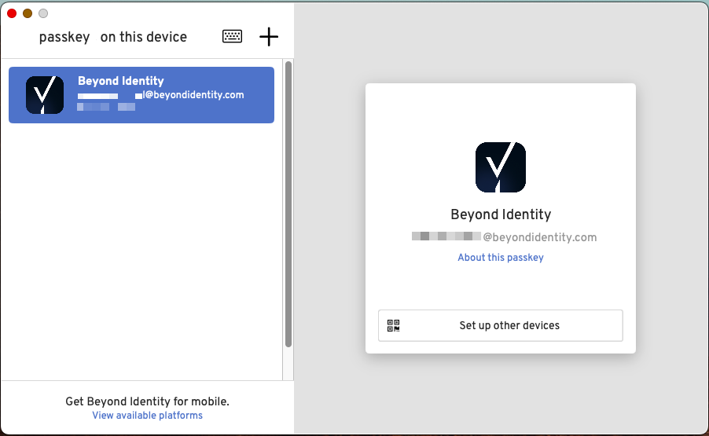
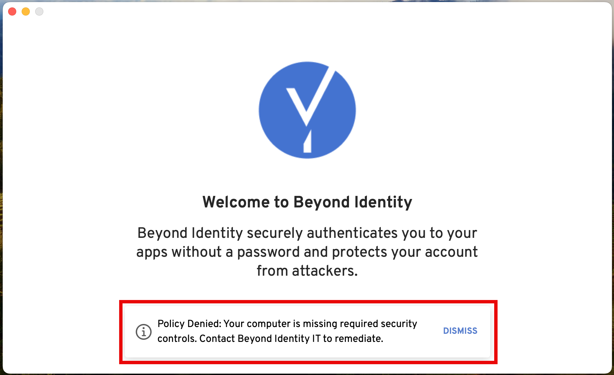

## Overview

This article is intended for users who have already registered a Beyond Identity passkey on a device and wish to extend it to a macOS device, such as a MacBook, iMac, or another Apple computer.

By completing this process, you'll create a backup of your passkey, making it possible to restore it if it's ever deleted from the original device.

---

### What You'll Learm
This article will walk you through the process of adding or extending your passkey credential to a trusted macOS device. 

---

### Steps

1. If you haven’t already, download the Beyond Identity Authenticator for macOS from https://app.byndid.com/downloads.

    

2. Next, follow the steps to install the Authenticator on your macOS device. 

3. Once installed, at the welcome screen, click **Next**. 

    

4. Click **Enroll with Existing Device**. 

     

5. Next, on your iOS device, tap **Generate QR / 9 Digit Code**. 

    

When the QR or 9-digit code appear in the next screen, you have only 60 seconds to enter them in the device that already has the passkey installed. 

**Note**: If you miss entering the code because the time expires, a new code will be generated and you'll have 60 seconds to enter the new code. 

6. For this use case, let's imagine that you want to extend the passkey stored in your Android device.

    Open the Beyond Identity Authenticator on your Android, then tap **Set up other devices**. 

    **NOTE**: The steps may be similar if you are extending the passkey from your iOS (iPhone) device.

7. Enter the 9-digit code generated in your macOS machine (see Step 5 above) to the Android device, **OR** tap **Open Camera** to scan the QR code. 

     

8. If your macOS device complies with your organization's security policies, a confirmation banner will appear indicating that the passkey was added successfully.

    You should also see that the passkey is now installed on your macOS device.

     

    If your macOS device doesn't meet the security policies, you will see a **Policy Denied** message. Contact your IT admin for assistance. 

     

    That's is all! You've successfully extended a passkey to your macOS device!