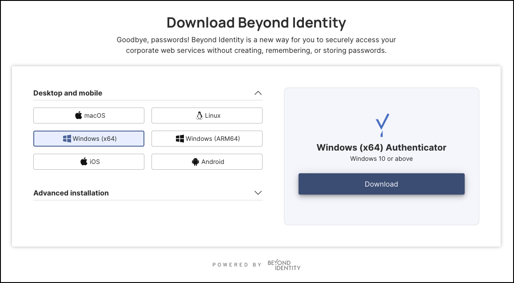
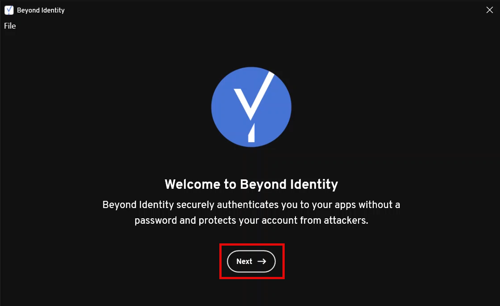
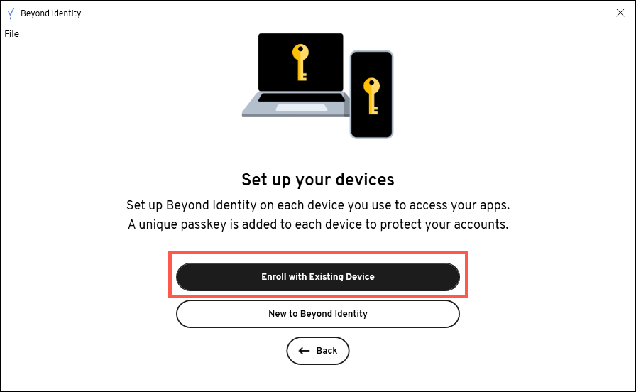
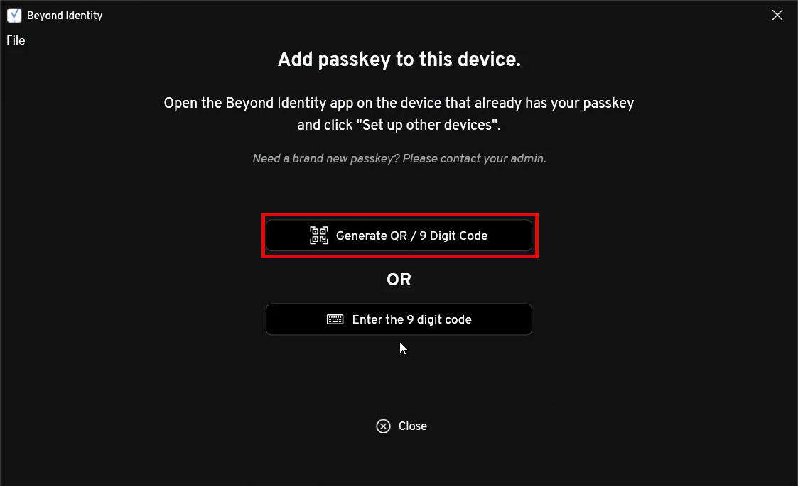
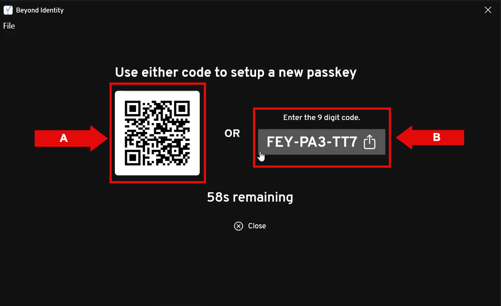
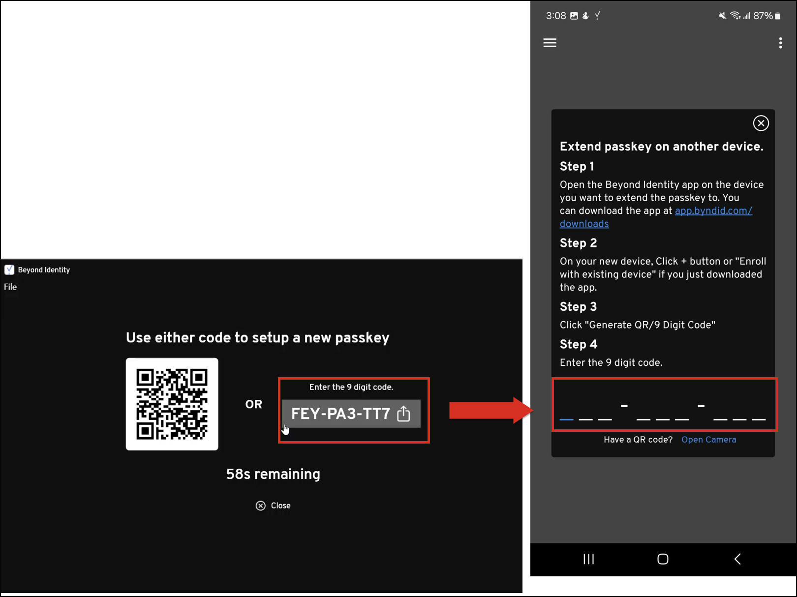
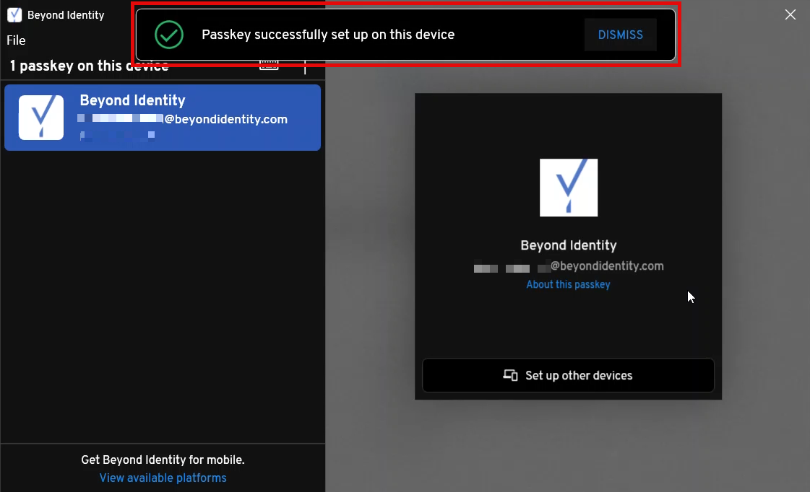

## Overview

This article is for users who have already registered a Beyond Identity passkey on one device and want to extend it to a Microsoft Windows device, such as a PC, laptop, or other workstation running the Windows operating system. 

By completing this process, you'll create a backup of your passkey, making it possible to restore it if it's ever deleted from the original device.

---

### What You'll Learm
This article will walk you through the process of adding or extending your passkey credential to a trusted Windows device. 

---

### Steps

1. If you haven’t already, download the Beyond Identity Authenticator for Windows from https://app.byndid.com/downloads.

    

    Download the version of the Beyond Identity Authenticator that matches your system type: 
    **Windows (x64) Authenticator** or **Windows (ARM64) Authenticator**.

    To check which system type your Windows device is running, follow these steps:

    a. On your Windows machine, press **Windows + R**, then type **msinfo32**, and press **Enter**.

    b. In the **System Information** window, find **System Type**:
        - x64-based PC = 64-bit (x64)
        or
        - ARM-based PC = ARM64

2. After following installation instructions, at the welcome screen, click **Next**. 

    

3. Click **Enroll with Existing Device**. 

    

4. Next, click **Generate QR / 9 Digit Code**.

    

    The image below shows the codes that will allow your other device (i.e., another laptop or mobile device) to extend its passkey to your Windows machine.

        

5. Let's, for example, imagine that you're trying to extend the Beyond Identity passkey stored in your Android smartphone to your Windows machine. 

    First, open the Beyond Identity Authenticator app on your Android, then tap **Set up other devices**.

6. Next, add the 9-digit code generated in the Windows Authenticator (see Step 3 above) to the Authenticator in the Android device.

        

7. If the passkey was successfully extended from your Android device to your Windows machine, a confirmation banner will appear on your Windows device stating:

    **“Passkey successfully set up on this device.”**

        

    **Note**:  If your Windows device doesn't meet the security policies, you will see a **Policy Denied** message. Contact your IT admin for assistance. 

     
        
           