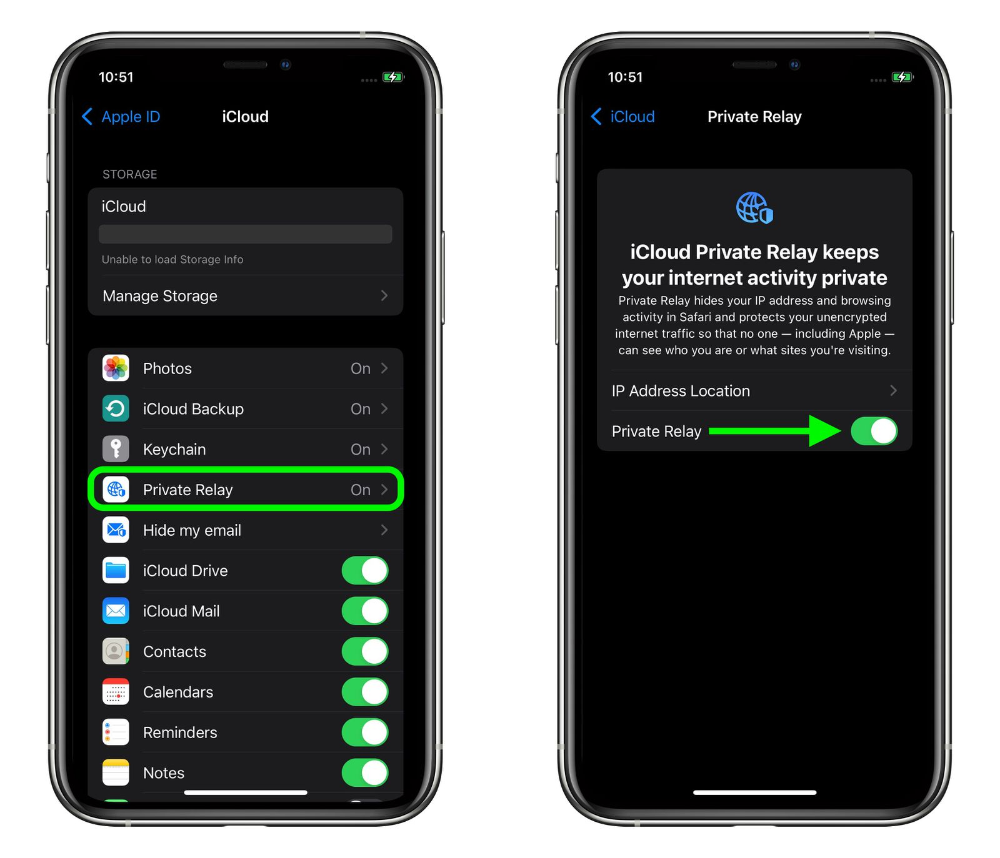

### Overview

When end users have iCloud Private Relay enabled on their personal (BYOD) Apple devices, Beyond Identity authentication may fail. This occurs because iCloud Private Relay masks the user’s IP address and routes network traffic through Apple’s relay servers, interfering with Beyond Identity’s ability to verify the device’s identity or security posture.

### Impact

- Authentication requests from BYOD or unmanaged macOS/iOS devices may fail or timeout.  
- Device posture checks may return incomplete data.  
- Admins may receive reports from end users unable to log in despite having valid credentials.

### Recommended Action for Admins

- Educate end users about iCloud Private Relay’s effect on Beyond Identity authentication. 
 
  > “To successfully sign in with Beyond Identity, please turn off iCloud Private Relay. This setting hides your device’s IP address and can interfere with secure identity verification. You can turn it back on after authentication if you wish.”  

- Provide documentation or a quick guide explaining how to temporarily disable iCloud Private Relay.  
- Update internal onboarding guides to note that this setting must be disabled for Beyond Identity login to function properly.  
- (Optional) Consider deploying an MDM policy (for managed devices) that restricts or disables iCloud Private Relay when corporate authentication is required.

### How End Users Can Turn Off iCloud Private Relay

The following steps show how to disable Private Relay temporarily to allow Beyond Identity authentication. After authentication, you may re-enable it if desired.

#### On iPhone / iPad

1. Open **Settings**  
2. Tap your name (Apple ID)  
3. Tap **iCloud**  
4. Tap **Private Relay**  
5. Toggle **Private Relay** **off**, then confirm **Turn Off Private Relay**  

#### On macOS

1. Open **System Settings** (or **System Preferences** on older macOS versions)  
2. Click your name (Apple ID)  
3. Select **iCloud**  
4. Click **Private Relay**, then toggle **Private Relay** **off** and confirm  

> 💡 **Important:** You can turn Private Relay back on after completing your Beyond Identity authentication.

### Additional Notes

Beyond Identity continuously reviews compatibility with Apple’s privacy features. However, as of this writing, iCloud Private Relay’s design inherently conflicts with device posture validation and secure authentication requirements.

 
 
 

