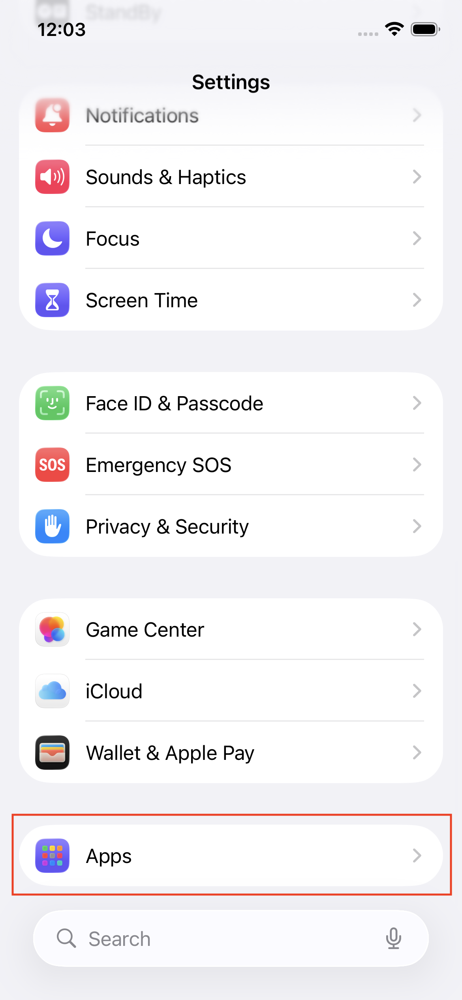
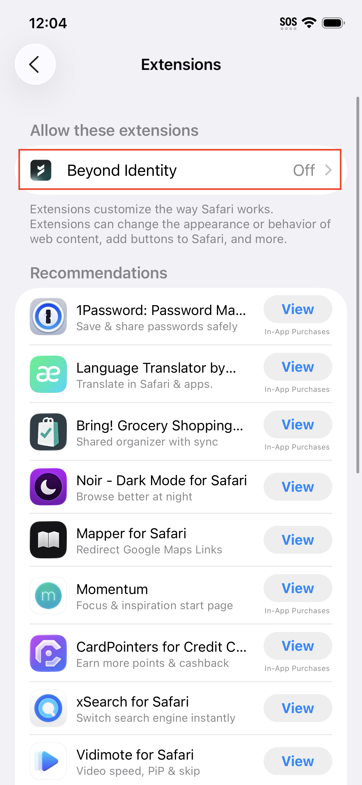
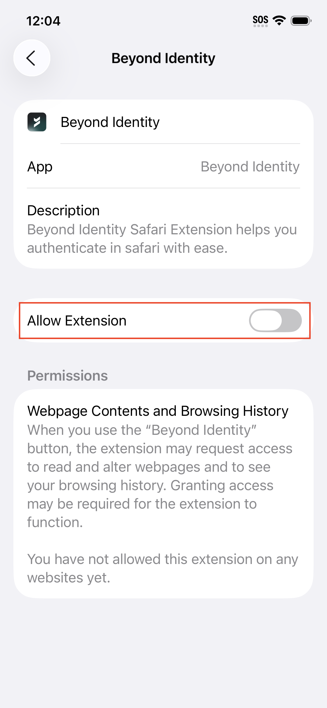
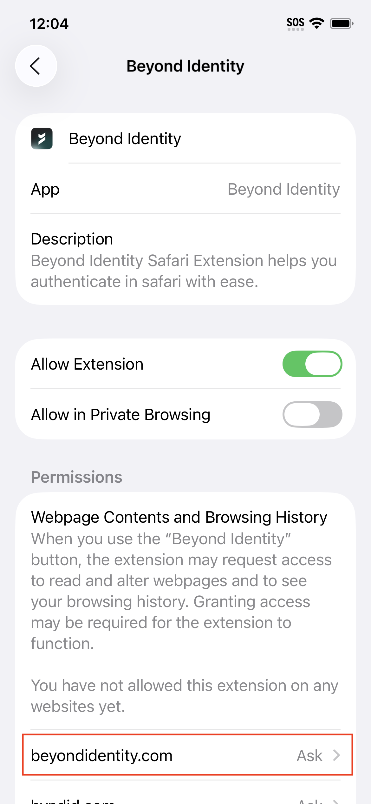
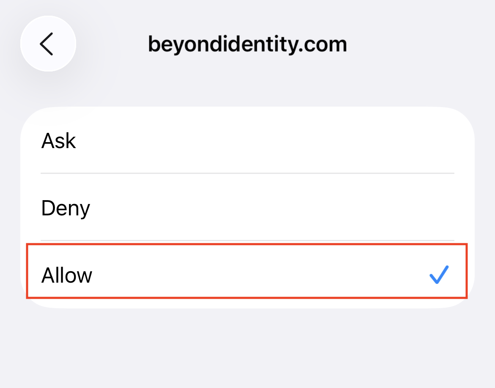
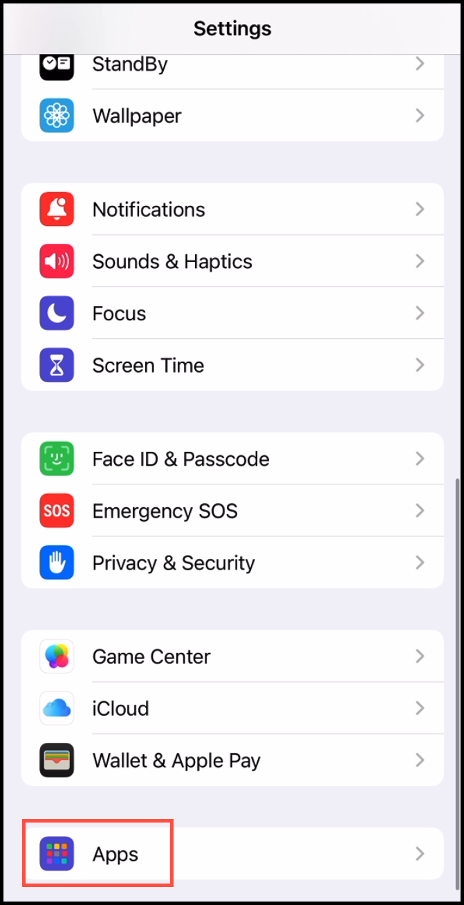
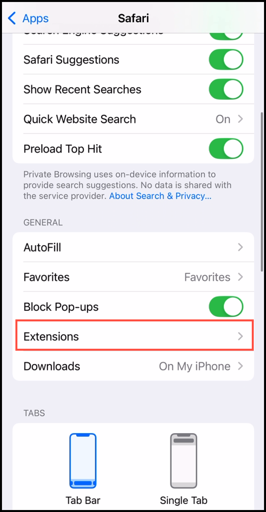
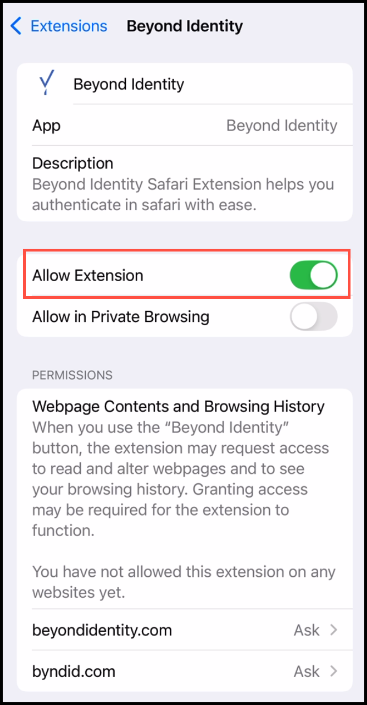
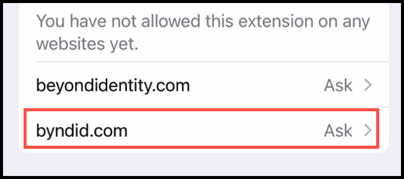

### Enable Beyond Identity Safari Extension on iOS Devices (iOS 26)

You can enable the Beyond Identity Safari Extension to streamline authentication on iPhones and iPads.

**Important**
- The Safari extension only supports web application logins accessed via the Safari browser.
- Due to Apple restrictions, extensions do not work in web browsers embedded inside apps.

---

### iOS 26 Configuration Steps

1. On your iOS device, locate and tap **Settings**.

    

2. Scroll down and tap **Apps**.

    

3. From the list of apps, tap **Safari**.

    

4. Tap **Extensions**.

    

5. Under Safari extensions, tap **Beyond Identity**.

    

6. Toggle **Allow Extension** to ON.

    

7. On the same screen, under **Permissions**, tap **beyondidentity.com**.

    

8. Tap **Allow**.

    

9. Repeat steps **7** and **8** for **byndid.com**.

### Ask vs Allow (Permission Explanation)

- **Ask**  
  Temporarily remembers your login preference for 24 hours. After that, you may receive repeated login prompts.

- **Allow**  
  Permanently streamlines authentication by reducing repeated prompts and enabling seamless access to Beyond Identity and SSO applications such as Okta or Entra ID (Azure).

### Completion

You’re all done. You can now authenticate using your Beyond Identity passkey in the Safari browser when accessing protected applications.

 

### Enable Beyond Identity Safari Extension on iOS Devices (iOS 18)

Follow the steps below to configure the Beyond Identity Safari Extension on devices running iOS 18.

### iOS 18 Configuration Steps

1. On your iOS device, locate and tap **Settings**.

    

2. Scroll down and tap **Apps**.

    

3. Tap **Safari**.

    

4. Tap **Extensions**.

    

5. From the list of extensions, tap **Beyond Identity**.

    

6. Toggle **Allow Extension** to ON.

    

7. Under **Permissions**, tap **byndid.com**.

    

8. Tap **Allow**.

    

9. Repeat steps **7** and **8** for **beyondidentity.com**.

---

### Completion

Your iOS device is now configured. Future logins will use an unprompted authentication flow for faster, seamless access to work applications.

---

### Want to Test It?

Open **Safari** and sign in to:
- The Beyond Identity Admin Console, or
- Your SSO provider (for example, Okta or Entra ID)

---

### Troubleshooting

If authentication does not work as expected:

- Confirm Safari is set as the default browser
- Ensure the Beyond Identity extension is turned ON
- Verify all Beyond Identity domains are set to **Allow** under **Webpage Contents and Browsing History**
