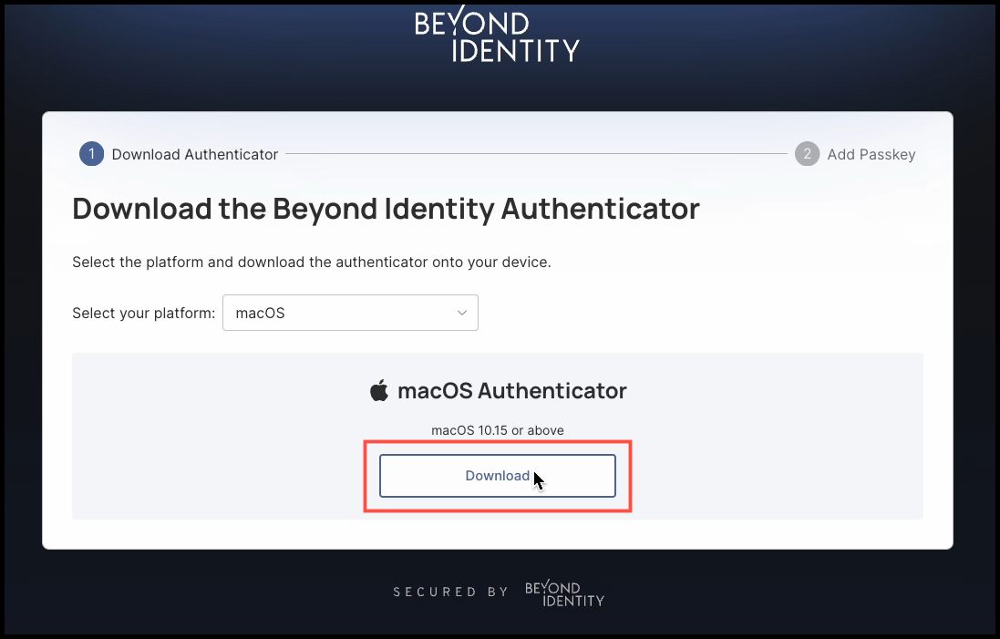

## Overview

In this article, you’ll learn how to set up your device with a passkey so you can log in securely without passwords.

**Important**: In this process, you’re actually enrolling a credential that is tied to you (your identity), not just the device itself. Your device simply stores this passkey credential. A single device can hold multiple passkeys, and you can generate passkeys for multiple devices.

There are several ways to set up a passkey on your device:

- Email with Magic Link – A link sent via email that, when clicked, starts the passkey enrollment process.
- Magic Link (without email) – A direct link that can be shared to start enrollment.
- 9-digit code – A numeric code entered to start enrollment.
- Credential Extension – Extend an existing passkey from one device to another.
- IDP Authorization – Use your identity provider to authorize the enrollment of a new passkey via the user console.

These flows all achieve the same result: your device will have a new passkey credential bound to your identity, enabling secure, passwordless access.

**Note**: The rest of this article focuses on **enrollment via email**. The *magic link* and *9-digit code* methods work very similarly. If you're looking to extend a credential from one device to another, see:

- [Extend your credential to a Windows Device](https://docs.beyondidentity.com/docs/end-user-guides/extend-passkey-credential/extend-credential-windows)
- [Extend your credential to a macOS Device](https://docs.beyondidentity.com/docs/end-user-guides/extend-passkey-credential/extend-credential-macos)
- [Extend your credential to an Android Device](https://docs.beyondidentity.com/docs/end-user-guides/extend-passkey-credential/extend-credential-android)
- [Extend your credential to an iOS Device](https://docs.beyondidentity.com/docs/end-user-guides/extend-passkey-credential/extend-credential-ios)

 
:::caution
Only enroll passkeys on devices you control and are approved by your organization.
:::
 

---

### Steps

#### Enroll a Passkey on Your Device

1. Open the invitation email from your IT team and click **Set up Beyond Identity**. 

    

2. Next, click **Get Started**.

    

3. Since this is your first time downloading the Authenticator, click **No, I don't have the Authenticator**. 

    

4. Your operating system will be detected automatically, and you'll be prompted to download the appropriate Authenticator version. In this example, we click **Download** for the macOS Authenticator.

    

5. After the file is downloaded, follow the instructions for **Step 1**, which will guide you through the installation process. 

    

6. Once the Authenticator installation is complete, return to the dialog box and click **I've downloaded the authenticator**.

    

7. Next, click **Create my passkey.**

    

8. After a brief moment, the Beyond Identity Authenticator will appear and display a banner confirming that **"Your passkey was successfully created!"**

    

That's it! A new passkey has not been installed in your device. 
