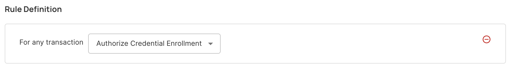
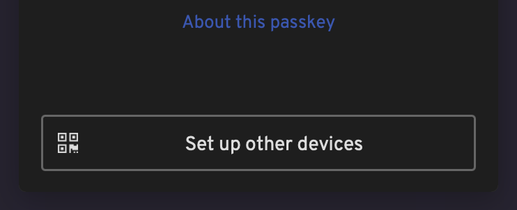
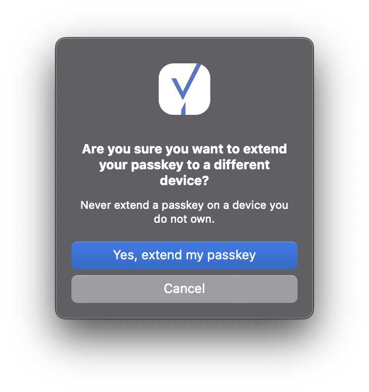
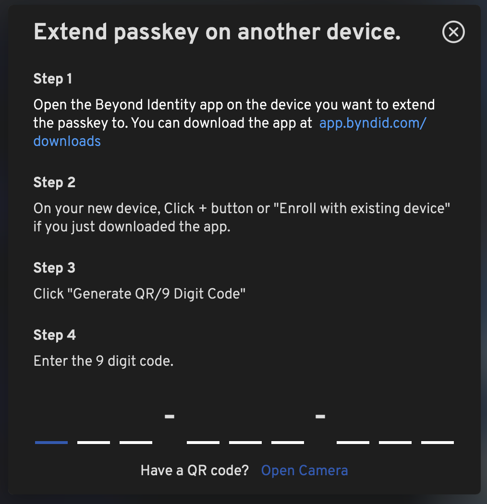
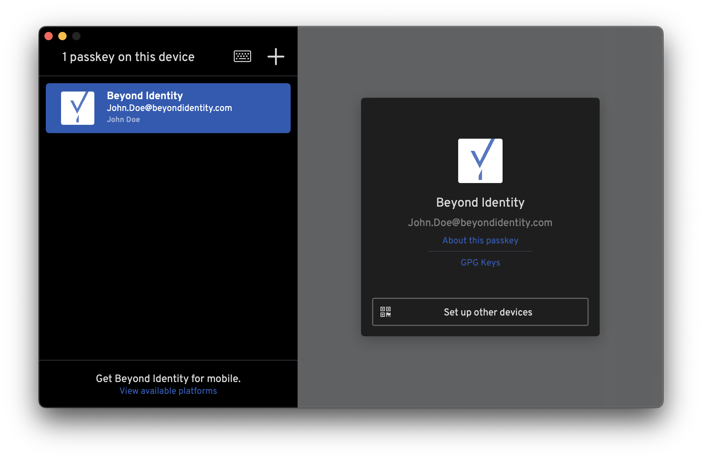
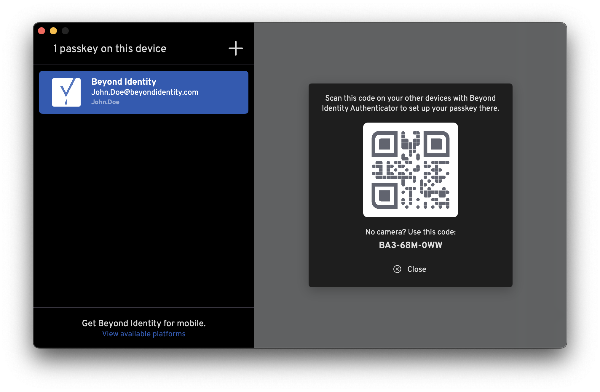
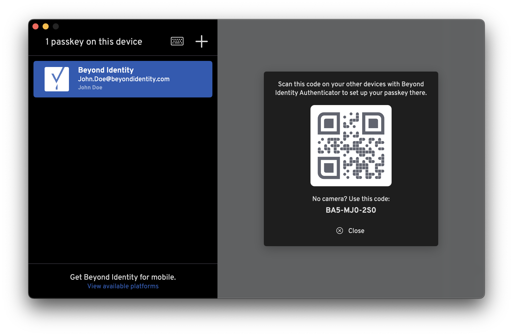
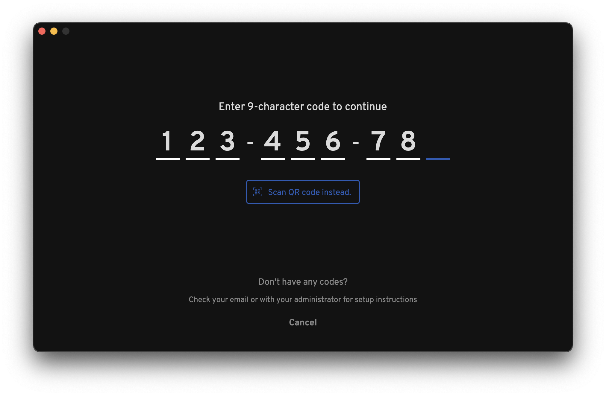
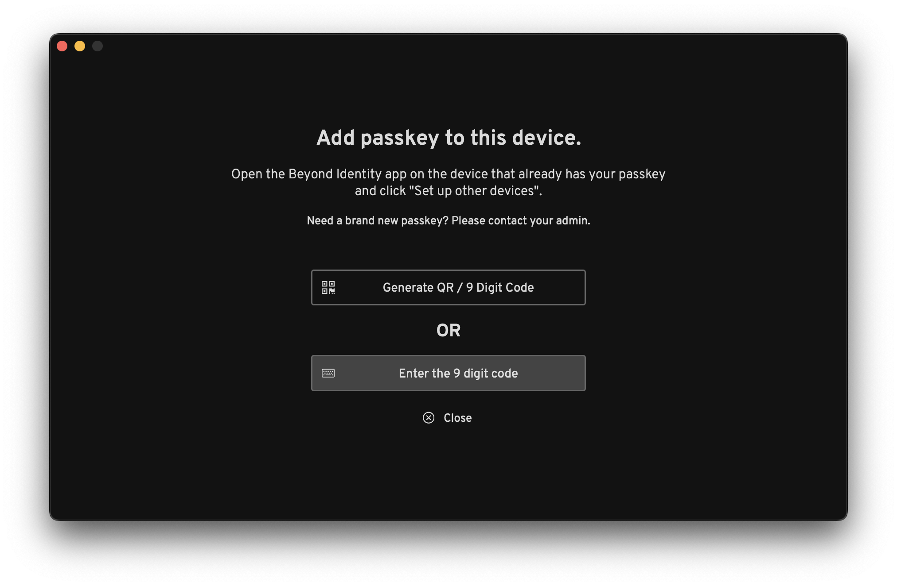

## Overview

This guide covers the process of taking a trusted device with the user's passkey and extending that passkey to another device. This lets end users extend passkeys to their devices on their own.

Users enroll a credential on a device which lets them login to work applications on that device. When users want to access work applications from another device, they must extend existing enrolled credentials to the new device. 

Credential extension helps end users maintain additional devices, passkeys, or both if a primary device no longer has a passkey. This method streamlines enrollment and reduces dependency on external factors. It helps when resources like email or IdP aren't available while still maintaining our high-security standards. 

## Prerequisites

To use credential extension in Beyond Identity as an end user, the following conditions are required.

**End users**
- Beyond Identity Platform Authenticator installed with a passkey on any of these operating systems: macOS, iOS, Windows, Android, Linux
    - The Beyond Identity Platform Authenticator version `2.103.0` is the most recently supported version
    - Both trusted and untrusted devices must have the supported Beyond Identity Platform Authenticator version installed
    - [Download the most recent version of the Beyond Identity Platform Authenticator](https://app.byndid.com/downloads)

:::caution
Only enroll credentials on devices you control.
:::

**Administrators**
- Group or groups in Beyond Identity to apply credential enrollment policy rules

### Differences from Secure Work passkey enrollment

For users coming from Secure Work, the Secure Access credential enrollment process is different. End users generate a QR code or a nine digit code from the new device and then input that information to the trusted device.  The Secure Work credential enrollment process inverts this process and hasn't changed from the original method.

:::note
Passkeys from Secure Work aren't compatible with passkeys from Secure Access and Secure Access passkeys aren't backwards compatible with Secure Work.
:::

View the [Migrating passkey guides from Secure Work documentation](https://support.beyondidentity.com/hc/en-us/sections/6763268099863-Migrating-passkey) for more information.

## Stage summary

The process for credential extension covers different steps for IT administrators and end users. The sections below include sections and steps to complete the setup.

| Stage | Summary | Role |
| --- | --- | --- |
| [Beyond Identity Console setup](#beyond-identity-console-setup) | - [Create group for testing](#create-group-for-testing)   - [Configure policy for credential enrollment](#configure-policy-for-credential-enrollment) | Adminstrator |
| [Passkey enrollment for devices](#passkey-enrollment-for-devices) | - [Download Beyond Identity Platform Authenticator on devices](#download-beyond-identity-platform-authenticator-on-devices)   - [Initiate credential enrollment on trusted device](#initiate-credential-enrollment-on-trusted-device)   - [Coordinate enrollment on untrusted device](#coordinate-enrollment-on-untrusted-device) | End user |
| [Changes to Secure Work self enrollment flow](#changes-to-secure-work-self-enrollment-flow) | Changes to already existing Secure Work self enrollment flow for  Platform Authenticator version 2.103.0 and above  | End user |

### Beyond Identity Console setup

The stages below are for administrators to prepare user groups with the ability to enroll their own credentials on to other devices.

#### Create group for testing

As a security best practice, configure this feature for a smaller number of users within a group. With this functionality available for a smaller number of users at first, you can test this in a more controlled environment first. After successful testing, you can then configure this for a larger group or more groups as needed.

View the Groups document for more information on managing Groups in Beyond Identity. The steps below cover creating a small group of users first to test.

1. On the Beyond Identity Console, navigate to **Groups** under the **Directory** section of the left side navigation.
1. Click **Add Group**.
1. Input `Authorize Credential Enrollment` as the name for the Group and add a description.
1. Click **Add Group**.
1. Scroll down to the newly added Group at the bottom of the Group table and click on the name to go to group details.
1. Click **Add group member** to add Identities to the group.

#### Configure policy for credential enrollment

Before end users are able to use credential extension, use policy rules for the transaction of `Authorize Credential Enrollment` to create protections against passkey abuse.

Learn more about credential enrollment policies in the [Credential Enrollment Policy Guide](/docs/policy/credential-enrollment)

### Passkey enrollment for devices

End users with existing passkeys can add their passkey to new devices using credential extension. This functionality is available after IT administrators for the organization configure policy for authorized credential enrollment. The sections below cover the steps to download and install the Beyond Identity Platform Authenticator to the new device, then to initiate the communication between devices for credential extension.

#### Download Beyond Identity Platform Authenticator on devices

This section includes the steps to download and install the Beyond Identity Platform Authenticator on your new device.

1. [Download the Beyond Identity Platform Authenticator](https://app.byndid.com/downloads) according to your operating system for desktop, mobile, or both.

#### Initiate credential enrollment on trusted device

The steps below are for beginning the credential enrollment on the trusted device. This involves opening the Beyond Identity Platform Authenticator on that device.

1. On the Beyond Identity Platform Authenticator, select the specific passkey to extend.
1. Select the **Set up other devices** button at the bottom of the selected passkey.

1. On the operating system pop up, click **Yes, extend my passkey** to confirm.

1. Follow the steps from the Platform Authenticator and begin the next section of credential enrollment.

#### Coordinate enrollment on untrusted device

This section is for generating QR codes or nine digit codes to input to the trusted device. When the devices communicate and confirm authentication and authorization, the passkey extends from the trusted device to the new device. Follow the steps below to complete the process.

1. On your new device, Click **+** button or **Enroll with existing device** if you just downloaded the app.
1. Click **Generate QR/9 Digit Code**.
1. On the trusted device, use the device's camera to scan the QR code or input the nine digit code.

:::success
Success! Congratulations, you've completed your credential enrollment to a new device!
:::

For `Policy denied` errors, contact your administrator for support.

### Changes to Secure Work self enrollment flow

With the introduction to new Secure Access self enrollment we have also tweaked how Secure Work self enrollment flow works. In this table you will find comparison between the versions of Platform Authenticator that introduced this change.

| 
 version < 2.103.0 
 | version >= 2.103.0 |
| :-------: | :-------: |
| Start on **Trusted** device that has the credential already in it.   | Start on **Trusted** device that has the credential already in it.   |
| Click "Set up other devices". You will be presented with QR code and 9 digit code.   | Click "Set up other devices". You will be presented with QR code and 9 digit code.   |
| On your **Untrusted** device click the "+" icon on the top.   | On your **Untrusted** device click the "+" icon on the top or the "keyboard" icon next to it.   |
| You will be presented with a input field where you input the 9 digit code from the other device.   | If you clicked the keyboard icon, you will be presented with a input field where you input the 9 digit code from the other device.   |
|  | If you clicked "+" icon you will be presented with a decision view, and because you are comming from a already generated code, you can click "Enter the 9 digit code" and enter your code as above.   |