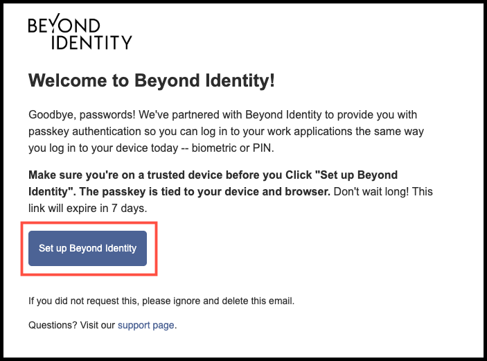
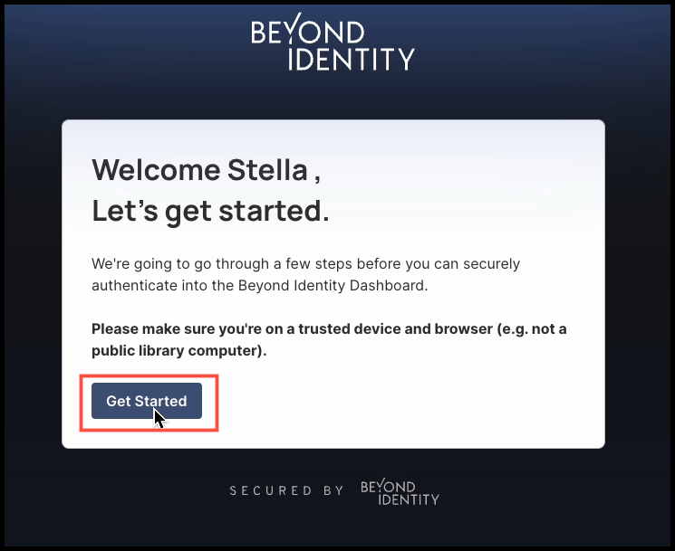
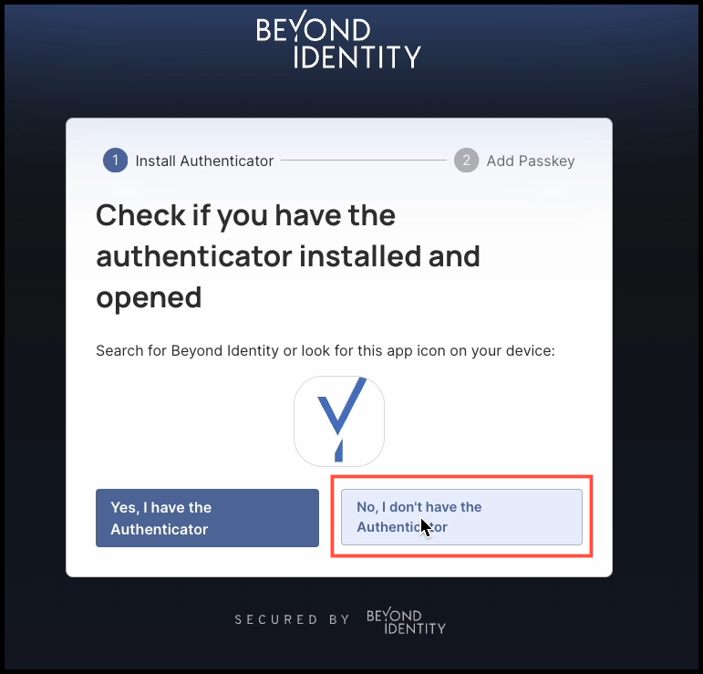
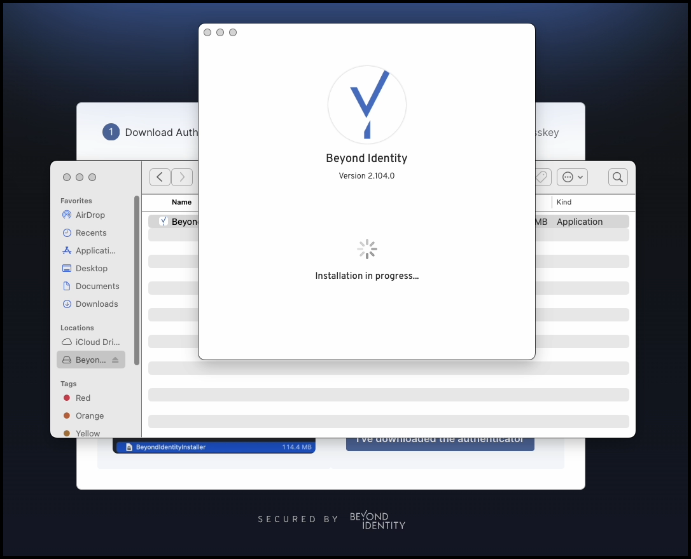
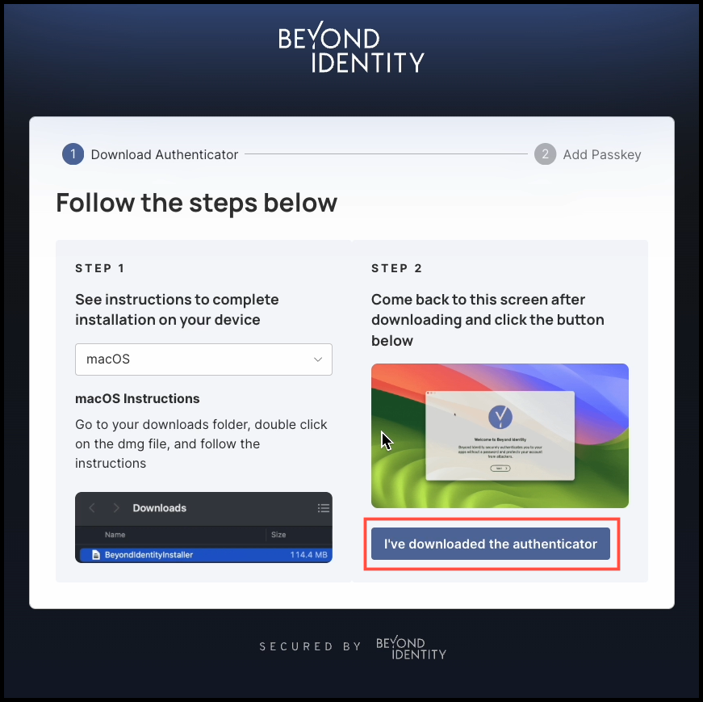
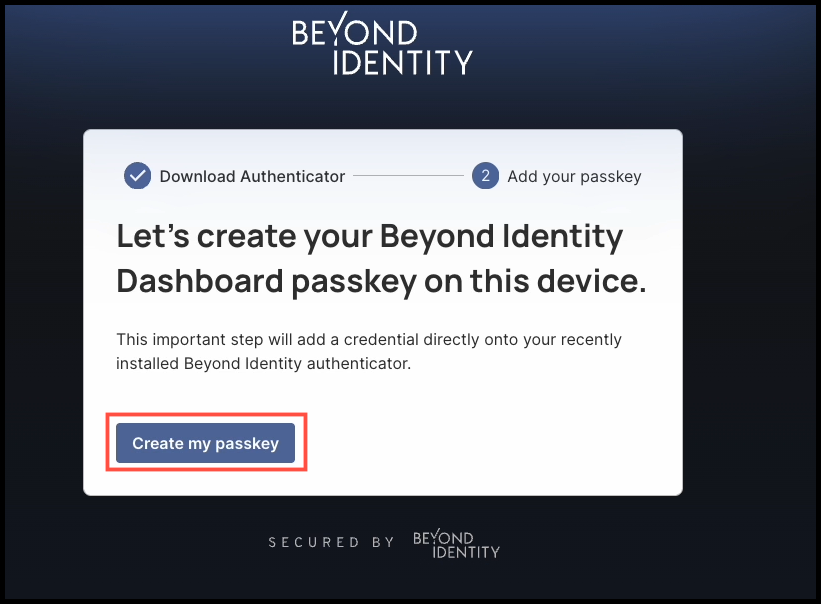
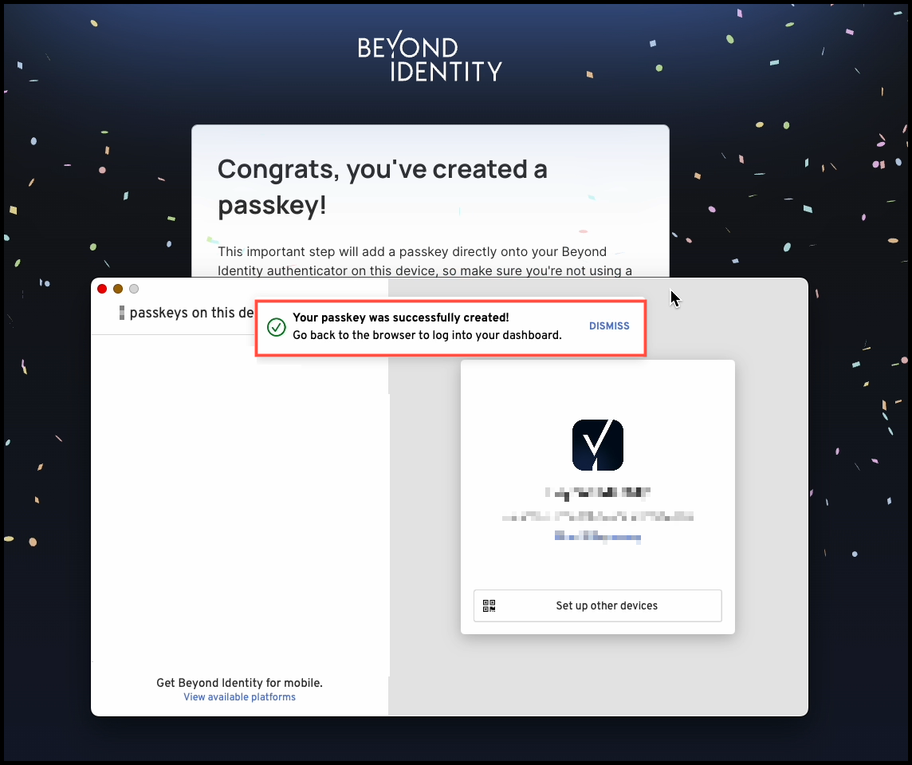

## Overview

Beyond Identity protects you and your organization from phishing attacks and other threats that come with using traditional passwords. Instead of relying on passwords, you use **passkeys**, which are secure credentials stored directly on your approved devices.

Getting started with passkeys is simple. Here’s how it works:

1. You will receive an invitation email from your IT team to begin the passkey setup process.
2. The email will guide you to download and install the Beyond Identity Authenticator for your device. The Authenticator is available for Windows, macOS, iOS, Android, and Linux.
3. After you install the Authenticator, a passkey will be created on that device. You can then use the app to add/extend passkeys to other devices, such as your smartphone or tablet.

Once set up, you will be able to sign in securely from any of your approved devices, without ever needing to enter a password.

 
:::caution
Only enroll passkeys on devices you control and are approved by your organization.
:::
 

### What You'll Learn

In this article, you will learn how to enroll your device with a secure passkey using the Beyond Identity Authenticator. 

If you are looking to set up a shared or secondary device, please refer to our [Roaming Authentication guide](https://docs.beyondidentity.com/docs/authentication-experience/roaming-authentication).

 
### Steps

#### Enroll a Passkey on a Trusted Device

1. Open the invitation email from your IT team and click **Set up Beyond Identity**. 

2. Next, click **Get Started**.

New to BI

3. Since this is your first time downloading the Authenticator, click **No, I don't have the Authenticator**. 

4. Your operating system will be detected automatically, and you'll be prompted to download the appropriate Authenticator version. In this example, we click **Download** for the macOS Authenticator.

5. After the file is downloaded, follow the instructions for **Step 1**, which will guide you through the installation process. 

6. Once the Authenticator installation is complete, return to the dialog box and click **I've downloaded the authenticator**.

7. Next, click **Create my passkey.**

8. After a brief moment, the Beyond Identity Authenticator will appear and display a banner confirming that **"Your passkey was successfully created!"**

That's it!
