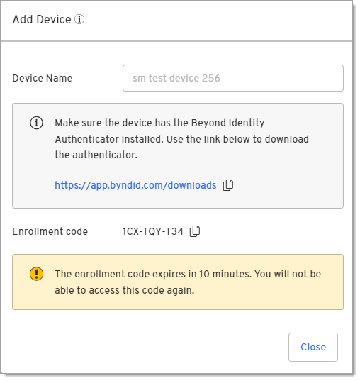

# Device360 installation
This guide walks you through the process of downloading and installing the Beyond Identity Authenticator and enrolling devices so you can start monitoring device posture.  

## Supported operating systems
This release supports the following operating systems. This list will be updated as additional platforms are added. 

| **Operating System** | **Versions**                   | 
|----------------------|--------------------------------|
| macOS                | 12, 13, 14 (Sonoma)            |
| Windows              | 10 (build 18363 and later), 11 |

## Supported Beyond Identity authenticator

Device360 is available starting in version 2.94 or later. It is highly recommended that you update to the latest version of the Beyond Identity authenticator to ensure that you can access new features.  

# Install the authenticator and enroll devices
To begin collecting data and running queries on a device, you must first install the Beyond Identity authenticator on a device and enroll it. Select from the following installation options:

- [New customer installation and enrollment](#new-customer-installation-and-enrollment)
- [Secure Workforce customer enrollment](#secure-workforce-customer-enrollment)

 
## New customer installation and enrollment 
If you are new to Beyond Identity, you will need to download and install the authenticator on devices, and then provide users with an enrollment code that will enable Device360 to collect data. 

1. Select **Inventory > Device Inventory** in the left nav bar. 

2. Click **Add Device**.

   

3. Enter a device name and click **Next**.
   
   

4. Click the link to open the authenticator downloads page.
   
   

5. Copy the Enrollment code. The enrollment code will expire after 10 minutes. 

6. Open the authenticator and click the + button.

   

7. Paste or type the enrollment code in the "Enter 9-digit code" screen to enroll the device. Note that a cursor doesn't appear on the screen.

      

   Once the device is enrolled by entering the 9-digit code, it will be added to the Device table.
   
   You can now monitor and query the device.

## Secure Workforce customer enrollment
If you are a Secure Workforce customer, Device360 uses the same authenticator that allows you to securely sign into corporate applications without passwords. You will just need to generate a Device360 enrollment code and add it to your existing version of the authenticator (minimum version of 2.92). 
:::note 
- This will **not** impact your Secure Workforce passkey in the authenticator.
- Beyond Identity's Windows Desktop Login is not compatible with Device360.
:::
1. Select **Inventory > Device Inventory** in the left nav bar. 

2. Click **Add Device**.

   

4. Copy the Enrollment code. The enrollment code will expire after 10 minutes. 

5. Open the authenticator and click the + button.

   

6. Paste or type the enrollment code in the "Enter 9-digit code" screen to enroll the device. Note that a cursor doesn't appear on the screen.

      

   Once the device is enrolled by entering the 9-digit code, it will be added to the Device table.
   
   You can now monitor and query the device.

## Generate a new enrollment code
The enrollment code expires after 10 minutes so you may need to generate a new enrollment code for a device. 

  1. Select the checkbox by the Device Name. 
  
  2. Click the Edit icon under the Actions column to open the Edit device dialog.
     

3. Click **Generate new enrollment code**. 

4. Send the code to the user to enroll their device. 

## Troubleshooting installation

### Unable to see data for iOS, Android, or Linux operating systems
Currently, Device360 is supported on Windows and macOS only. 

### Deleted enrollment code or passkey 
If the enrollment code or passkey is deleted, you will need to [rebind the device](/docs/device-inventory#rebind-devices).