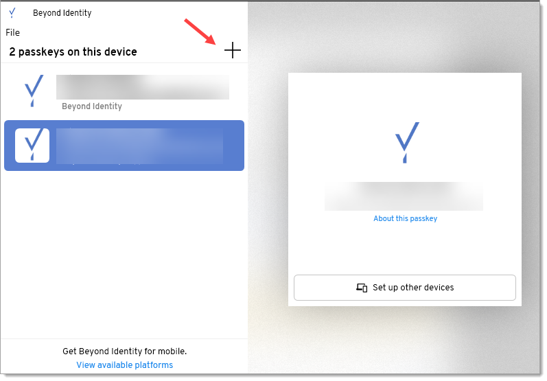

#Device360 installation
This guide walks you through the process of downloading and installing the Beyond Identity Authenticator and enrolling devices so you can start monitoring device posture.  

## Supported operating systems
This release supports the following operating systems. This list will be updated as additional platforms are added. 

| **Operating System** | **Versions**               | 
|------------------|--------------------------------|
| macOS            | 12, 13, 14 (Sonoma)            |
| Windows          | 10 (build 18363 and later), 11 |

## Supported Beyond Identity authenticator

Device360 is available with version 2.94 or later of the Beyond Identity authenticator.  

# Install the authenticator and enroll devices
To begin collecting data and running queries on a device, you must first install the Beyond Identity authenticator on a device and enroll it. Select from the following installation options:

- <ins>[New customer installation and enrollment](#new-customer-installation-and-enrollment)</ins> 
- <ins>[Secure Workforce customer installation and enrollment](#secure-workforce-customer-installation-and-enrollment)</ins>

 
## New customer installation and enrollment 
If you are new to Beyond Identity, you will need to install 

1. Select **Inventory > Device Inventory** in the left nav bar. 

2. Click **Add Device**.

   

3. Enter a device name and click **Next**.
   
   

4. Click the link to open the authenticator downloads page.
   
   

5. Copy the Enrollment code.

6. Open the authenticator and click the + button.

   

7. Paste or type the enrollment code in the "Enter 9-digit code" screen to enroll the device. Note that a cursor doesn't appear on the screen.

      

   Once the device is enrolled by entering the 9-digit code, it will be added to the Device table.
   
   You can now monitor and query the device.

## Secure Workforce customer installation and enrollment
If you are a Secure Workforce customer, Device360 uses the same authenticator that allows you to securely sign into corporate applications without passwords. You will just need to generate a Device360 enrollment code and and add it to your existing version 2.94 or later authenticator. This will not impact your Secure Workforce passkey in the authenticator.
:::note 
For Secure Workforce customers, Beyond Identity's Windows Desktop Login is not compatible with Device360.
:::
1. Select **Inventory > Device Inventory** in the left nav bar. 

2. Click **Add Device**.

   

4. Copy the Enrollment code.

5. Open the authenticator and click the + button.

   

6. Paste or type the enrollment code in the "Enter 9-digit code" screen to enroll the device. Note that a cursor doesn't appear on the screen.

      

   Once the device is enrolled by entering the 9-digit code, it will be added to the Device table.
   
   You can now monitor and query the device.