For passwordless authentication, the customer may integrate Zscaler with Beyond Identity, either directly or through their existing SSO. This document describes the direct integration between Zscaler and Beyond Identity. For integration through SSO, don't hesitate to get in touch with Beyond Identity.

Zscaler's direct integration with Beyond Identity applies to Zscaler Client Connector (ZCC) for ZPA, ZPA Admin Console, and ZIA.

In this guide, you'll set up Beyond Identity:

* As a passwordless authentication solution for your Zscaler Internet Access (ZIA) and Zscaler Private Access (ZPA) services.
* To enforce corporate Zero Trust policies by using Zscaler Mobile Portal APIs.

:::info
Zscaler's integration doesn't apply to ZIA Admin Console because it doesn't support service provider-initiated SAML flow, and Beyond Identity doesn't support the IdP-initiated SAML flow.   

ZIA and ZPA Provisioning use SCIM-supported directory or SSO while supporting Authentication directly with Beyond Identity as the IdP.
:::
## Prerequisites

Ensure that you have the following:

* Zscaler account with _**Super**_ admin privileges to configure SAML IdP.
* Zscaler Mobile APIs enabled for your tenant (mobileadmin.<_Zscaler cloud_\>.net); under the **Administration** tab, go to **Public API**.

## Configure ZPA Admin authentication

In this procedure, you'll configure Beyond Identity as the IdP for the ZPA Admin Console sign-in.

1. Sign in to the ZPA Admin Console as Administrator.

2. From the side menu, select **Administration > IdP Configuration**.

  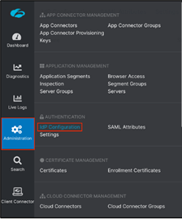

3. In the upper right of the **IdP Configuration** tab, select the **Add IdP Configuration** blue plus sign and provide the following information. Then click **Next**.

  <table width="60%">
    <tbody>
      <tr>
        <td>
          <b>Name</b>
        </td>
        <td>Beyond Identity Admin SSO
        </td>
      </tr>
      <tr>
        <td><b>Single Sign-on</b>
        </td>
        <td>Admin
        </td>
      </tr>
      <tr>
        <td><b>Admin SP Certificate Rotation</b>
        </td>
        <td><i>Select the correct certificate</i>
        </td>
      </tr>
      <tr>
        <td><b>Domains</b>
        </td>
        <td><i>Select the correct domain</i>
        </td>
      </tr>
    </tbody>
  </table>

1. From the **SP Metadata** tab, download the **Service Provider Metadata**, which you'll use to upload as part of the configuration process. Then click on **Next**.

  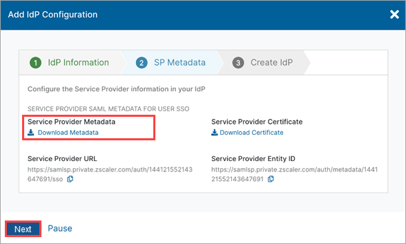

2. Sign in to the Beyond Identity Admin Console, and select the **Integrations** tab.

3. Select the **SAML** tab, and select **SAML Connections > Add SAML Connection**.

4. In the Edit SAML Connection window, upload the SP Metadata XML file you downloaded in the previous step, update the Name field with **Zscaler Private Access Admin SSO**. Then click **Save Changes**.

  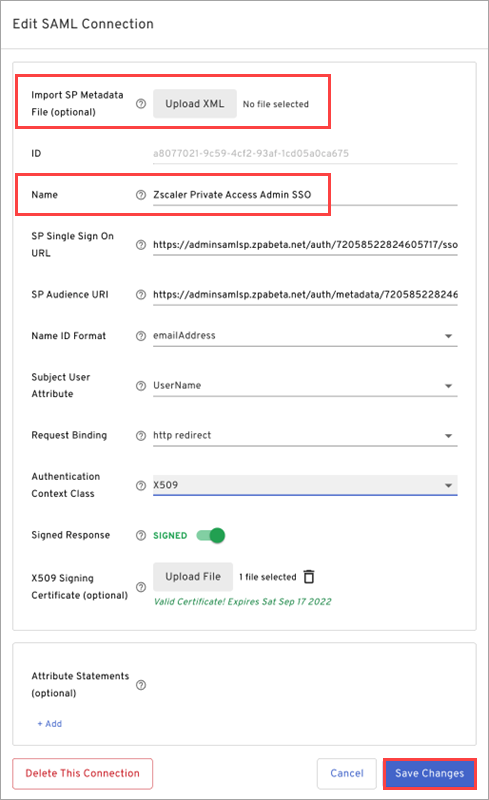

5. Make a note of the IdP ID (Beyond Identity Connection ID) and then copy the following information from the recently created SAML Connection. You'll need these to finish the configuration. Then click **Save Changes**.

  <table width="100%">
    <tbody>
      <tr>
        <td>
          <b>IdP Single Sign-On URL</b>
        </td>
        <td>https://auth.byndid.com/saml/v0/<i>BI-Connection-ID</i>/sso
        </td>
      </tr>
      <tr>
        <td><b>IdP Issuer</b>
        </td>
        <td>https://auth.byndid.com/saml/v0/<i>BI-Connection-ID</i>/sso/metadata.xml
        </td>
      </tr>
    </tbody>
  </table>

1. Click **Download Certificate**.

  
    
2. Go back to the **Zscaler Private Access Admin Console**, and on the **IdP Configuration** tab, configure the following and then click **Save**:

  <table width="100%">
    <tbody>
      <tr>
        <td>
          <b>IdP Certificate</b>
        </td>
        <td><i>Upload the certificate from the previous step</i>
        </td>
      </tr>
      <tr>
        <td><b>Single Sign-On URL</b>
        </td>
        <td>https://auth.byndid.com/saml/v0/<i>BI-Connection-ID</i>/sso
        </td>
      </tr>
      <tr>
        <td><b>Status</b>
        </td>
        <td>Enabled
        </td>
      </tr>
      <tr>
        <td><b>Domains</b>
        </td>
        <td><i>Select the correct domain</i>
        </td>
      </tr>
      <tr>
        <td><b>HTTP-Redirect</b>
        </td>
        <td>Enabled
        </td>
      </tr>
      <tr>
        <td><b>ZPA (SP) SAML Request</b>
        </td>
        <td>Signed
        </td>
      </tr>
    </tbody>
  </table>

  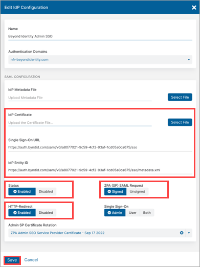

## Configure ZPA User authentication

In this procedure, you'll configure Beyond Identity as the IdP for the ZPA Client Connector user sign-in.

1. Sign in to the ZPA Admin Console as Administrator.

2. From the side menu, select **Administration > IdP Configuration**.
    
  
    
3. On the **IdP Configuration** tab, select the **Add IdP Configuration** blue plus sign, provide the following information, and click **Next**:

  <table width="100%">
    <tbody>
      <tr>
        <td>
          <b>Name</b>
        </td>
        <td>Beyond Identity User SSO
        </td>
      </tr>
      <tr>
        <td><b>Single Sign-on</b>
        </td>
        <td>User
        </td>
      </tr>
      <tr>
        <td><b>User SP Certificate Rotation</b>
        </td>
        <td><i>Select the correct certificate</i>
        </td>
      </tr>
      <tr>
        <td><b>IdP Issuer</b>
        </td>
        <td><i>Select the correct domain</i>
        </td>
      </tr>
    </tbody>
  </table>

1. From the **SP Metadata** tab, download the **Service Provider Metadata**, which you'll use to upload as part of the configuration process. Then click on **Next**.

   

2. Sign in to the Beyond Identity Admin Console, and select the **Integrations** tab.

3. Select the **SAML** tab, and select **SAML Connections > Add SAML Connection**.

4. In the Edit SAML Connection window, upload the SP Metadata XML file you downloaded in the previous step, update the Name field with **Zscaler Private Access Admin SSO**. Then click **Save Changes**.
    
   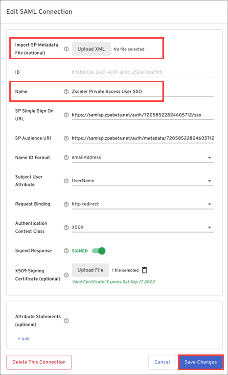

5. Make a note of the IdP ID (Beyond Identity Connection ID) and then copy the following information from the recently created SAML Connection. You'll need these to finish the configuration. Then click **Save Changes**.

  <table width="100%">
    <tbody>
      <tr>
        <td>
          <b>IdP Single Sign-On URL</b>
        </td>
        <td>https://auth.byndid.com/saml/v0/<i>BI-Connection-ID</i>/sso
        </td>
      </tr>
      <tr>
        <td><b>IdP Issuer</b>
        </td>
        <td>https://auth.byndid.com/saml/v0/<i>BI-Connection-ID</i>/sso/metadata.xml
        </td>
      </tr>
    </tbody>
  </table>

1. Click **Download Certificate**.

    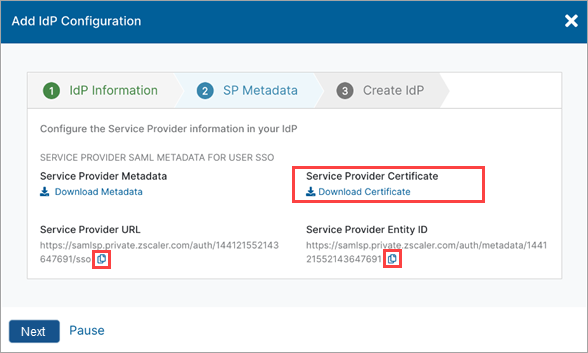

2. Go back to the **Zscaler Private Access Admin Console**, and on the **IdP Configuration** tab, configure the following and then click **Save**:

  <table width="100%">
    <tbody>
      <tr>
        <td>
          <b>IdP Certificate</b>
        </td>
        <td><i>Upload the certificate from the previous step</i>
        </td>
      </tr>
      <tr>
        <td><b>Single Sign-On URL</b>
        </td>
        <td>https://auth.byndid.com/saml/v0/<i>BI-Connection-ID</i>/sso
        </td>
      </tr>
      <tr>
        <td>
          <b>IdP Entity ID</b>
        </td>
        <td>https://auth.byndid.com/saml/v0/<i>BI-Connection-ID</i>/sso/metadata.xml
        </td>
      </tr>
      <tr>
        <td><b>Status</b>
        </td>
        <td>Enabled
        </td>
      </tr>
      <tr>
        <td>
          <b>HTTP-Redirect</b>
        </td>
        <td>Enabled
        </td>
      </tr>
      <tr>
        <td><b>ZPA (SP) SAML Request</b>
        </td>
        <td>Signed
        </td>
      </tr>
      <tr>
        <td><b>Single Sign-On</b>
        </td>
        <td>User
        </td>
      </tr>
      <tr>
        <td><b>SCIM Sync</b>
        </td>
        <td>Disabled
        </td>
      </tr>
      <tr>
        <td><b>SCIM Attributes for Policy</b>
        </td>
        <td>Disabled
        </td>
      </tr>
    </tbody>
  </table>

  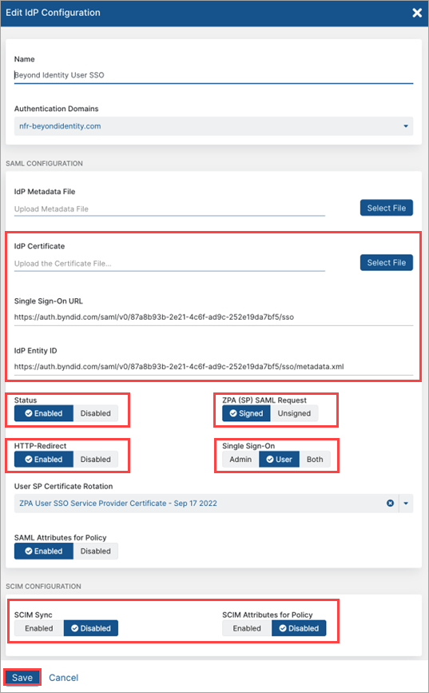

## Configure ZIA User authentication

In this procedure, you'll configure Beyond Identity as the IdP for the ZIA Client Connector user sign-in.

1. Sign in to the ZIA Admin Console as Administrator.

2. From the side menu, select **Administration > Authentication Settings**.

  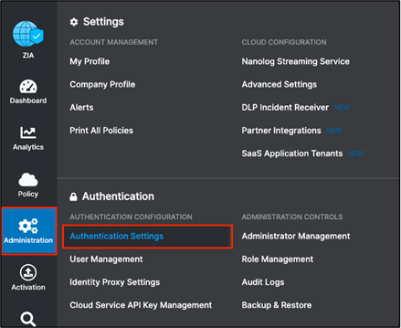

3. Select **Identity Providers > Add IdP**.

  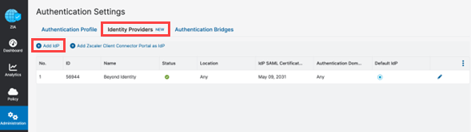

4. Download the SP Metadata file. You'll use it in the Beyond Identity Admin Console as part of the integration setup. 

5. Sign in to the Beyond Identity Admin Console, and select the **Integrations** tab.

6. Select the **SAML** tab, and select **SAML Connections > Add SAML Connection**.

7. In the Edit SAML Connection window, upload the SP Metadata XML file you downloaded in the previous step, update the Name field with **Zscaler Internet Access User SSO**. Then click **Save Changes**.
    
  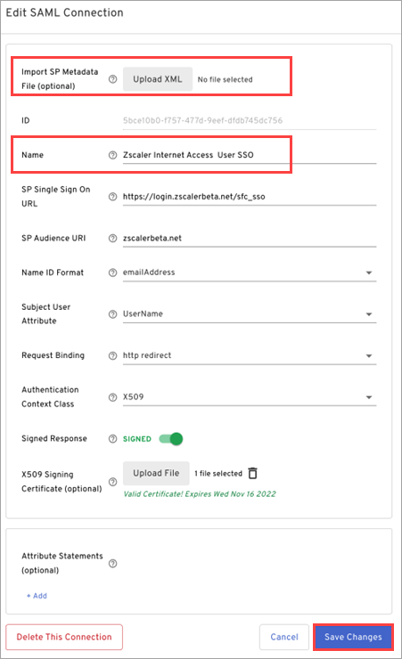
    
8. Make a note of the IdP ID (Beyond Identity Connection ID) and then copy the following information from the recently created SAML Connection. You'll need these to finish the configuration. Then click **Save Changes**.

  <table width="100%">
    <tbody>
      <tr>
        <td>
          <b>IdP Single Sign-On URL</b>
        </td>
        <td>https://auth.byndid.com/saml/v0/<i>BI-Connection-ID</i>/sso
        </td>
      </tr>
      <tr>
        <td><b>IdP Issuer</b>
        </td>
        <td>https://auth.byndid.com/saml/v0/<i>BI-Connection-ID</i>/sso/metadata.xml
        </td>
      </tr>
    </tbody>
  </table>

9. Click **Download Certificate**.
    
    
    
10. Go back to the **Zscaler Private Access Admin Console**, and on the **IdP Configuration** tab, configure the following and then click **Save**:

  <table width="100%">
   <tbody>
   <tr>
      <td>
         <b>Status</b>
      </td>
      <td>Enabled
      </td>
   </tr>
   <tr>
      <td><b>SAML Portal URL</b>
      </td>
      <td>https://auth.byndid.com/saml/v0/<i>BI-Connection-ID</i>/sso
      </td>
   </tr>
   <tr>
      <td>
         <b>Login Name Attribute</b>
      </td>
      <td>NameID
      </td>
   </tr>
   <tr>
      <td><b>IdP SAML Certificate</b>
      </td>
      <td><i>Upload the certificate from the previous step</i>
      </td>
   </tr>
   <tr>
      <td>
         <b>Vendor</b>
      </td>
      <td>Others
      </td>
   </tr>
   <tr>
      <td><b>Sign SAML Request</b></td>
      <td>Disabled</td>
   </tr>
   <tr>
      <td><b>Enable SAML Auto-Provisioning</b>
      </td>
      <td>Disabled
      </td>
   </tr>
   <tr>
      <td><b>Enable SCIM Provisioning</b>
      </td>
      <td>Disabled
      </td>
   </tr>
   </tbody>
  </table>

  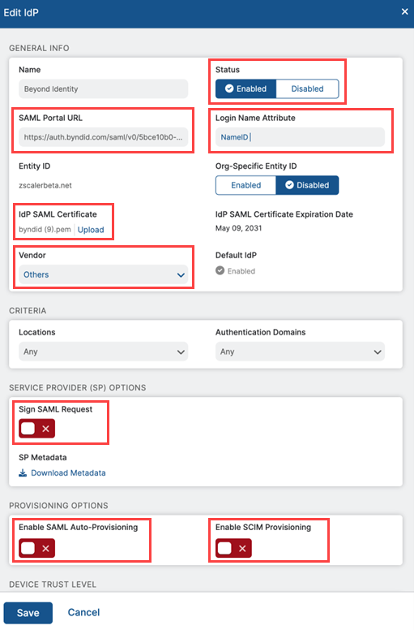

1. From the **Authentication Settings** page, select **Authentication Profile** and then select **SAML** as the Authentication Type.

  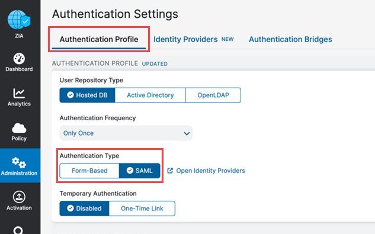

## Enable API access in the Zscaler Mobile Portal

In this procedure, you'll enable API access in the Zscaler Mobile Portal.

1. Sign in to the Zscaler Client Connector (Mobile) portal from ZIA (Policy -> ZCC Portal) or ZPA Admin Console (Client Connector from the left menu).

2. From the ZCC portal, select **Administration > Public API > Add API Key**.

  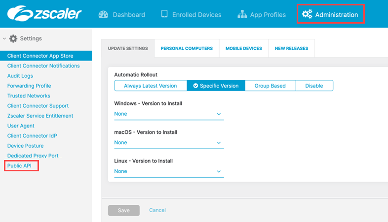

3. Provide the following information, and click **Save**.

  <table width="100%">
    <tbody>
      <tr>
        <td>
          <b>Name</b>
        </td>
        <td>Beyond Identity
        </td>
      </tr>
      <tr>
        <td><b>Status</b>
        </td>
        <td>Enabled
        </td>
      </tr>
      <tr>
        <td><b>Role</b>
        </td>
        <td>Write
        </td>
      </tr>
      <tr>
        <td><b>Session Validity Interval (In seconds)</b>
        </td>
        <td>31540000 <i>(approximately 1 year)</i>
        </td>
      </tr>
    </tbody>
  </table>

  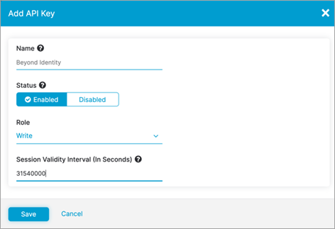

4. Make a note of the **Client Secret** and **Client ID** because you'll need this for configuring Zscaler API access in the Beyond Identity Admin Console (in the next section).

## Configure Zscaler API access in Beyond Identity

Beyond Identity supports continuous authentication and monitors device security posture even when the user is not actively trying to authenticate. In addition, Beyond Identity uses [Zscaler Mobile APIs](#enable-api-access-zscaler-mobile) to force the Zscaler Client Connector re-authentication in case the device security posture doesn't meet enterprise policies.

In this section, you'll create a test group with a single user to test the Deny rule before configuring the policy to target all users.

:::info before you start!
You'll need the Client ID, Client Secret, and Zscaler Mobile Portal URL, which you should have copied from the previous section.
:::

1. Sign in to the Beyond Identity Admin Console and select **Integrations > End Point Management > Zscaler > Edit Configuration**.

2. Enter the Zscaler Mobile Portal URL (Host Url), Client ID, and Client Secret from the previous step. Then click **Save Changes**.

  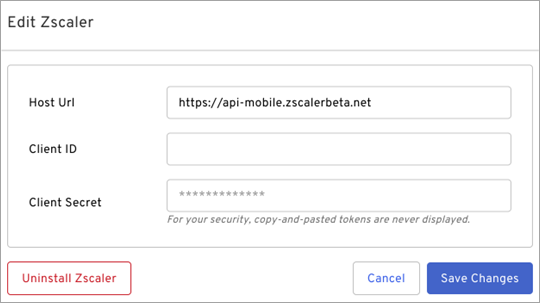

3. In the Admin Console, go to **Groups > Add Group** to create a test group with a single user added. You'll use this group to test the new rule you'll create in the next step.

4. Go to **Policy > Edit Policy > Add Rule**.

  1. Create a **Deny** rule to deny authentication and invoke **Zscaler Force Remove Device** API.

  2. Add a custom notification saying _Zscaler Client Connector will be logged out soon!!!_

  3. Click **Add**.

  4. Change the rule order as needed and click **Publish changes**.

  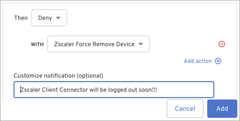

5. Log into Zscaler Client Connector using the test user you create above.

6. Authenticate to any application using Beyond Identity ensuring the authentication meets the criteria to trigger the Deny rule.

  The custom notification should appear and the Zscaler Client Connector should log out within a 3-minute timeframe.

7. If the test was successful, configure the policy to target all users.