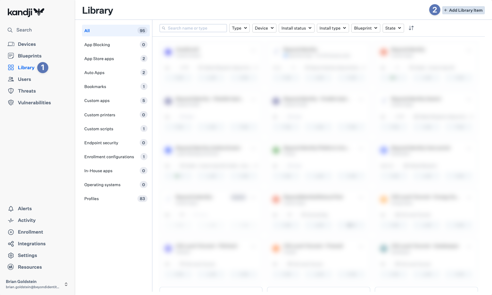
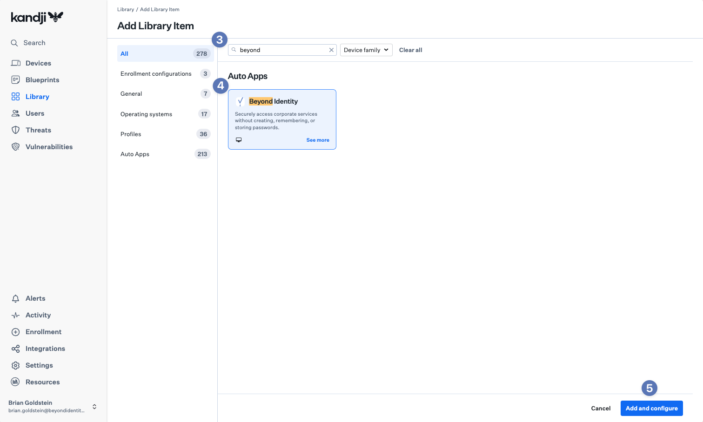
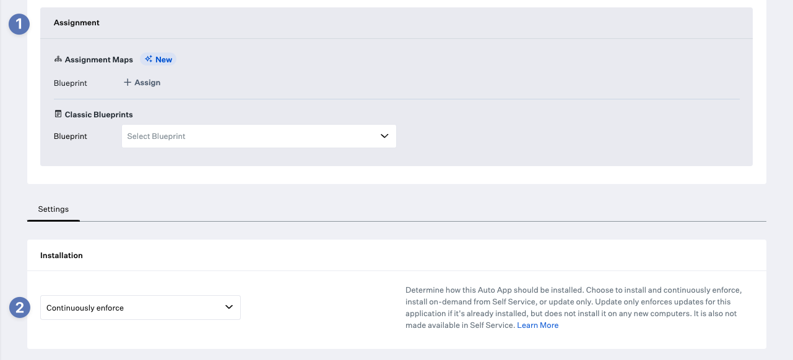
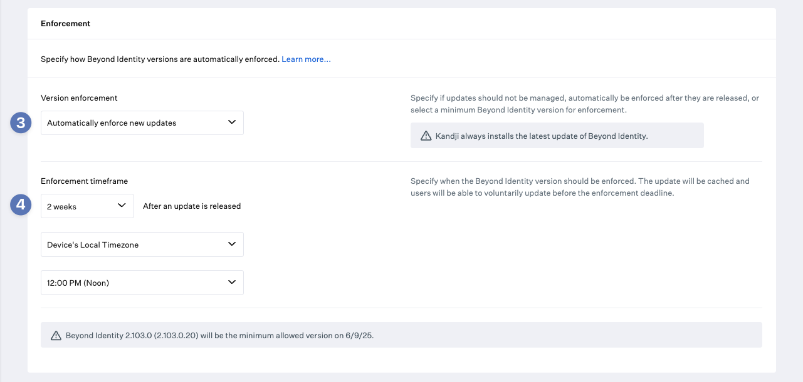
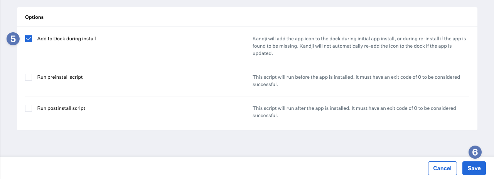

---
Deploy Beyond Identity Authenticator to macOS Using Kandji
---

This article describes how to deploy and automatically update the **Beyond Identity Authenticator** application to macOS devices via **Kandji**.  

For more details on Kandji Auto Apps, please refer to the [Kandji Knowledge Base](https://support.kandji.io/).

## Add the Beyond Identity Auto App Library Item

1. Login to your **Kandji** tenant and navigate to the **Library**.

2. Click **+ Add Library Item** at the top right corner.

3. In the search bar, type `Beyond` to filter available Library Items.

4. Click the **Beyond Identity Auto App**.

5. Click **Add and Configure** in the bottom right corner.

## Configure the Beyond Identity Auto App Library Item

6. Select the **Blueprint(s)** you want to assign the Library Item to.

7. Select **Continuously Enforce** from the **Installation** dropdown.

8. Select **Automatically enforce new updates** from the **Version enforcement** dropdown.

9. Set the **Enforcement time frame** based on your organization’s preferences.  
   _Note: We suggest setting this to no longer than 2 weeks._

10. *(Optional)* Select the **Add to Dock during install** checkbox.

11. Click **Save**.

