# Beyond Identity Secure Work Events Data Integration with Splunk Cloud and Enterprise

This guide provides step-by-step instructions for integrating event data from the Secure Work platform into Splunk Cloud and Splunk Enterprise.

## Overview

This integration allows security teams and administrators to centralize logs, visualize activity, and generate alerts in Splunk using events from Secure Work.  

By following this guide, you will learn how to:

- Configure the Secure Work platform to send event data.
- Connect and authenticate with Splunk Cloud or Splunk Enterprise.
- Verify that data is flowing into Splunk. 

## Prerequisites

Before beginning the integration, ensure you have:

- A configured Secure Work tenant with access to the admin console and permissions to generate API keys or configure event forwarding.  
- An admin-level Splunk Cloud or Splunk Enterprise account.  
- Network connectivity allowing outbound connections from Secure Work to Splunk. 

## Steps

### Creating an HTTP Event Collector

1. Access your Splunk Cloud or Enterprise admin console and log in with admin privileges.  

    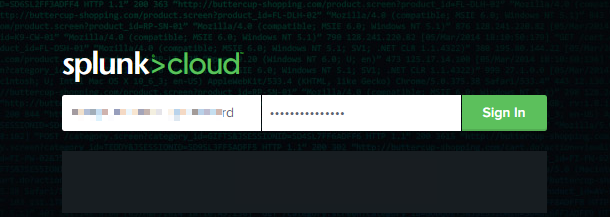

2. On the top navigation menu, click **Settings**.  

    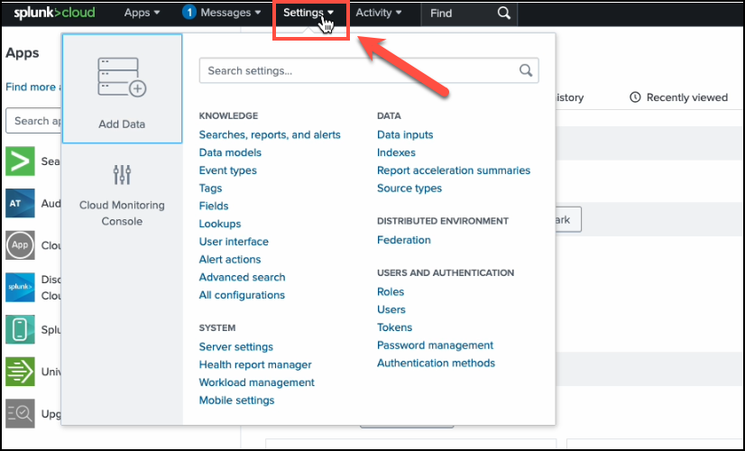

3. From the Settings dropdown, click **Data Inputs**.  

    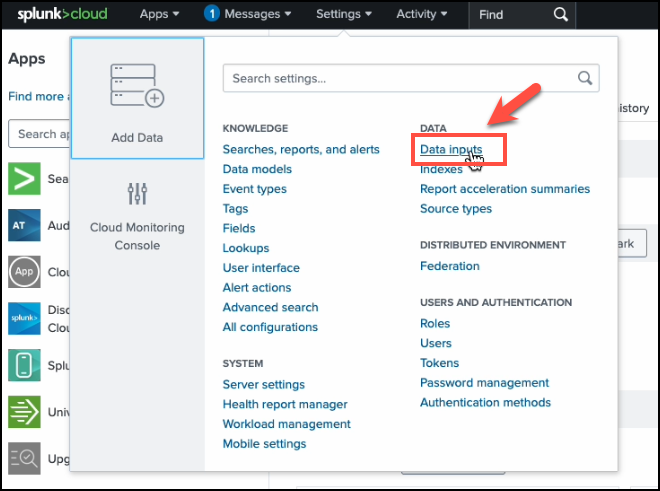

4. In Data Inputs, find **HTTP Event Collector**, then under **Actions**, click **+Add new**.  

    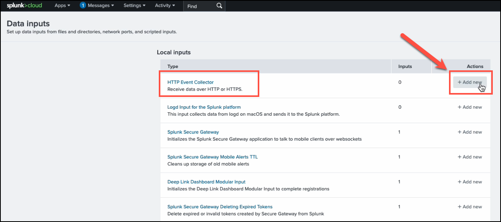

5. Provide a **Name** for the new token.  

    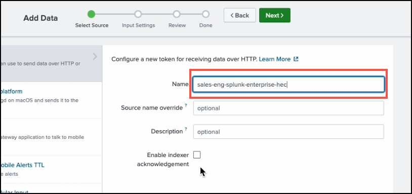

6. Leave other fields blank and click **Next**.  

    

7. In the Input Settings page, in the **Index** section, click **add all**.  

    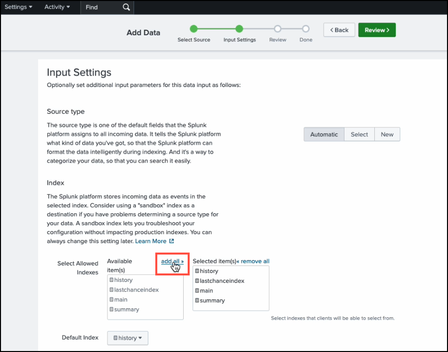

8. Set the **Default Index** to `main`, then click **Review**.  
    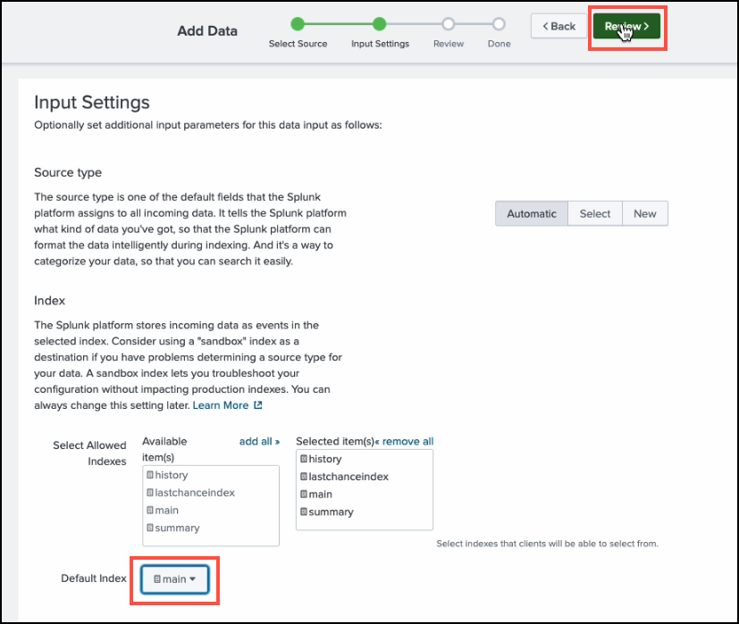


9. Review your configuration and click **Submit**.  

    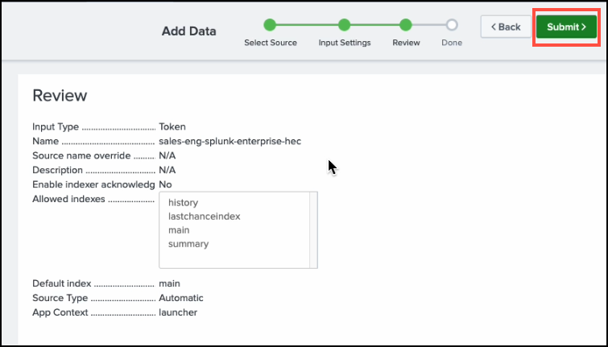

10. When the token is created, copy its value and store it securely—you’ll need it later.  

    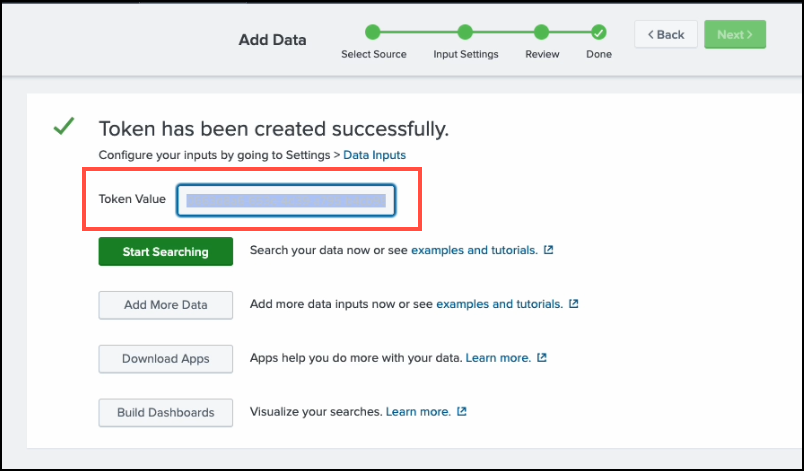

11. Locate the HTTP Event Collector you just created and under Actions click **Edit**. Under Source Type, type beyond_identity_log and click **Save**.

    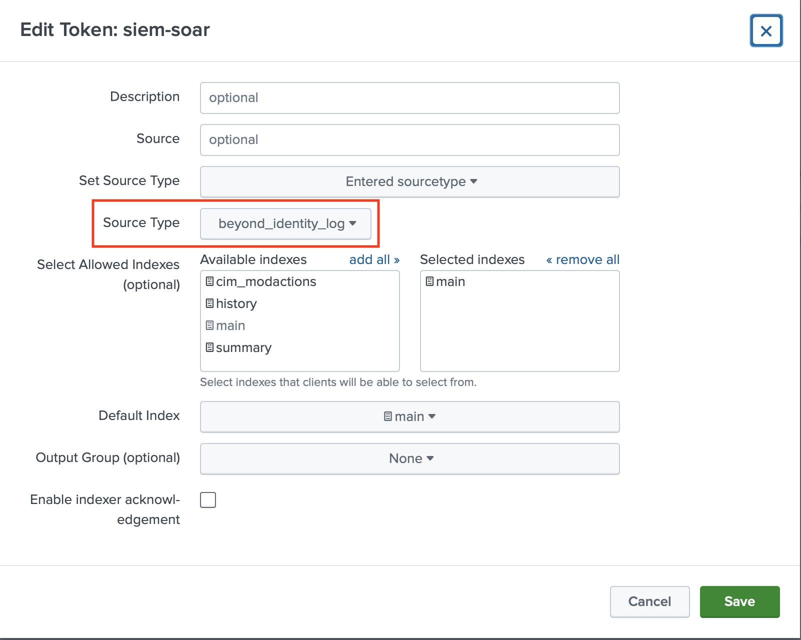

### Beyond Identity Console Configuration

12. Log in to your Beyond Identity Secure Work tenant.  

13. In the left navigation menu, click **Integrations**.  

    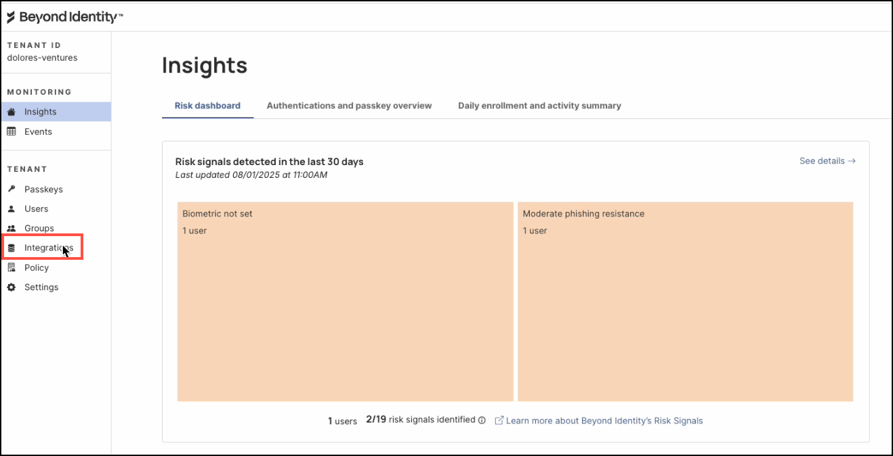

14. Click the **SIEM** tab.  

    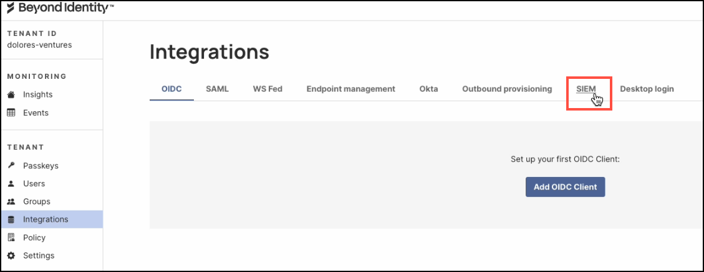

15. Click **Add SIEM Integration**.  

    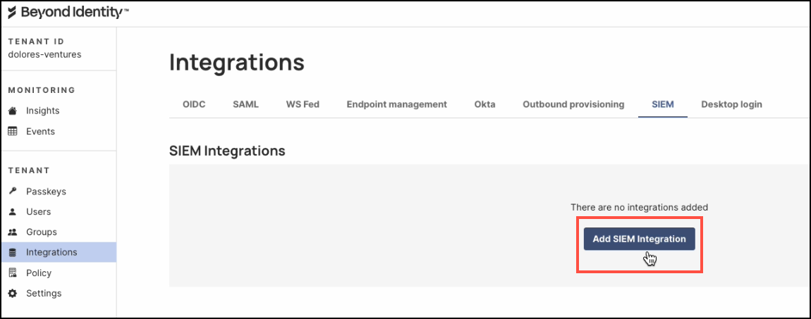

16. In the dialog window, select **Splunk** as the SIEM Provider.  

    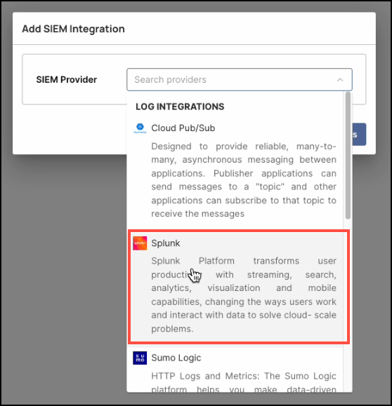

17. Enter the following details:
    - **Name:** A descriptive name for the integration.
    - **HEC Token:** Paste the token copied from the Splunk console.
    - **HEC Host:** The URL of your Splunk instance (without `https://`).
    - **HEC Port:** Enter `8088`.  
    - **Events:** Select which event types you want forwarded to Splunk.
    - **Threat Signals:** Choose which threat signals you want forwarded.
    - **Status:** Toggle to **ACTIVE**.  

    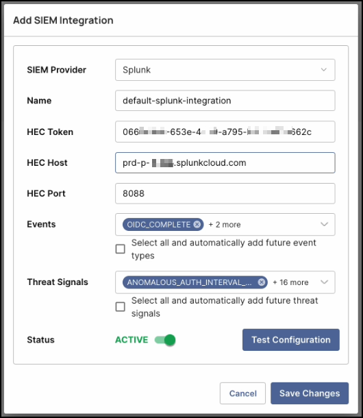

18. Click **Test Configuration** to verify connectivity.  

    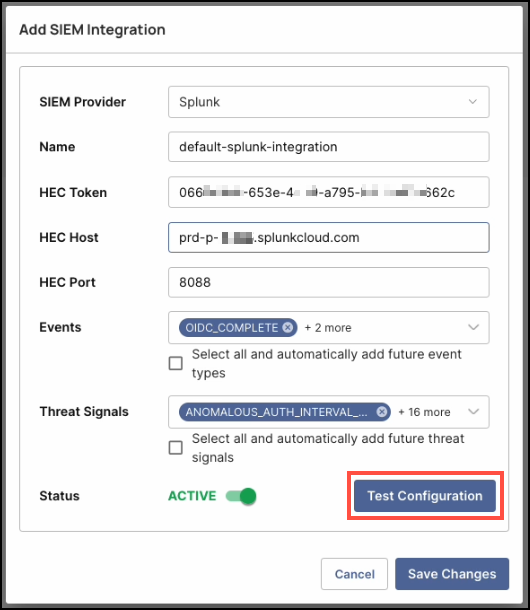

19. When you see a confirmation banner that the configuration is valid, click **Save Changes**.  

    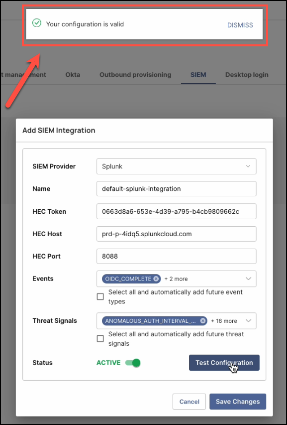

### Verify Events in Splunk Cloud

After configuration, verify that events are flowing into Splunk:

1. Log in to your Splunk Cloud instance.
2. Run a search similar to:

```
index="main" source="BI_events_http" actor.tenant_id="TENANT_CONFIGURED"
```

- Replace `source` with the source name you defined.
- Replace `actor.tenant_id` with your configured tenant ID.

If successful, events matching the search will be returned. 

## Appendix

For developers: refer to the Beyond Identity Developer API Guide for programmatic event retrieval:  
https://developer.beyondidentity.com/api/v0#tag/Events/operation/getEvents 
