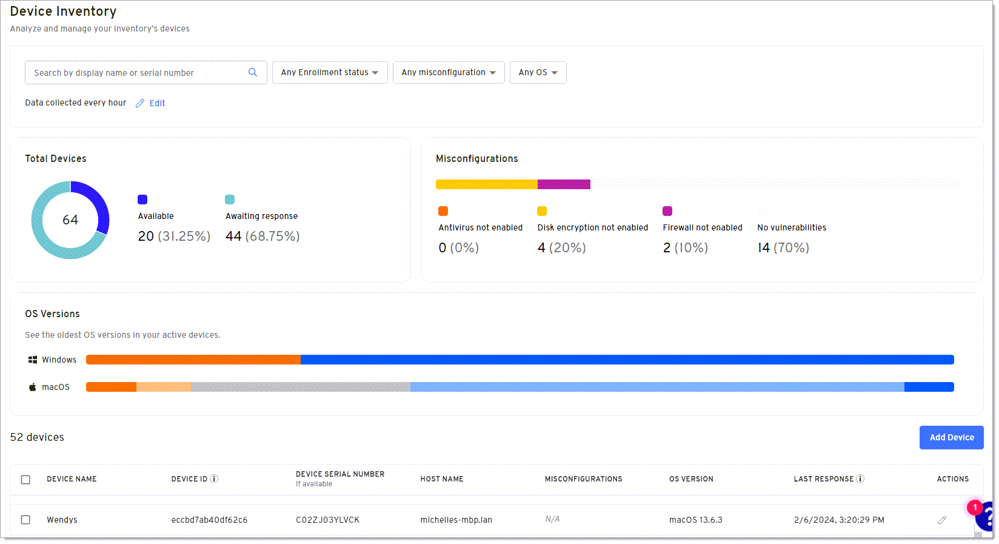

# Analyze devices

On the Devices page, you can quickly analyze enrolled devices for misconfigurations and vulnerabilities, such as firewalls that aren't enabled. You can also add or manage devices from this page.

:::note
In order to see devices, you must first enroll the device by adding a Device360 credential to the Beyond Identity Authenticator version 2.91.1 or later. Note that this is a different passkey than the one used for the Beyond Identity console and passwordless authentication. For more information, see [Add a device](https://docs.beyondidentity.com/docs/add-device).
:::

## Update the data collection interval

You can specify the interval for how often device attributes in the table on this page will be collected from devices that are online.

1. Click **Devices** in the navigation pane.

2. Click **Edit** beside Data collected every x.

3. Under **Frequency**, select how often you want Device360 to poll enrolled devices and return results that display in the Devices table.

4. Click **Save Changes**. 

## Device table

The Device table shows device details and vulnerabilities from polling the device based on the data collection setting.

Click a row with a device to view details. 

### Device Name

A custom name you can set for the device by clicking Add Device on this page. If you don't add a device name, the entry will be blank on this page and will show as "Not Available" for device query results. 

### Device ID

The Device ID is a value assigned by Beyond Identity and is useful to:

- See how many passkeys are on a device

- Ensure passkeys are sync’d between multiple devices

- Understand which passkeys will need to be revoked If a user losses a device

### Device Serial Number

The serial number associated with the device. 

### Host Name

The label assigned to the device on network. 

### Vulnerabilities

Displays any configuration or vulnerabilities found on the device, such as a firewall that isn't enabled so you can begin remediation. 
 
### OS Version

Displays the operating system version of the device. Use this column to locate devices that are on vulnerable operating systems. 

### Enrollment Status

Displays the status of the enrollment. Statuses are:

- Active - The device is online and available. 

- Pending - Occurs when:

    - The device was added recently, and initial queries associated with the table are running.

    - The enrollment code\credential hasn’t been added to the authenticator. For more information, see [Rebind a device](./rebind-device.mdx).

### Last Data Collection

The last date and time that data was collected from either the data collection setting on this page or an Osquery executed from the Device Query page.

### Actions

Click the Edit icon under Actions to perform the following:

- Add or update the name that displays for the device.

- Generate a new enrollment code to bind or re-bind a device to Device360.

- Delete a device (useful when an employee leaves or a device is decommissioned).