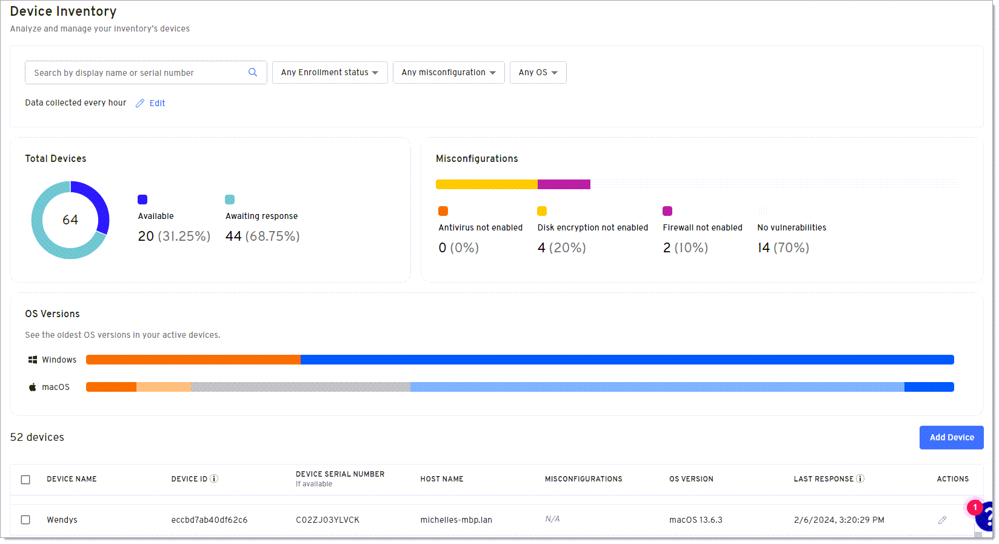
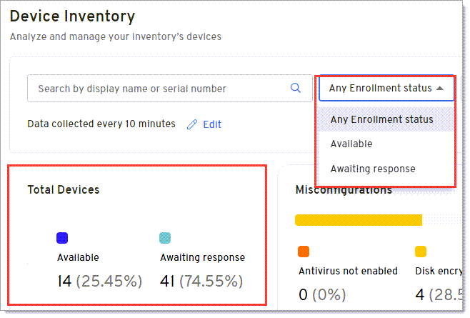
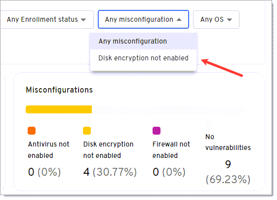
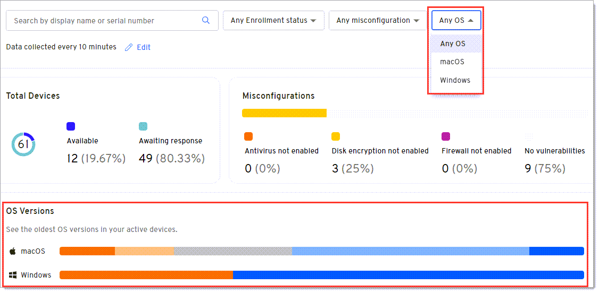
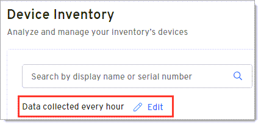
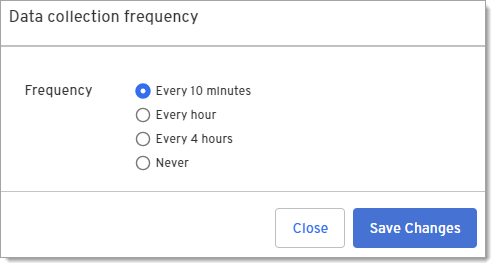
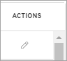

## Analyze devices

On the Devices page, you can quickly analyze enrolled devices for misconfigurations and vulnerabilities, such as firewalls that aren't enabled. You can also add or manage devices from this page.

:::note
In order to see devices, you must first enroll the device by adding a Device360 credential to the latest Beyond Identity Authenticator (minimum version 2.94 or later). Note that this is a different passkey than the one used for the Beyond Identity console and passwordless authentication. For more information, see <ins>[Install Device360](/docs/install-authenticator)</ins>.
:::

### Search for a device
Use the Search bar to quickly find a device when you know the display name or serial number. 

1. Select either **Display name** or **Serial number** in the Search field.

2. Press **Enter** on the keyboard or click the **Search** icon. The graphs and table update to display the search results. 

You can click x in the **Search** bar to clear the results. 

### View the enrollment status for devices
You can use the filter above the graphs or select an option in the Total Devices widget to quickly locate devices that haven't yet added the enrollment code to begin collecting data or to find the date and time a query last ran on devices that are enrolled. 

Available options are: 

- Active - Date and time of the last response for a query.

- Pending - Device is not yet enrolled. 
  :::note 
  The enrollment code expires after 10 minutes so you may need to generate a new code for the device. For more information, see <ins>[Generate a new enrollment code](install-authenticator#generate-a-new-enrollment-code)</ins>
  :::

Selecting an enrollment status will update the remaining graphs on the page and the Devices table with your results. 

### View misconfigurations for devices
You can use the filter above the graphs or select an option in the Misconfigurations graph to view devices that contain common misconfigurations that lead to vulnerabilities. This helps you to quickly prioritize and fix misconfigurations before they become a problem. 

- Select a misconfiguration option from the **Any misconfiguration** drop down to update the graphs and Devices table with your results. The drop down only shows misconfiguration options that exist for enrolled devices. For example, in the image above, there aren't any devices where the Antivirus and Firewall aren't enabled so those options don't appear in the current list.  

  or

- Click a misconfiguration option from the **Misconfigurations** graph to update the remaining graphs on the page and the Devices table with your results. 

:::tip
You can take a screenshot of the initial graphs and then take screenshots of the graphs over time to show progress to the executive team and stakeholders as you remediate the misconfigurations and reduce potential risks to your organization. 
::: 

### View OS Versions
You can use the **Any OS** filter above the graphs or select an option in the **OS Versions** graph to identify devices on older and more vulnerable operating systems.

- Select an operating system from the **Any OS** drop down to update the graphs and Devices table with your results. If you prefer to filter by a specific OS version, use the graph option below. 

  or

- Hover over different color sections for an operating system in the **OS Versions** graph and click that version to update the remaining graphs on the page and the Devices table with your results. 

### Update the data collection interval

You can specify the interval for how often device attributes in the table on this page will be collected from devices that are online.

1. Click **Devices** in the navigation pane.

2. Click **Edit** beside Data collected every x.

   

3. Under **Frequency**, select how often you want Device360 to poll enrolled devices and return results that display in the Devices table.

   

4. Click **Save Changes**. 

### Devices table
The Devices table shows device details and vulnerabilities from polling the device based on the data collection setting.

You can click a device row to view details for that device. 

| **Column**             | **Description**                                      | 
|------------------------|------------------------------------------------------|
|**Device Name**         | A custom name you can set for the device by clicking Add Device on this page. If you don't add a device name, the entry will be blank on this page and will show as "Not Available" for device query results.|
|**Device ID**           | The Device ID is a value assigned by Beyond Identity and is useful to: <ul><li>See how many passkeys are on a device</li><li>Ensure passkeys are sync’d between multiple devices</li><li>Understand which passkeys will need to be revoked If a user losses a device</li></ul>  |
|**Device Serial Number**| The serial number associated with the device.        |
|**Host Name**           | The label assigned to the device on network.         |
|**Misconfigurations**   | Displays any misconfigurations found on the device that can cause vulnerabilities, such as a firewall that isn't enabled so you can begin remediation.  |
|**OS Version**          | Displays the operating system version of the device. Use this column to locate devices that are on vulnerable operating systems.        |
|**Last Response**       | The last time the authenticator responded to a device query. Available values are: <ul><li>Active - The date and time of last response to a query.</li><li>Pending - The device is not yet enrolled. The enrollment code expires after 10 minutes so you may need to generate a new code for the device (select the checkbox by the Device Name and click the Edit icon under the Actions column).</li></ul>|
|**Actions**             | Click the Edit icon to perform the following: <ul><li>Add or update the name that displays for the device.</li><li>Generate a new enrollment code to bind or re-bind a device to Device360</li><li>Delete a device (useful when an employee leaves or a device is decommissioned).</li></ul>

## Rename devices

You can add a name for a device or rename a device on the Devices page. If you don't add a name, the Device Name on the Devices page will be blank and the Device Name for any query results will display as "Not Available". 

1. Click the Edit icon under the Actions column on the Devices page. 

2. Enter or update the name in the **Device Name** field. 

3. Click **Save changes**. 

## Rebind devices

You can rebind or re-enroll a device by generating a new enrollment code and adding it to the Beyond Identity authenticator. 

:::note 
If you are a Secure Workforce customer, this will not impact the passkey in the authenticator that allows you to securely sign into corporate applications without passwords.
:::

1. Click the Edit icon under the Actions column on the Devices page. 

   

2. Click **Generate new enrollment code**.

3. Copy the **Enrollment code**.

4. Click **Save changes**. 

5. Remove the current passkey from the authenticator. For more information, see <ins>[Remove passkeys from devices](#remove-passkeys-from-devices)</ins> below.
   
6. Add the regenerated enrollment code to bind your device to this tenant: 

   a. Click the + button to add the new enrollment code.

   b. Paste or type the enrollment code in the Enter 9-digit code screen. Note that a cursor doesn't appear on the screen. 
 
      The device will be added to the Device table with a status of Pending until internal queries complete. Once those complete, the status will change to Active. For more information, see <ins>[Analyze devices](#analyze-devices)</ins> above.

## Remove passkeys from devices
You may need to remove the device credential from a device when rebinding a device 

1. Open the Beyond Identity authenticator and select the passkey you want to remove.

2. Click **About this passkey**.

3. Click **Remove passkey from computer**.   

## Delete devices

:::note 
This will not delete the passkey from the authenticator that allows users to securely sign into corporate applications without passwords.
:::

1. Click the Edit icon under the Actions column on the Devices page.

   

2. Click **Delete Device**. A message displays that the device was successfully deleted and the device is removed from the Device table.

         