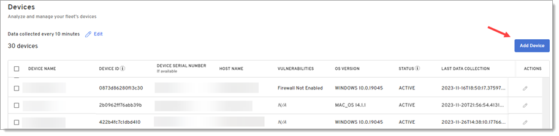
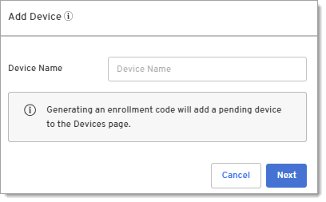

## Add devices

To begin collecting data and running queries on a device, you must first enroll it. 

:::note
- If you are new to Beyond Identity, you will need to install the authenticator and add Device360 enrollment code and to the authenticator (follow all steps below).
- If you are a Secure Workforce customer, Device360 uses the same authenticator that allows you to securely sign into corporate applications without passwords. You will just need to generate a Device360 enrollment code and and add it to your existing authenticator (start with step 5 below). This 
credential will not impact your Secure Workforce passkey in the authenticator.
:::

1. Select **Inventory > Device Inventory** in the left nav bar. 

2. Click **Add Device**.

   

   :::note 
   If you already have the Beyond Identity authenticator version 2.91.1 or later installed on your device, skip to Step 5 below to add a passkey to your device to start collecting data.
   :::

3. Enter a device name and click **Next**.
   
   

4. Click the link to open the authenticator downloads page.
   
   

5. Copy the Enrollment code.

6. Open the authenticator and click the + button.

   

7. Paste or type the enrollment code in the "Enter 9-digit code" screen to enroll the device. Note that a cursor doesn't appear on the screen.

      

   Once the device is enrolled by entering the 9-digit code, it will be added to the Device table.
   
   You can now monitor and query the device.

## Analyze devices

On the Devices page, you can quickly analyze enrolled devices for misconfigurations and vulnerabilities, such as firewalls that aren't enabled. You can also add or manage devices from this page.

:::note
In order to see devices, you must first enroll the device by adding a Device360 credential to the Beyond Identity Authenticator version 2.91.1 or later. Note that this is a different passkey than the one used for the Beyond Identity console and passwordless authentication. For more information, see [Add a device](https://docs.beyondidentity.com/docs/add-device).
:::

The Device table shows device details and vulnerabilities from polling the device based on the data collection setting.

Click a row with a device to view details. 

| **Column**             | **Description**                                      | 
|------------------------|------------------------------------------------------|
|**Device Name**         | A custom name you can set for the device by clicking Add Device on this page. If you don't add a device name, the entry will be blank on this page and will show as "Not Available" for device query results.|
|**Device ID**           | The Device ID is a value assigned by Beyond Identity and is useful to: <ul><li>See how many passkeys are on a device</li><li>Ensure passkeys are sync’d between multiple devices</li><li>Understand which passkeys will need to be revoked If a user losses a device</li></ul>  |
|**Device Serial Number**| The serial number associated with the device.        |
|**Host Name**           | The label assigned to the device on network.         |
|**Vulnerabilities**     | Displays any configuration or vulnerabilities found on the device, such as a firewall that isn't enabled so you can begin remediation.  |
|**OS Version**          | Displays the operating system version of the device. Use this column to locate devices that are on vulnerable operating systems.        |
|**Actions**             | Click the Edit icon to perform the following: <ul><li>Add or update the name that displays for the device.</li><li>Generate a new enrollment code to bind or re-bind a device to Device360</li><li>Delete a device (useful when an employee leaves or a device is decommissioned).</li></ul>

### Update the data collection interval

You can specify the interval for how often device attributes in the table on this page will be collected from devices that are online.

1. Click **Devices** in the navigation pane.

2. Click **Edit** beside Data collected every x.

3. Under **Frequency**, select how often you want Device360 to poll enrolled devices and return results that display in the Devices table.

4. Click **Save Changes**. 

## Rename devices

You can add a name for a device or rename a device on the Devices page. If you don't add a name, the Device Name on the Devices page will be blank and the Device Name for any query results will display as "Not Available". 

1. Click the Edit icon under the Actions column on the Devices page. 

2. Enter or update the name in the **Device Name** field. 

3. Click **Save changes**. 

## Rebind devices

You can rebind or re-enroll a device iby generating a new enrollment code and adding it to the Beyond Identity authenticator. 

:::note 
If you are a Secure Workforce customer, this will not impact the passkey in the authenticator that allows you to securely sign into corporate applications without passwords.
:::

1. Click the Edit icon under the Actions column on the Devices page. 

   

2. Click **Generate new enrollment code**.

3. Copy the **Enrollment code**.

4. Click **Save changes**. 

5. Remove the current passkey from the authenticator. For more information, see [Remove a passkey from a device](https://docs.beyondidentity.com/docs/remove-passkey).
   
6. Add the regenerated enrollment code to bind your device to this tenant: 

   a. Click the + button to add the new enrollment code.

   b. Paste or type the enrollment code in the Enter 9-digit code screen. Note that a cursor doesn't appear on the screen. 
 
      The device will be added to the Device table with a status of Pending until internal queries complete. Once those complete, the status will change to Active. For more information, see [Analyze devices](https://docs.beyondidentity.com/docs/analyze-devices).

## Delete devices

:::note 
This will not delete the passkey from the authenticator that allows users to securely sign into corporate applications without passwords.
:::

1. Click the Edit icon under the Actions column on the Devices page.

   

2. Click **Delete Device**. A message displays that the device was successfully deleted and the device is removed from the Device table.

         

## Remove a passkey from devices
You may need to remove the device credential from a device when rebinding a device 

1. Open the Beyond Identity authenticator and select the passkey you want to remove.

2. Click **About this passkey**.

3. Click **Remove passkey from computer**.   