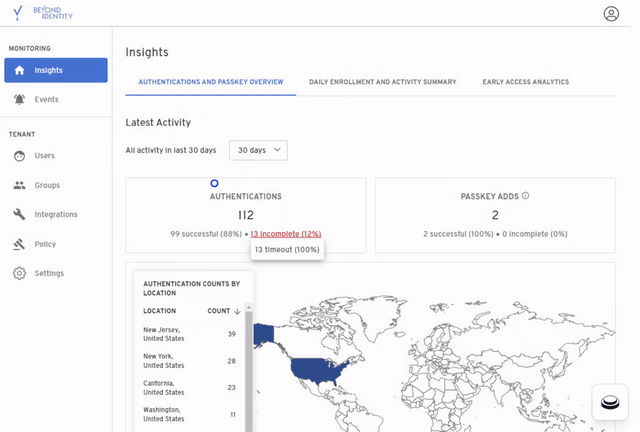
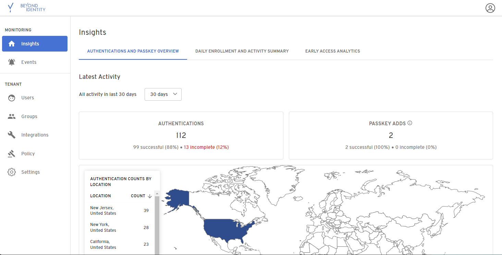
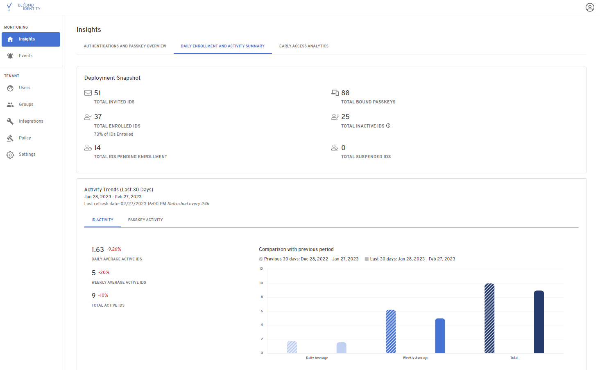
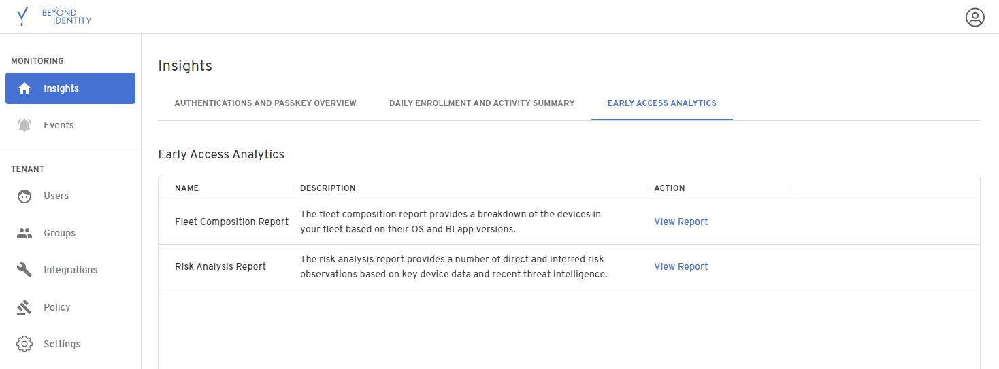
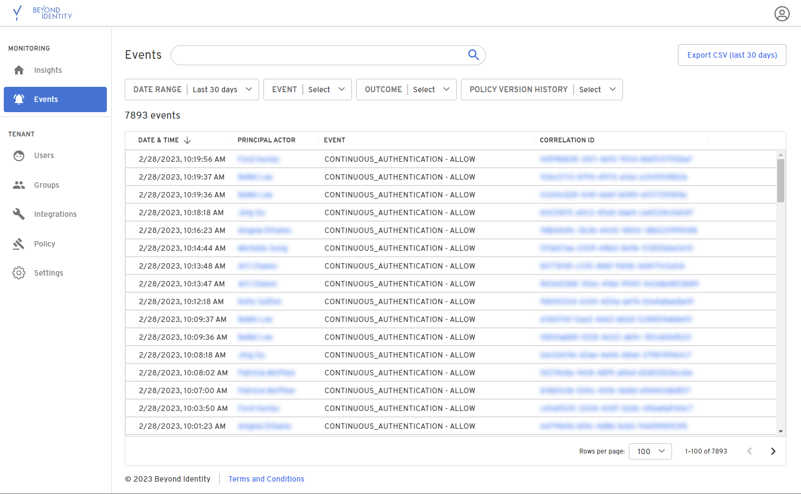

The Admin Console dashboard shows how many authentications, new device setups, and newly registered users. The data is updated every 20 minutes. Therefore, you can see the time the data was refreshed. 

## Insights

### Authentications and Passkey Overview

*[We need a description of this section.  What is it? What can the user get from it?]*

### Daily Enrollment and Activity Summary

*[We need a description of this section.  What is it? What can the user get from it?]*

### Early Access Analytics

*[We need a description of this section.  What is it? What can the user get from it?]*

## Events

### Export event data

Event data can be exported to a CVS file. To export event data, select the date range to include and any specific events. If no events are selected, all events within the specified time period will be exported.

### Filter events

Events can be filtered by selecting one or more items from any of the drop-down menus at the tops of the page. Only those events matching the selected events will be displayed on the page. Events can be filtered on:

- [Date Range](#filter-on-a-date-range)
    
- [Event type](#filter-on-event-types)
    
- [Event outcome](#filter-on-event-outcomes)
    
- [Event service](#filter-on-service-events)
    
- [Specific policy version](#filter-on-a-specific-policy-version)

#### Filter on a Date Range

To display events that occurred within a specific period of time, select the appropriate time from the **DATE RANGE** drop-down menu:

To specify a customized range, select **Custom date range** and provide the appropriate start and end date.

#### Filter on Event Types

You can filter the display to only show specific events such as when a device has been added or when a device credential has changed. To filter on event types, select one or more events from the **EVENT** drop-down menu.

#### Filter on Event Outcomes

Events can be filtered to only display the outcome of an event. Event outcomes include items such as a failure, success, and policy denial. To filter based on an event outcome, select one of more items from the **OUTCOME** drop-down menu.

#### Filter on Service Events

Events can be filtered to only display specific service events such as a policy change or the result of a device registration. To filter on the service events, select one or more items from the **SERVICE** drop-down menu.

#### Filter on a Specific Policy Version

Events can be filtered on a specific policy version. To display events associated with a specific version, click the specific version from the **POLICY VERSION HISTORY** drop-down menu.

### Search events

You can search for specific user or an event by typing a string in the search box at the top of the **Events** page.

### User profiles

You can access a user’s profile by clicking on a specific user in the **PRINCIPAL ACTOR** column. The user’s profile includes information including the username, primary email address, status, user ID, external ID, and device info associated with the user.

### Event details

Detailed event information can be viewed by clicking on a user in the **PRINCIPAL ACTOR** column. Once clicked the **Event Details** are displayed on the right of the **Events** page.

The event details include information such as:

*   Date and time of the event
    
*   Event and correlation IDs
    
*   User name
    
*   Event type
    
*   Event status
    
*   IP address of the Authenticator
    
*   Related IP addresses, if any
    

Additional information includes:

*   Details associated with the principal actor including the user type, display name, ID, display ID, Tenant ID, event type, and correlation ID
    
*   Details associated with the event data including certificate and client information, device info, and user information
    
*   Event outcome
    

The event details can be copied to a file by clicking the icon next to **Other Info**.

