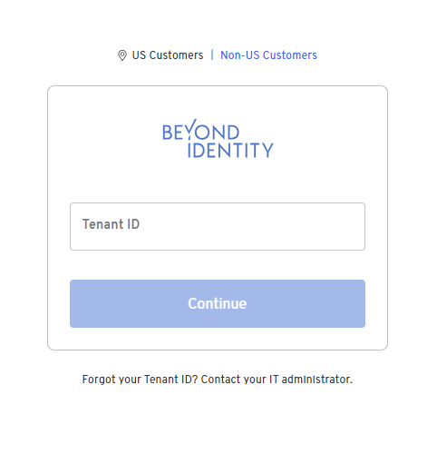
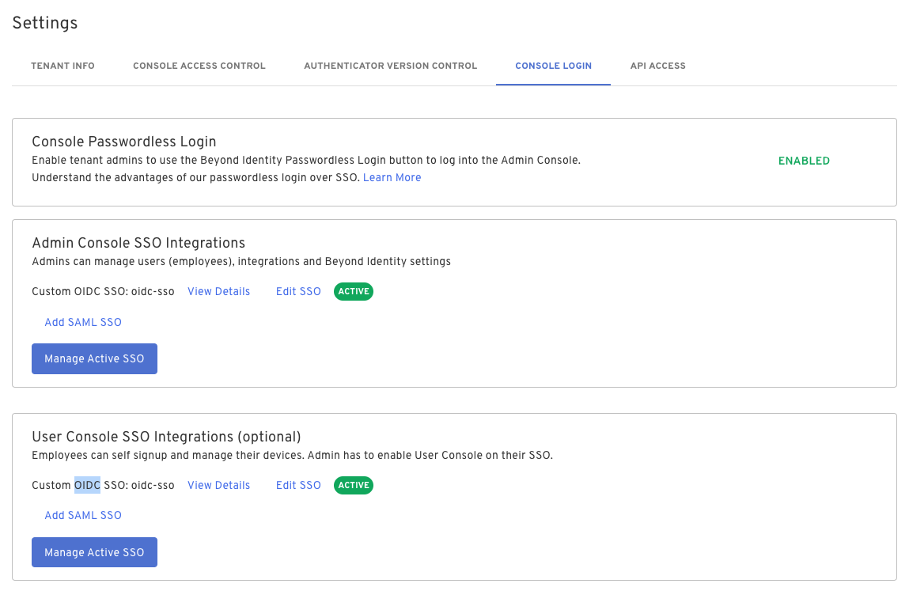
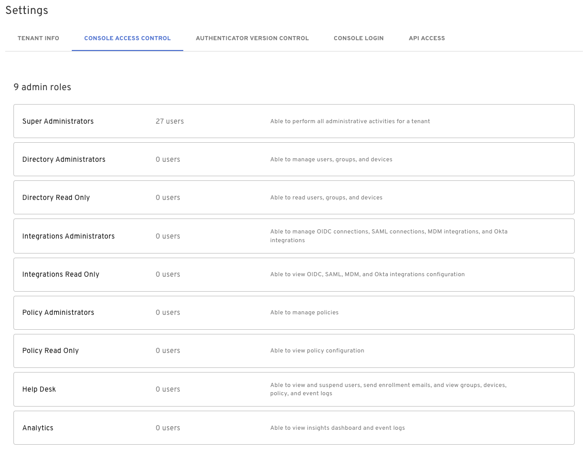

The Beyond Identity Admin Console provides administrative access to manage your Beyond Identity environment. The Admin Console supports various roles and methods of authentication to support identity and security teams of all sizes.

## Logging in

Log into the Admin Console at the url:

https://admin.byndid.com/ 

Beyond Identity provides each organization with a unique tenant ID. Enter your tenant ID to log in.

## Authentication

The first user created in a Beyond Identity tenant is by default a Super Administrator of the tenant and the Admin Console.

### Authentication methods

Beyond Identity supports authenticating to the Admin Console directly via Beyond Identity Passwordless Login or via a third party identity provider for authorized users of the Admin Console.

Configure authentication methods in the Admin Console under **Settings > Console Login**.

### Roles

Once desired authentication methods are enabled, users must be added to a Role in the Admin Console in order to authenticate and log in. Beyond Identity provides 9 default roles for users accessing the Admin Console. Assign roles to users under **Settings > Console Access Control**.

