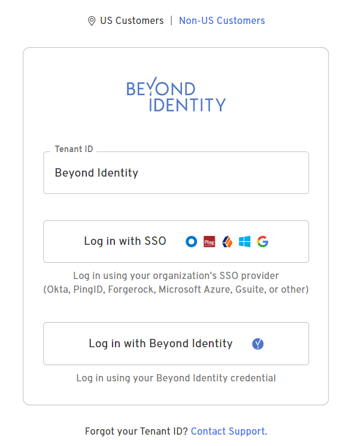

Customize items for your tenant, for example, the login screen and notification messages. 

## Login screen

You can customize the login screen with:

- The display name of the Tenant ID  
- A logo and its URI
- The support email address to contact in the event of a forgotten Tenant ID

import TenantRequirements from '../../static/includes/_tenant-logo-requirements.mdx';

:::info Logo requirements
<TenantRequirements />
:::

1.  From the Admin Console, select the **Settings** tab.
2.  The **TENANT INFO** settings should be displayed. If not click the **TENANT** **INFO** tab at the top of the **Settings** page.
3.  Click the **Customization** edit icon.  
    
4.  From the **Edit Customization** dialog, make the appropriate changes.
5.  Click **Save Changes**.  
    

## Notification messages

