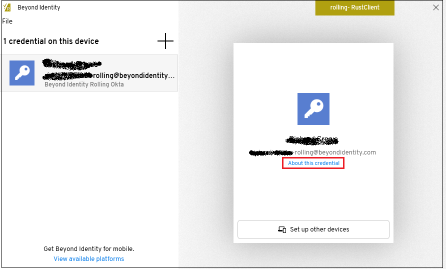
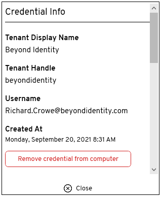

To remove a credential from a device perform the following steps. Once the credential is removed, that device can no longer authenticate.
 
1.	Select the approrpriate credential on your device and select ** About this credential**.

	
	
2.	From the **Credential Info** window, select **Remove credential from device** or **Remove credential from computer**.

	

#### Related Topics ####

