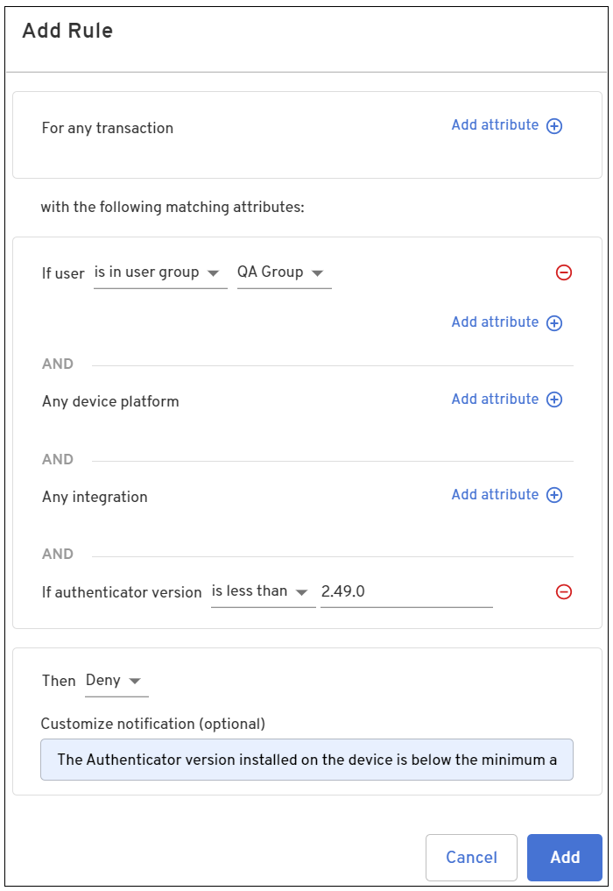
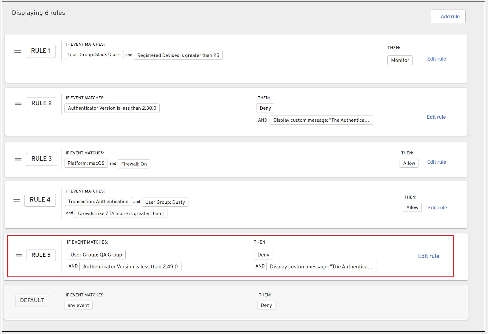

## All transaction type rules

In addition to setting policy for a specific transaction type, you can set policy that applies for all transaction types. The following provides an example that writes a policy that denies authentication for any transaction type that matches the criteria set in the policy.

### Deny authentication

This example creates a rule that denies users from the QA Group attempting to authenticate or add a device that is installed with an Authenticator version less than 2.49.0.

1. Log into the Admin console and select **Policy > Edit Policy**.

2. Click **Add rule** and select the attributes that are required for authentication for your organization.

  <table width="100%">
    <tbody>
      <tr>
        <td>
          For any transaction
        </td>
        <td><b>Any</b>
        </td>
      </tr>
      <tr>
        <td>If user
        </td>
        <td><b>is in user group</b> <b>QA Group</b>
        </td>
      </tr>
      <tr>
        <td>If authenticator version
        </td>
        <td><b>is less than</b> <b>2.49.0</b>
        </td>
      </tr>
      <tr>
        <td>Then
        </td>
        <td><b>Deny</b>
        </td>
      </tr>
    </tbody>
  </table>

4. Add an optional message that is displayed to inform the user why the authentication or device add function was denied. 

  For example, *The Authenticator version installed on the device is below the minimum allowed. Please upgrade your Authenticator version to 2.49.0 or greater.*  

  

5. Click **Add** when done.  

  

6. Create additional rules as needed.

<NotePolicyMustBePublished />